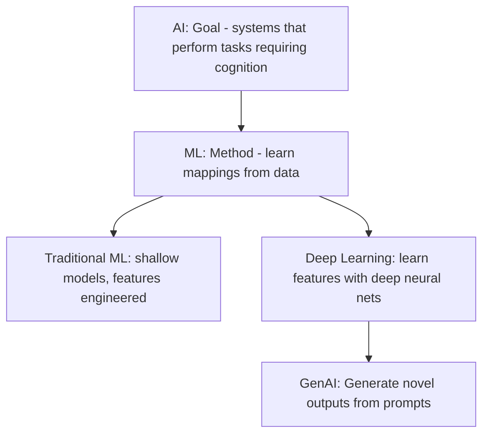

# AI vs ML vs Deep Learning vs GenAI

> **Learning Path:** AI / LLM Foundations
> **Section:** 6.1.1 — Understand

**The problem**

Rule-based software breaks when requirements are ambiguous, incomplete, or too high-dimensional to encode. You can write an if/then for "reject this transaction if amount > $10k", but you cannot write rules for "does this support ticket sound frustrated", "will this user churn next month", or "write a summary that matches our tone".

The problem is not computation, it's *knowledge representation*. Hand-coding mappings from inputs to outputs doesn't scale with variation. You need systems that infer patterns from examples and generalize to unseen inputs.

That need creates a stack of concepts, not four synonyms.

**Mental model**

Think of it as layers of abstraction:

* AI is the goal: software that perceives, reasons, plans, or creates like a human would.
* ML is a method to get there: instead of programming rules, you provide data and an objective, the system finds parameters that minimize error.
* Deep Learning is an implementation of ML: multi-layer neural networks that learn hierarchical representations automatically.
* GenAI is a capability built on large deep models: it synthesizes text, code, image, audio that is plausible given a prompt and training distribution.

ML is not AI, and GenAI is not the only AI.

**How it works**

ML works in two phases. Training: optimize model parameters against a dataset with a loss function. Inference: apply the learned parameters to new inputs.

Traditional ML requires feature engineering: you decide what signals matter, e.g., transaction amount, time, merchant category. Deep Learning removes much of that: the network learns features from raw inputs like pixels or token sequences, at the cost of more data and compute.

GenAI models are typically large autoregressive transformers trained on massive corpora with next-token prediction. At inference they sample conditioned on a prompt. They do not retrieve facts, they approximate distributions over plausible continuations.

**Architectural reasoning**

Choose the layer by constraints, not hype.

* Use rule-based / classical software when the domain is closed, logic is stable, and you need determinism and auditability.
* Use ML when you have data, the mapping is statistical, and performance beats rules. Examples: churn scoring, anomaly detection, recommendation ranking.
* Use Deep Learning when data is abundant and unstructured: images, audio, text, time series, and feature engineering is infeasible. You trade data/compute for accuracy.
* Use GenAI when you need open-ended generation, summarization, or reasoning over natural language with low engineering cost per use case. You trade control and cost for flexibility.

Alternatives matter. For tabular data with limited labels, gradient boosted trees often beat deep nets and are more interpretable. For classification with strict latency, a small traditional model may be better than a LLM.

**Trade-offs and failure modes**

* Data hunger and drift. ML models degrade as distribution shifts. You need monitoring, retraining pipelines, and data quality controls.
* Compute vs latency vs cost. Deep models are expensive to train and serve. GenAI inference is high latency and cost per token.
* Opacity and explainability. Deep models are black boxes. In regulated domains you need explainability, guardrails, or hybrid retrieval-augmented generation.
* Hallucination and prompt injection for GenAI. Models generate plausible but false content. Never trust outputs without verification, grounding to sources, and output validation.
* Security. GenAI systems expose attack surface via prompts and training data leakage.

**Example**

Enterprise support triage.

Rule-based: if keyword "refund" then route to billing. Fails on paraphrase.

Traditional ML: train a classifier on labeled tickets with handcrafted TF-IDF features. Works with ~10k labels, explainable via feature importance, low latency.

Deep Learning: fine-tune a BERT classifier on raw text. Better accuracy, no feature engineering, higher serving cost.

GenAI: LLM with RAG over knowledge base to generate first-response drafts and summarize conversations. High flexibility, needs guardrails, retrieval grounding, and human-in-the-loop for sensitive topics.

An architect would use ML for routing, GenAI for draft generation, and rules for compliance checks. Not one size fits all.

**Reasoning challenge**

You need a real-time fraud decision in <50ms with explainable reasons for regulators, and you have 5 years of labeled transactions but only ~5k confirmed fraud examples.

Do you reach for a large GenAI model, a deep neural net, or a traditional ML model? What data, latency, explainability, and operational constraints drive the decision?

**Key takeaway**

* AI is the goal, ML is a method, Deep Learning is a technique, GenAI is a generative capability.
* Choose by problem constraints: data availability, structure, latency, cost, explainability, and risk.
* ML shines on statistical patterns with data; Deep Learning replaces feature engineering with compute; GenAI trades control for generality.
* Architect for failure: monitor drift, ground generation, validate outputs, and keep human oversight where it matters.
