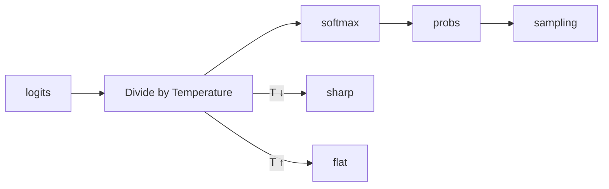

# Temperature

> **Learning Path:** AI / LLM Foundations
> **Section:** 6.1.10 — Understand

## 1. The problem

An LLM always outputs a probability distribution over the next token. For a given prompt, the top token might be 0.6, second 0.2, third 0.1...

If you always pick the highest probability token you get deterministic, safe, boring output.
If you sample randomly from the distribution you get diverse, creative, sometimes incoherent output.

The problem for an architect is: **the same model must serve both modes**. A code generation service needs reproducibility. A brainstorming assistant needs variation. Retraining is not an option.

You need a runtime knob that controls how much the model listens to its own confidence vs explores alternatives, without changing the model.

## 2. Mental model

Think of temperature as a thermostat for sharpness.

* Low temperature = focused beam. The model commits to high-probability tokens.
* High temperature = diffuse beam. The model flattens its beliefs and gives low-probability tokens a chance.

It does not make the model smarter or more accurate. It changes how it uses the probabilities it already has.

## 3. How it works

Sampling is done after softmax. Temperature `T` scales the logits before softmax:

```
P(token) = exp(logit / T) / sum(exp(logit_i / T))
```

* `T < 1` : divides logits, makes differences larger → distribution peaks, top token dominates
* `T = 1` : normal softmax
* `T > 1` : shrinks differences → distribution flattens, tail tokens gain mass



Temperature interacts with top-k and top-p. Temperature shapes the distribution, top-k/top-p truncates it. Use them together.

## 4. Architectural reasoning

Temperature solves the need for controllable stochasticity at inference time.

When it helps:
* **Deterministic production paths:** API docs, code completion, structured JSON, test generation. You want `T ~ 0.1-0.3` and often greedy decoding.
* **Creative / exploratory paths:** marketing copy, brainstorming, paraphrasing, dialogue. You want `T ~ 0.7-1.0`.
* **A/B experimentation:** Same model, different personality without redeploy.

Alternatives:
* Greedy decoding = `T → 0`. Maximum likelihood, no sampling.
* Top-k / top-p nucleus sampling = truncate tail regardless of temperature.
* Multiple samples + reranking = higher quality at higher cost.

Choose temperature when you need a simple, model-agnostic lever for diversity vs consistency, and you can accept the trade-off of less precise control.

## 5. Trade-offs and failure modes

* **Determinism vs diversity.** Low T improves reproducibility and testability, but increases repetition and mode collapse. High T increases diversity but risks incoherence, factual drift, and non-deterministic bugs.
* **Consistency vs user experience.** Customers expect stable answers for the same question. Too high T breaks that expectation and makes caching and evaluation hard.
* **Temperature alone is insufficient.** High T with no top-p cap can sample garbage tokens. Low T can cause degeneration loops: "the the the".
* **Operational risk.** Temperature changes output distribution, which changes downstream validation failure rates. Treat it as a config that needs canarying and monitoring, not a magic creativity slider.

## 6. Example

Enterprise support assistant vs idea generator, same base model.

* Support assistant: `temperature=0.2, top_p=0.95`. Goal: consistent, safe answers from knowledge base. Outputs are logged and compared against golden responses. Low variance makes regression testing feasible.
* Marketing brainstorm: `temperature=0.9, top_p=0.9`. Goal: varied headlines. Variation is a feature. Outputs are sampled in batches and filtered by a cheap classifier for brand safety.

Same model, two services, different temperature profiles, different SLAs and monitoring.

## 7. Reasoning challenge

You are designing an AI solution for a bank.

Service A generates regulatory disclosure text from internal data. Service B generates internal training scenarios for fraud detection.

What temperature range would you target for each, and what other sampling controls would you pair with it? What would you monitor to know the setting is wrong?

## 8. Key takeaway

* Temperature does not change what the model knows, only how it samples from what it knows.
* Low temperature = exploitation, high temperature = exploration. Choose based on product risk tolerance.
* Always pair temperature with top-p/top-k and validate with real outputs. Reproducibility is an architectural property.
* Treat temperature as a deployment config with measurable impact on consistency, quality, and failure modes.
