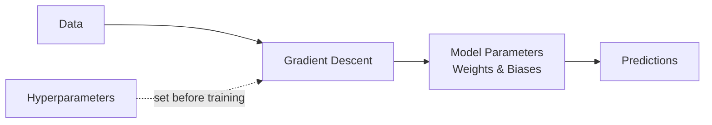

# Model parameters

> **Learning Path:** AI / LLM Foundations
> **Section:** 6.1.12 — Understand

### The problem

You need a model that generalizes language, not memorizes examples. Generalization requires capacity to store and compose patterns from training data.

Capacity is constrained by compute, memory, latency and cost at training time and inference time. You cannot just add capacity indefinitely.

Model parameters are how that capacity is expressed.

### Mental model

Model parameters are the learned weights of the network. They are the state the model acquires from data.

Think of them as the adjustable slots in a massive lookup table that the training process fills in. Hyperparameters are the settings you choose before training: learning rate, depth, context length, optimizer. Parameters are what training writes.

More parameters = more degrees of freedom = more patterns the model can represent. Fewer parameters = less capacity, lower compute and memory.

### How it works

During pre-training, the model is initialized with random parameters. Each training step computes loss on a batch, backpropagates gradients, and nudges parameters to reduce loss.

After training, parameters are frozen for inference. Inference is just forward passes through the same parameter set.

Parameter count is a proxy for capacity, not quality. Quality also depends on data quality, architecture, and training compute. Scaling laws show predictable gains from increasing parameters, data, and compute together, with diminishing returns and a cost cliff.

### Architectural reasoning

When does parameter size matter?

* **Quality target.** High reasoning, long context, low hallucination needs more capacity. A 7B model will not match a 70B model on complex tasks.
* **Latency and throughput budget.** Parameters live in memory and are read every token. Larger models need more VRAM, higher bandwidth, and more FLOPs per token. That drives cost per request and P95 latency.
* **Deployment target.** Cloud GPU cluster vs on-prem vs edge device. A 1B parameter model quantized to 4-bit fits on a phone; a 70B model does not.
* **Data regime.** With limited domain data, a huge model overfits and memorizes. A smaller model with parameter-efficient fine-tuning often generalizes better.

Alternatives to raw scale:
* Better data curation and architecture
* Parameter-efficient adaptation: LoRA, QLoRA, adapters keep base parameters frozen
* Quantization and distillation: reduce effective size without retraining from scratch
* Mixture-of-Experts: activate a subset of parameters per token

Choose scale when the quality gap justifies the operational cost. Choose efficiency when latency, cost, or hardware constraints dominate.

### Trade-offs and failure modes

* **Quality vs cost.** Each doubling of parameters increases training cost super-linearly and inference cost linearly in memory and compute. Architectures must budget tokens per month.
* **Latency vs throughput.** Larger models increase time per token and memory per request, limiting concurrent users per node.
* **Overfitting and memorization.** Too many parameters for the available data leads to verbatim memorization of training text and poor generalization. Regularization, data diversity, and early stopping help.
* **Operational fragility.** Large models increase failure blast radius: a bad deployment or prompt injection affects more expensive inference. Versioning and canary rollout become mandatory.
* **Privacy and leakage.** More capacity increases risk of memorization of sensitive training data.

### Example

Enterprise support RAG chatbot.

Internal tier: low latency, high throughput, cost sensitive. 8B parameter model, 4-bit quantized, served on single GPU. Good enough for simple retrieval-augmented answers. Parameter-efficient fine-tuning on company docs.

Customer-facing tier: complex reasoning, compliance-sensitive answers. 70B parameter model, full precision, served with tensor parallelism. Higher cost per token accepted for quality and reduced hallucination risk.

Same architecture, different parameter budgets chosen by workload constraints, not by "best model".

### Reasoning challenge

You have a budget of $50k/month inference and a P95 latency SLA of 400ms. A 70B model meets quality but costs $80k/month and hits 600ms. A 7B model fits budget and latency but fails quality gates on 15% of complex queries.

What do you do? Options: optimize serving, use routing, distill, or change the SLA. Which decision changes the architectural trade-off the least?

### Key takeaway

* Parameters are learned weights, hyperparameters are design choices. Confusing them leads to wrong optimization.
* Parameter count controls capacity, not quality directly. Capacity must be matched to data, task, and deployment constraints.
* Larger models improve quality predictably but increase cost, latency, and operational risk.
* Architectural choice is model size + efficiency techniques, not just "pick the biggest model".
