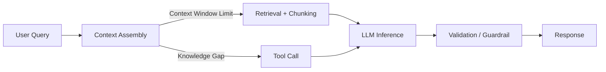

# Model limitations

> **Learning Path:** AI / LLM Foundations
> **Section:** 6.1.14 — Understand

**Model limitations**

### 1. The problem

You want to use an LLM as a reliable component in a system. In practice it fails in predictable, repeatable ways: it forgets long inputs, invents facts, gets confused by large prompts, and costs/latens with scale.

If you treat an LLM like a database or a deterministic function, you will ship hallucinations, silent truncation, and runaway costs. Model limitations are the constraints you must design around.

### 2. Mental model

An LLM is a finite-context pattern matcher trained on static data, not a reasoning engine with memory.

Think of it as: **compressed text -> next token prediction**, bounded by tokens in and out, compute per token, and the training cutoff.

It has no persistent state, no guaranteed truth, and no built-in notion of "I don't know". The context window is a hard working memory limit. Beyond it, information is dropped.

### 3. How it works

The limits that matter architecturally:

* **Context window and attention decay.** Input + output must fit in tokens. Relevant information at the start of a long prompt is effectively invisible. Cost and latency grow linearly with tokens.
* **Knowledge cutoff and hallucination.** The model cannot know what it was not trained on, and it will confidently generate plausible but false outputs when uncertain.
* **Reasoning depth.** Complex multi-step problems degrade without explicit scaffolding. The model can simulate reasoning but has no verifiable internal check.
* **Non-determinism and modality.** Same prompt can yield different answers. Vision/audio models add further constraints on format and fidelity.
* **Safety and policy.** Open-ended generation risks disallowed content, leakage, and prompt injection.

These are not bugs to fix; they are properties of the architecture.

### 4. Architectural reasoning

Limitations drive design decisions.

When it helps: LLMs are excellent at fuzzy synthesis, reformulation, classification, and structured extraction *within* their window.

What problem they solve: They reduce hand-coded logic for ambiguous natural language tasks.

Alternatives and when to choose them:

* **Retrieval Augmented Generation** when you need current or private data. The model stays general, facts come from your store. You pay retrieval latency and chunking complexity.
* **Tool use / function calling** when you need deterministic actions or fresh data. The model generates a plan, tools execute. You pay orchestration complexity.
* **Fine-tuning / prompt engineering** when you need style consistency. You trade data prep and evaluation cost for fewer hallucinations on a narrow domain.
* **Decomposition / agents** when reasoning depth exceeds one shot. You trade latency and failure modes for better accuracy.

The decision is always: how much uncertainty can the downstream system tolerate?

### 5. Trade-offs and failure modes

* **Bigger context vs cost and quality.** Larger windows reduce truncation but increase cost, latency, and dilution of signal. More context ≠ better answer.
* **Retrieval vs hallucination.** RAG reduces hallucination but introduces retrieval quality as a new failure mode: missing docs, bad chunking, prompt injection into context.
* **Latency vs reliability.** Re-ranking, self-consistency, and multi-step agents improve quality at the cost of p95 latency and operational complexity.
* **Determinism vs flexibility.** Temperature 0 reduces variance but does not guarantee correctness. You still need output schemas and validators.
* **Security.** Context is data. Prompt injection can make the model reveal system prompts or act on untrusted user content.

Failure modes architects see in production: silent truncation of critical inputs, stale answers due to cutoff, cascading errors in multi-step agents, token budget overruns, and cost spikes under load.

### 6. Example

Enterprise support agent.

Requirement: answer from internal KB and recent tickets, cite sources, never invent policy.

Architecture forced by limitations:
1. Query rewrite + hybrid retrieval over vector store + ticket DB.
2. Top-k chunks selected, re-ranked, and injected into a tight prompt with explicit citation instructions.
3. LLM generates answer with required JSON schema: `answer`, `citations[]`.
4. Validator checks citations exist and answer length fits token budget. If confidence low, fallback to human.
5. Guardrail blocks disallowed content and logs prompt for audit.

Without this, the model would hallucinate policies, forget instructions in long threads, and cite non-existent documents.

### 7. Reasoning challenge

You are designing a financial reconciliation assistant that must process 500-page PDF contracts and compare them to live transaction data.

The model has a 128k token context. A single contract is ~80k tokens.

Do you: A) chunk and summarize iteratively, B) retrieve only relevant clauses per question, or C) fine-tune on contracts?

What failure mode worries you most, and what architectural guardrail would you add?

### 8. Key takeaway

* Model limitations are design constraints, not quality defects. Design the system around context, cutoff, and non-determinism.
* Never trust raw model output. Ground it with retrieval, tools, and validation.
* Token budget is a first-class resource. Plan for chunking, summarization, and prompt compression.
* Reliability comes from orchestration, not a bigger model.
