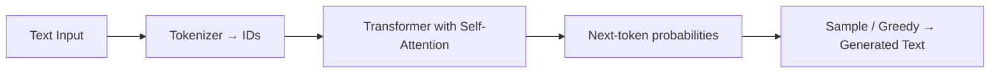

# LLMs

> **Learning Path:** AI / LLM Foundations
> **Section:** 6.1.3 — Understand

**The problem**

You need software that understands and generates natural language at scale, across domains, with minimal explicit programming.

Traditional NLP is a pipeline of rules, regex, classifiers, and hand-tuned models. It works for narrow, stable tasks: parse an address, extract an entity from invoices. It breaks when:
* Queries are open-ended and phrased in many ways
* You need generation, not just extraction: summarize, rewrite, reason over documents
* New intents appear continuously and you cannot retrain a pipeline each time

You want one system that generalizes from text examples instead of hand-coded logic.

**Mental model**

An LLM is a massive statistical autocomplete.

It has no explicit knowledge base or symbolic reasoning. It learns distributions over token sequences from huge corpora, then predicts the next token given context. Self-attention lets it weigh which prior tokens matter for the next prediction.

Think: pattern matcher with a very large memory, not a reasoning engine.

**How it works**

The essential mechanism is the Transformer trained on next-token prediction.

Pre-training: Model sees trillions of tokens and learns to predict the next token. This forces it to internalize grammar, facts, reasoning patterns, and style.

Post-training: Supervised fine-tuning and reinforcement learning from human feedback align it to be helpful, safe, and instruction-following.

Inference is autoregressive: output one token, feed it back in, repeat until stop. Context window is the limit of tokens it can attend to at once.

That is it. All capabilities emerge from scale + attention + next-token objective.

**Architectural reasoning**

When it helps:
* Open-ended understanding: chat, summarization, classification with fuzzy inputs
* Generation tasks where acceptable variation is high
* Rapid prototyping of language features without building pipelines

Alternatives and why you might not choose LLM:
* Rule-based / regex: deterministic, cheap, auditable. Use when input space is closed and correctness is critical.
* Retrieval + small classifier: cheaper, more controllable. Use when answers must come from a known source.
* Classical NLP pipeline: better precision on narrow extraction with limited data.

Choose LLM when flexibility and coverage outweigh cost, latency, and non-determinism. It solves the problem of *coverage over language variation* at the cost of control.

**Trade-offs and failure modes**

* Hallucination and confabulation. The model optimizes for plausible text, not truth. Architect for verification, grounding, and human-in-the-loop.
* Context limits and cost. Quality scales with model size and context, so does latency and $/token. Long documents need chunking, summarization, or retrieval.
* Non-determinism. Same prompt can yield different outputs. You need temperature control, caching, and evaluation.
* Security and leakage. Prompts are data. Sensitive information can be memorized from training and leaked via prompts. Assume the model is untrusted.
* Operational complexity. You need guardrails, prompt versioning, observability of prompt + output, and rate limiting.

**Example**

Enterprise support ticket triage.

Problem: 50k tickets/month, many phrasings for same issue, agents overloaded.

Architecture:
User message → LLM classifier → intent + entities → routing + draft reply
High confidence → auto-route
Low confidence → human review queue

RAG is added when answers must be sourced from KB: retrieve top docs, prepend to prompt, generate grounded answer. This trades generality for correctness.

Cost: $0.002 per ticket for classification vs building and maintaining 200 regex rules. Operational cost is monitoring drift and hallucinated routing.

**Reasoning challenge**

You need real-time fraud alert explanations for analysts. Latency budget 300ms, explanations must cite specific transaction fields and be auditable.

Do you use a large general LLM for explanation generation, a small fine-tuned model, or a template-based system? What constraints drive the decision?

**Key takeaway**

* LLMs solve the coverage problem for natural language by learning statistical patterns at scale, not by encoding rules.
* They are autoregressive token predictors whose behavior emerges from pre-training + alignment; understanding is approximate correlation.
* Use them when language variation and open-ended generation outweigh the need for determinism, low cost, and strict auditability.
* Architect around their failure modes: hallucination, context limits, cost/latency, and security. Ground with retrieval and add human oversight where correctness matters.
