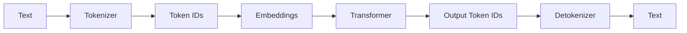

# Tokens

> **Learning Path:** AI / LLM Foundations
> **Section:** 6.1.4 — Understand

### 1. The problem

LLMs are neural networks that operate on fixed-size vectors, not raw text. You cannot feed arbitrary length English sentences directly in. The model needs a discrete, bounded input representation it can embed and process in parallel.

That creates three constraints for any architecture:
* **Context window:** The model can only attend to N tokens at once. Everything beyond is invisible.
* **Cost:** Providers bill per input token and per output token. Cost scales linearly with token count.
* **Latency:** More tokens = more computation per forward pass.

You need a way to map variable-length, open-vocabulary text into a finite set of units that the model understands, while keeping those units compact enough to fit in the window and cheap enough to run.

### 2. Mental model

A token is not a word and not a character. It is the smallest unit in the model's vocabulary that the tokenizer emits.

Think of tokenization as compression for language. The tokenizer breaks text into subword pieces the model was trained on. Common words become one token, rare words split into pieces, symbols and common prefixes get shared pieces.

The key mental model: **Token count is the true resource unit, not characters or words.** 1 word ≈ 1.3 tokens in English, but can be 2-4 tokens for non-Latin scripts. You architect to a token budget, not a character limit.

### 3. How it works

Training uses Byte-Pair Encoding or similar subword algorithms to build a vocabulary of ~32k-200k tokens. At inference:

Tokenizer maps text to integer IDs. Those IDs are looked up as embeddings, processed by the transformer, and the model predicts the next token ID autoregressively.

Input tokens + output tokens = billable tokens. The context window counts both system prompt, user prompt, retrieved context, and tool outputs.

### 4. Architectural reasoning

Token awareness changes design decisions.

**When it helps:** You need to fit more information into a fixed window. Retrieval Augmented Generation is the canonical case. You have a token budget of say 128k. You must decide how many tokens to allocate to:
System instructions → User query → Retrieved chunks → Tool results → Output reserve

That is a budgeting problem, not a string length problem.

**Alternatives and why tokens win:** Character-level models are universal but very long sequences → slow and expensive. Word-level models have huge vocabularies and fail on out-of-vocabulary words. Subword tokens give a compact sequence length with a manageable vocabulary.

Architecturally this means you design upstream for token efficiency: chunk documents at token boundaries, rank retrieval by token relevance, compress prompts, and reserve output tokens.

### 5. Trade-offs and failure modes

* **Token efficiency vs readability.** You can make prompts shorter with abbreviations, removing spaces, or using a more token-efficient tokenizer. That hurts maintainability and can change model behavior. Don't optimize tokens at the cost of clarity unless cost is critical.
* **Context vs fidelity.** More retrieved chunks = more context but uses token budget and increases noise. Top-k retrieval must be chosen by token budget, not just relevance score.
* **Truncation failure.** Silent truncation of the tail of a prompt is a common production bug. The model never sees the last instructions or the last retrieved document.
* **Cost blow up.** Output tokens are often more expensive and unpredictable. Unbounded generation, e.g., asking the model to "list everything", can exhaust budget and latency SLAs.
* **Tokenizer mismatch.** Counting tokens with the wrong tokenizer leads to overruns. OpenAI's `cl100k_base` != Anthropic's tokenizer. Always count with the model's tokenizer.

### 6. Example

Enterprise RAG for support tickets.

Documents are chunked to ~500 tokens with 50 token overlap. Retrieval returns top 5 chunks. System prompt is 200 tokens. User query ~50 tokens. Reserve 800 tokens for answer.

Token budget check per request:
`200 + 50 + 5*500 + 800 = 3,050 tokens`

If the corpus is updated, chunking must respect token boundaries, not character boundaries, otherwise a chunk may be 600 tokens in practice and break the budget.

When the budget is exceeded, you don't just truncate. You compress: summarize older chunks, drop low relevance chunks, or use a two-stage retrieve-then-rerank with a token cap.

### 7. Reasoning challenge

You have a 128k context model. A user wants to summarize a 500 page PDF. Tokenizing the whole PDF is ~750k tokens, far over budget.

Do you: A) Chunk and summarize iteratively with a map-reduce pattern, B) Try to fit as much as possible into one prompt with aggressive compression, or C) Stream the PDF in parts and let the model maintain state?

What is the trade-off between accuracy, cost, latency, and operational complexity for each?

### 8. Key takeaway

* Tokens are the resource unit for LLMs: context, cost, and latency are all measured in tokens.
* Tokenization is a compression trade-off. Subword tokens balance vocabulary size vs sequence length.
* Architect with a token budget: allocate tokens to system, context, and output before you call the model.
* Count with the correct tokenizer and design for truncation and cost blow up as first-class failure modes.
