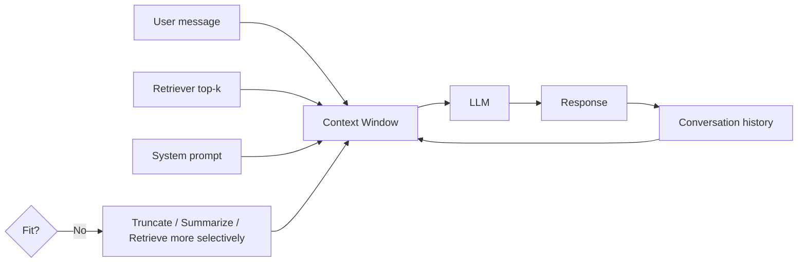

# Context windows

> **Learning Path:** AI / LLM Foundations
> **Section:** 6.1.5 — Understand

**Context windows**

### 1. The problem

An LLM can only reason over what it can see at inference time. For a useful assistant you need:
* conversation history to stay consistent
* documents, tickets, codebases to ground answers
* instructions and system prompts

Without a limit, you would feed the entire history + the whole corpus. That is impossible. Attention is O(n²) in tokens, and KV-cache memory grows linearly with sequence length. Cost and latency explode.

The problem is not "how much text can we store", it is **how much text can the model attend to in one forward pass while staying affordable and coherent.**

### 2. Mental model

Think of a context window as a working memory with a fixed number of slots. Slots are tokens, ~4 chars per token in English.

The window is one contiguous block: system prompt + user history + retrieved docs + current user message = input tokens. Output tokens are generated inside the same block, so they consume budget too.

```
[ System | Conversation history | Retrieved chunks | Current query ]  →  [ Output ]
        ^--- input window ---^                      ^--- output eats from window ---^
```

If the block exceeds the model's limit, the model cannot attend to the overflow at all.

### 3. How it works

* Tokenization maps text to tokens. Window size is in tokens, not characters.
* The model sees the whole window at once. Position matters: early and late tokens are attended to more reliably than the middle, and truncation is typically from the start or end.
* Longer windows cost more: more compute per token and larger KV-cache. A 128k window is not 128x cheaper than 4k.

Architecturally you therefore manage three budgets:
1. **Retention budget** - what history must stay
2. **Grounding budget** - what external context is needed now
3. **Generation budget** - tokens you reserve for output

### 4. Architectural reasoning

A context window enables single-pass reasoning over a bounded set of facts. That is the decision point.

When it helps:
* Short, high-signal interactions where full history fits. No extra system needed.
* RAG where you retrieve a few relevant chunks and fit them in window with query.
* Summarization of a document that fits.

Alternatives when it doesn't help:
* **Chunk + map-reduce** for documents larger than window. Split, summarize per chunk, then aggregate.
* **Retrieval** to replace window growth with selective recall. Window holds only top-k relevant passages.
* **Compression / summarization** of history to keep salient points while discarding verbatim turns.
* **Long-context models** to raise the limit, trading cost for simplicity.

Choose window management when you need low latency and simple ops. Choose retrieval + summarization when you need correctness over long histories or large corpora.



### 5. Trade-offs and failure modes

* **Size vs cost/latency.** Larger windows increase per-request compute and memory. At scale this dominates bill.
* **Completeness vs relevance.** More context reduces truncation risk but dilutes signal and increases the "lost in the middle" effect.
* **Freshness vs stability.** Keeping full history preserves tone and decisions, but bloats window and risks leaking old instructions.
* **Window overflow.** Silent truncation loses information. Failure mode: model answers from partial history, hallucinates continuity.
* **Context poisoning.** If you inject too much retrieved text, the model may attend to irrelevant passages and override system instructions.

The most common architect mistake: treating a bigger window as a replacement for retrieval. It is not; it just postpones the problem and raises cost.

### 6. Example

Enterprise support agent. Ticket history can be 50k tokens over weeks. Customer asks about a billing issue from 6 months ago.

Bad design: load entire history into 128k window every turn. Cost high, latency high, middle turns lost.

Better design:
* System prompt with policy.
* Summarized conversation state: last 5 turns verbatim + a compressed summary of older turns.
* Retrieve 2-3 relevant past tickets via vector search, only their excerpts.
* Reserve ~512 tokens for output.

Window is now ~8k tokens, stable cost, and the model has the right facts.

### 7. Reasoning challenge

You are building a code assistant for a monorepo. Engineers paste a file and ask "why is this failing?". Repo is millions of lines.

Do you:
A) Increase context window to 1M tokens and put the whole repo in context
B) Keep a modest window and retrieve relevant files/functions via embeddings + AST

What constraints drive your decision and what failure mode are you most worried about?

### 8. Key takeaway

* A context window is a hard, token-bounded working memory, not storage.
* Design for what must be in-window now, not what you could store.
* Window size is a cost/latency knob, not a feature. Use retrieval, summarization and chunking to keep the window useful.
* The failure modes are truncation, dilution and cost explosion, not "model is smart enough".
