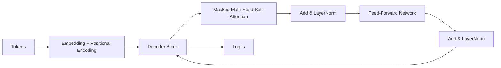

# Transformer high-level architecture

> **Learning Path:** AI / LLM Foundations
> **Section:** 6.1.6 — Understand

### The problem

RNNs and LSTMs could model sequences, but they process tokens one at a time. That creates three architectural constraints:
* **Sequential dependency** → no parallelism during training, slow wall-clock time
* **Vanishing gradient** → long-range dependencies are hard to learn, effective context is limited
* **Fixed bottleneck** → information must be compressed into a single hidden state

You need a model that can learn long-range relationships, train in parallel on GPUs/TPUs, and scale with more compute/data.

### Mental model

Transformer replaces recurrence with **content-addressable retrieval**.

Instead of passing a summary forward, each token asks: *which other tokens in this sequence are relevant to me right now?* Attention computes relevance scores for all pairs, then mixes values weighted by those scores.

Think of it as a massively parallel lookup table built on the fly per sequence, not a recurrent state.

### How it works

High-level flow for a decoder-only LLM:

Core components:
* **Embedding + Positional Encoding.** Tokens have no order. Sinusoidal or learned positional encodings inject sequence position.
* **Multi-Head Self-Attention.** Queries, Keys, Values are projected. Attention = softmax(QK^T / sqrt(d)) V. Multiple heads let the model attend to different relationships in parallel.
* **Masked causal attention.** In decoder-only models, each position can only attend to prior positions. This makes generation autoregressive and trainable with teacher forcing.
* **Feed-Forward Network + Residuals + LayerNorm.** Attention mixes information across tokens. FFN transforms each token independently. Residual connections and LayerNorm stabilize deep stacks.

Stacking 12-96+ of these blocks gives the model depth. Scale = more layers, wider hidden size, larger context window.

### Architectural reasoning

When it helps:
* Long-range dependency is important, e.g., language, code, reasoning over documents
* You have large parallel compute for training and can amortize cost at inference
* You need a single architecture that works for many tasks via prompting/fine-tuning

Alternatives:
* RNN/CNN: faster per-token inference, lower memory, but weaker long-range capture and harder to parallelize training
* State-space models / linear attention: aim for sub-quadratic inference, trade some expressivity for long contexts

You choose Transformer when quality and scaling behavior outweigh quadratic cost and you can handle inference engineering.

### Trade-offs and failure modes

* **Quadratic cost.** Attention is O(n²) in sequence length for compute and memory. 32k context = ~1B pairwise scores. This drives cost, latency, and KV-cache memory.
* **Position is an add-on.** Absolute positional encodings degrade at lengths seen only at training time. Extrapolation beyond training context is brittle.
* **Attention is not reasoning.** It is powerful pattern matching. Hallucination, lack of grounding, and brittle factual recall are systemic.
* **Training vs inference mismatch.** Training is highly parallel; inference is autoregressive and memory bound by KV cache. Throughput collapses if you don't batch, quantize, or use speculative decoding.
* **Data hungry.** Capacity scales, but requires massive, clean data and careful regularization.

### Example

Enterprise code completion service.

Requirement: complete functions with cross-file context, low p95 latency, 10k+ concurrent users.

Architecture decision: decoder-only Transformer, 8B parameters, 16k context. Training on internal code corpus with instruction tuning.

Why: self-attention captures long-range dependencies across files better than RNN. Parallel training enables scaling. At serving, KV-cache + continuous batching + 4-bit quantization keeps latency <150ms.

Failure mode to plan for: a 32k context request spikes KV-cache memory and evicts other users. Mitigation: context window guardrails, sliding window attention, and routing long requests to a separate pool.

### Reasoning challenge

You need real-time conversational search with a 1M token context window for full document ingestion. Your current Transformer hits OOM and 2s+ latency at 128k.

What architectural change would you evaluate first, and what capability would you lose?

### Key takeaway

* Transformer exists to replace sequential recurrence with parallel content-addressable attention, enabling long-range learning and massive training parallelism.
* Architecture = stacked self-attention + FFN with residuals and positional encoding; masked causal attention makes it generative.
* Choose it for quality and scaling on long sequences when you can afford quadratic compute/memory and inference engineering.
* Main risks: quadratic cost, positional extrapolation, inference memory pressure, and hallucination without grounding.
