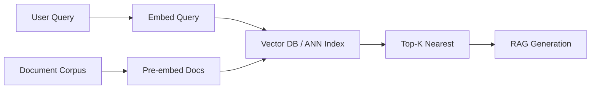

# Embeddings

> **Learning Path:** AI / LLM Foundations
> **Section:** 6.1.8 — Understand

**6.1.8 Embeddings — Understand**

### 1. The problem

LLMs are great at generating text, they are terrible at finding it.
You have millions of documents, support tickets, code, products. A user asks a question in their own words. You need to find the *semantically* relevant items fast, not just keyword matches.

Keyword search fails on paraphrase: "cancel my subscription" vs "stop recurring billing". Exact match fails on scale. LLMs are too slow and expensive to scan everything per query.

You need a way to compare meaning, not strings, and do it in milliseconds over a large corpus.

### 2. Mental model

An embedding is a coordinate in a high-dimensional meaning space.

The same encoder maps semantically similar text to nearby points, dissimilar text to distant points. Proximity = semantic similarity.

Think of it as a compression of meaning into a numeric fingerprint. You can't read the fingerprint, but you can measure distance between fingerprints.

### 3. How it works

Text -> Encoder model -> Dense vector, typically 384 to 1536 dimensions.

The encoder is trained with contrastive objectives to push similar texts together and pull dissimilar texts apart. Cosine similarity is the distance metric.

Search becomes vector similarity, not string matching:

Pre-embedding is key: embed once at ingestion, query at runtime. Retrieval is approximate nearest neighbor, not linear scan.

### 4. Architectural reasoning

Embeddings enable retrieval over meaning.

**When it helps:**
* RAG: find relevant context to ground LLM generation
* Semantic search: support, help centers, code search
* Recommendation and clustering: group by meaning, not tags
* Deduplication and classification pre-filtering

**Alternatives:**
* BM25 / keyword search: fast, interpretable, fails on paraphrase
* Manual taxonomy / tags: accurate but doesn't scale, high maintenance
* LLM re-ranking of full corpus: accurate but prohibitively expensive

Decision rule: Use embeddings when you need semantic recall at scale and can tolerate approximate results. Use keyword when exact terms matter and explainability is required. Hybrid is common: BM25 for recall, embeddings for semantic recall, LLM for re-rank.

### 5. Trade-offs and failure modes

**Model choice vs quality.** Bigger models give better semantics, cost more to embed and store. A 1536-dim embedding is 6KB per document. Millions of docs = tens of GB of vectors plus ANN index.

**Approximate vs exact.** ANN indexes like HNSW, ScaNN trade recall for latency. You get ~95% recall at 10x speed. For RAG that is usually fine, for compliance search it may not be.

**Staleness and drift.** Embeddings are static snapshots. New documents need backfilling. Model updates require full re-embedding. Without a refresh pipeline, retrieval degrades silently.

**Context limits.** Embeddings compress whole text into one vector. Long documents lose nuance. Common mitigation: chunking with overlap, then aggregate or re-rank.

**Failure modes architects miss:**
* Semantic collision: unrelated texts map close due to training bias
* Prompt leakage in RAG: retrieved chunks contain instructions or PII
* No interpretability: you can't explain *why* two vectors are close
* Cost creep: embedding at ingest is cheap, embedding every query at high QPS adds up

### 6. Example

Enterprise knowledge base with 2M internal docs.

Ingest pipeline: chunk docs to 512 tokens with 50 token overlap -> embed with one model -> store vectors in Pinecone/Weaviate with metadata filters for tenant, doc type, date.

Query path: user query embedded with same model -> ANN search with metadata filter -> top 8 chunks -> passed to LLM with system prompt.

Result: latency ~80ms for retrieval, recall of relevant policy improves vs keyword by ~40%. Trade-off: monthly re-embedding job and vector DB cost.

### 7. Reasoning challenge

You are designing a customer support chatbot for a bank. Queries are short, answers must cite exact policy clauses with source links. Should you use pure embedding retrieval, pure BM25, or hybrid?

Consider: need for exact citation, risk of hallucination, latency budget, and regulatory explainability.

### 8. Key takeaway

* Embeddings turn semantic similarity into a geometry problem you can search fast.
* They exist to make retrieval and comparison scalable, not to replace LLMs.
* Architecture is model choice + chunking strategy + ANN index + refresh pipeline.
* The critical trade-offs are recall vs latency, embedding cost vs quality, and freshness vs stability.
* Always pair embeddings with guardrails: metadata filtering, re-ranking, and source attribution.
