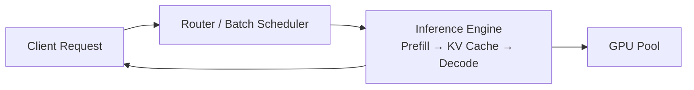

# Inference

> **Learning Path:** AI / LLM Foundations
> **Section:** 6.1.9 — Understand

**Inference**

### 1. The problem

You have a trained model. Training is done once. Product value comes from serving it millions of times.

The constraints appear immediately:
* Users expect interactive latency, 200-500ms for chat, <100ms for some real-time systems
* Each request needs the full model weights in memory, 10-100GB
* Generation is autoregressive: one token depends on all previous tokens
* Cost per request must be predictable and controllable

Naive serving - load weights per request, process one at a time - fails on cost and latency. Inference is the production problem of turning frozen weights into a reliable, cost-efficient service.

### 2. Mental model

Inference is a stateful compute service, not a stateless function.

The weights are the state. The input is a prompt. The output is generated tokens one by one. During decode the model is memory-bandwidth bound, not compute bound, because it re-reads the KV cache each step.

Think of it as: **Prefill = parallel, Decode = sequential loop**.

### 3. How it works

Essentially:

Prompt -> Tokenize -> Prefill -> Autoregressive Decode -> Detokenize -> Response

Prefill processes the whole prompt in parallel to build the initial KV cache. Decode generates tokens one at a time, each step attending to the growing cache.

Two mechanisms make this practical at scale:

* **Batching.** Multiple requests share one forward pass. Throughput goes up, latency for individual requests stays bounded.
* **KV cache.** Stores keys/values from previous tokens to avoid recomputation. Cache size grows with context length and is the main memory consumer.

Continuous batching lets new requests enter while others are still decoding, keeping GPUs full.

### 4. Architectural reasoning

Inference forces a decision: optimize for latency or throughput.

* **Low latency, interactive.** Small batch size, maybe 1, prioritize P99. Accept lower GPU utilization. Often use smaller models, quantization INT4/INT8, and streaming output so first token arrives fast.
* **High throughput, batch jobs.** Large batch size, max tokens per second. Accept higher average latency. Use continuous batching and larger models.

Where to run matters:
* **Centralized cloud GPU farm** for scale, autoscaling, and cost pooling. Good for variable demand.
* **Edge / on-prem** for data residency, <50ms SLOs, or offline use. Higher per-unit cost, limited model size.

Alternatives to raw inference: caching common prompts, speculative decoding, model distillation, or routing to smaller models first. These are architectural choices to reduce cost without changing the API.

### 5. Trade-offs and failure modes

* **Latency vs throughput.** Bigger batches = higher throughput, higher tail latency. The scheduler is the control point.
* **Cost vs quality.** Larger models and longer context improve quality but increase memory and per-token cost linearly. Quantization saves memory and cost but can degrade accuracy.
* **Memory pressure.** KV cache can OOM long contexts. Prefill of very long prompts spikes compute. Both cause latency cliffs.
* **Operational fragility.** Inference services fail with queuing buildup, not crashes. A single slow request can stall a batch. Cold start of model weights is minutes, not seconds.
* **Security / privacy.** Prompt data touches GPU memory. Need prompt filtering, output redaction, and isolation between tenants.

Common failure: designing for average QPS and hitting P99 spikes at peak, causing queue overflow and timeouts.

### 6. Example

Customer support chatbot vs nightly document summarization.

Chatbot needs P95 first-token latency <600ms, streaming. Architecture: autoscaled inference pool with continuous batching, max batch size 4, INT4 quantized 7-13B model, router with prompt cache. Cost target $0.001 per query.

Summarization runs offline on 10k documents per night. Architecture: batch job with large batch size 32, full precision 70B model, no streaming needed. Same model, different serving config, 5x cheaper per token because throughput is maximized.

### 7. Reasoning challenge

You are architecting fraud detection that scores transactions in <80ms P99. Model is 70B, needs high accuracy. Traffic is bursty, 10x spikes during sales.

Do you serve the 70B in cloud with autoscaling, distill to a smaller model and serve at edge, or use a cascade: small model first, 70B only on uncertain cases? What is the dominant constraint you would measure first?

### 8. Key takeaway

* Inference is a serving problem dominated by memory bandwidth, batching, and KV cache management.
* Prefill is compute heavy, decode is memory heavy and sequential.
* Choose architecture by latency SLO and cost per token, not by model accuracy alone.
* Throughput is created by batching and continuous batching; latency is protected by batch size limits and caching.
* Operationalize for queueing, memory, and tail latency, not just average QPS.
