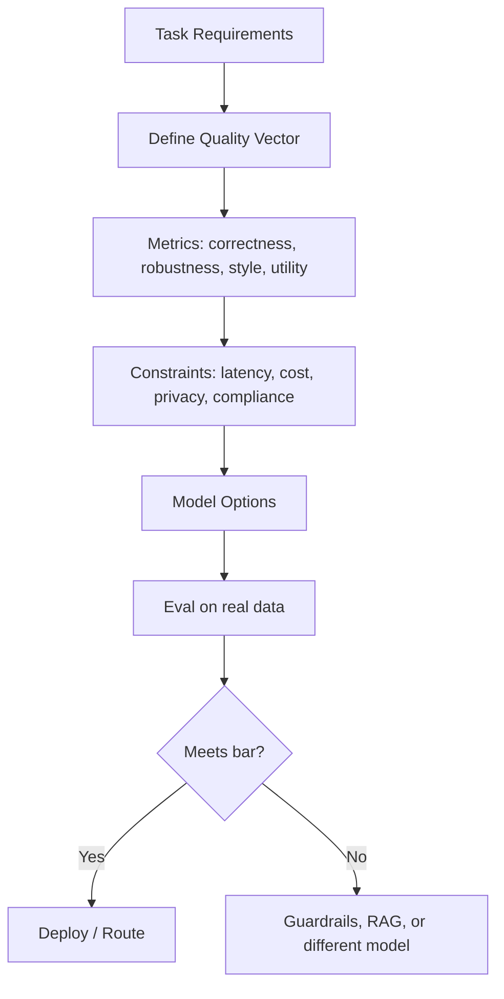

# Quality

> **Learning Path:** AI / LLM Foundations
> **Section:** 6.2.1 — Model selection

## 1. The problem

You have a task for an LLM. A frontier model scores high on benchmarks. You put it in production and it hallucinates on your domain, is too slow for chat, and costs $0.02 per request. A smaller model is fast and cheap but drops critical constraints.

Model selection fails when you treat *quality* as a leaderboard rank. In production quality is task-specific and constrained. The problem is not finding the best model, it is finding the model that meets a quality definition under real constraints.

## 2. Mental model

Quality is a vector, not a scalar.

For a given task you need to define quality as:
* **Correctness** - factual accuracy, instruction following, format adherence
* **Robustness** - consistency across inputs, low hallucination on edge cases
* **Style** - tone, brevity, safety, brand voice
* **Task-specific utility** - e.g., recall@k for retrieval, tool call validity for agents

A model can be excellent on one axis and poor on another. Your job is to match the vector to the use case.

## 3. How it works

Quality is validated, not assumed.

1. Define success criteria from the product requirement, not from a benchmark.
2. Build a small evaluation set from real production-like prompts and gold outputs.
3. Measure the candidate models on those metrics: accuracy, hallucination rate, latency p95, cost per request.
4. Decide if the quality is sufficient, or if you need guardrails, routing, or a different model.

## 4. Architectural reasoning

When it helps:
* User-facing generation where error cost is high
* Agents that call tools - invalid calls are worse than slow answers
* Regulated domains - privacy and explainability constraints

Alternatives:
* **Single best model** - simple, consistent, expensive
* **Tiered routing** - cheap model first, fallback to strong model on uncertainty
* **Hybrid** - small model for classification/routing, large model for generation

Why choose it: You trade model capability for system properties. A $0.002 model that is 92% correct with a retry policy can beat a $0.02 model that is 95% correct on cost and latency.

## 5. Trade-offs and failure modes

* **Quality vs Latency.** Larger models improve correctness but increase p95 latency. For synchronous chat you may need <800ms. That eliminates many frontier models.
* **Quality vs Cost.** Quality gains are logarithmic. The jump from 7B to 70B is big. 70B to frontier is marginal for many tasks, but cost multiplies 10x.
* **Benchmark overfitting.** Models tuned for MMLU or HumanEval do not generalize to your schema, jargon, or tool format. Always evaluate on your data.
* **Quality drift.** Prompt changes, data distribution shifts, and model updates silently degrade quality. Without continuous evaluation you will not notice until users do.

Common failure: picking a model for its headline score, then adding heavy post-processing to fix its weaknesses. That is often more expensive than picking a slightly weaker model that fits the task natively.

## 6. Example

Enterprise support triage.

Requirements: classify intent and extract fields from tickets, latency <600ms, cost <$0.001 per ticket, PII must not leave VPC.

Quality vector: field extraction F1 >0.95, no hallucinated fields, classification accuracy >0.93.

Options: frontier closed model 0.97 F1, 1200ms, $0.015, cloud. Mid-tier open model 0.95 F1, 400ms, $0.0008 on self-hosted GPU.

Decision: self-hosted mid-tier model meets the quality bar, satisfies latency/cost/privacy constraints. Frontier model rejected not because it is worse, but because it violates constraints and quality delta is not material.

Architecture: model behind evaluation harness, canary 5% traffic to frontier for regression detection, automatic rollback if F1 drops.

## 7. Reasoning challenge

You need a code generation assistant for internal developers. 
Option A: frontier model, 88% pass@1 on your internal tests, 2.5s latency, $0.04 per request.
Option B: distilled 32B model, 82% pass@1, 0.6s latency, $0.003 per request, runs on-prem.

Latency budget is 1s. Monthly volume is 1M requests.

Do you pick A, B, or a hybrid? What quality definition would change your decision?

## 8. Key takeaway

* Define quality from the task and constraints, not from a leaderboard.
* Quality is a vector of correctness, robustness, style, and utility.
* Evaluate on real data with real metrics before choosing a model.
* Model selection is a system trade-off between quality, latency, cost, and risk; routing and guardrails let you operate on the Pareto frontier.
