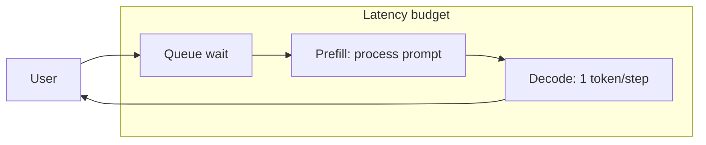

# Latency

> **Learning Path:** AI / LLM Foundations
> **Section:** 6.2.2 — Model selection

**The problem**

Users don't care about your model's benchmark score. They care about waiting.

In interactive AI, perceived latency is the time from prompt to first useful response, and the time between tokens. Miss that window and users abandon, retype, or assume the system is broken. Miss it consistently and your product fails even if the model is brilliant.

In model selection, latency is a hard constraint that sits alongside quality and cost. A larger, more capable model can be useless if it violates the latency budget for the use case.

**Mental model**

Think of latency as a budget you spend per request, not a single number.

Latency = Queue wait + Prefill + Decode

Prefill is parallelizable: the model processes the whole prompt at once. Decode is autoregressive: one token at a time, each depends on the previous. This is why latency has two personalities: Time To First Token TTF T and tokens per second.

You can trade quality for speed, but the trade is not linear. A smaller model is not just "faster", it changes the failure modes you can tolerate.

**How it works**

Model selection changes both terms:

* Prefill time scales roughly with model size, context length, and attention complexity. Larger models and longer contexts increase prefill.
* Decode speed is limited by memory bandwidth and head size. Smaller models fit better in cache, decode faster, and are less sensitive to batching.

You can also move latency without changing the model: quantization, distillation, speculative decoding, and better hardware all reduce latency at a quality cost. Model selection is the first lever, and the one with the biggest architectural impact.

**Architectural reasoning**

When to pick what:

* **Low latency, high interactivity** - chat, voice assistants, copilots in an IDE. Budget is < 300ms TTF T, < 50ms per token. Pick a smaller model, shorter context, aggressive quantization. Accept a quality drop for speed.
* **High quality, latency tolerant** - summarization, batch classification, code review overnight. Budget is seconds to minutes. Pick the largest model you can afford and batch requests.
* **Hybrid** - route by intent. Use a small model for triage and fast replies, escalate to a larger model only when needed. This is the common production pattern.

Alternatives to "pick a bigger model": caching, retrieval augmentation to shrink prompts, and prompt compression. Model selection is part of a system, not the whole system.

**Trade-offs and failure modes**

* **Latency vs Quality vs Cost.** Larger models improve quality but increase both latency and cost per token. The sweet spot is usually the smallest model that meets quality.
* **P99 vs average.** Decode is variable. Long outputs, high concurrency, and cold starts blow up tail latency. Design for P95/P99, not mean.
* **Batching improves throughput, hurts latency.** Batching increases tokens per second per GPU but adds queue wait. For interactive use, keep batch size low or use continuous batching with priority queues.
* **Context length is latency.** Every extra token in the prompt costs prefill time. Architects often limit context or summarize history rather than pay for longer windows.

Failure mode: picking a model based on benchmark Elo alone, then discovering TTF T violates UX in production. Latency must be measured under real load with real prompts.

**Example**

Customer support chatbot with SLA: first response < 800ms, 95% of users satisfied.

Option A: 70B model on A100. Great quality, but TTF T ~ 1.2s at load, P99 > 2s. Fails SLA, users retry.

Option B: 7B distilled model quantized to INT4, same hardware. TTF T ~ 220ms, P99 ~ 500ms. Quality is lower but acceptable for 80% of queries.

Architecture chosen: 7B as default, route to 70B only when confidence low or query is escalation. Latency budget met, cost drops 60%, user satisfaction rises.

**Reasoning challenge**

You are designing a code completion feature inside an IDE. Requirement: suggestions must appear <150ms TTF T, but completion quality must be high enough developers trust it.

You have access to a 1B model that meets latency easily, and a 34B model that is much better but too slow on a single GPU. What do you change first: model selection, inference optimization, or system architecture? Why?

**Key takeaway**

* Latency is a budget composed of queue wait, prefill, and decode. Model size hits all three.
* TTF T drives perceived responsiveness, tokens per second drives perceived smoothness. Optimize both differently.
* Choose the smallest model that satisfies quality for the latency budget; use routing and caching to handle exceptions.
* Measure latency under load at P95/P99, not benchmarks in isolation.
