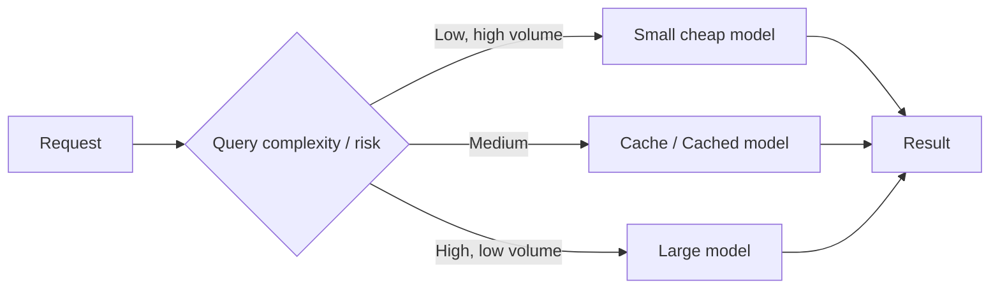

# Cost

> **Learning Path:** AI / LLM Foundations
> **Section:** 6.2.3 — Model selection

## The problem

LLM usage is metered by tokens, but business value is metered by outcomes. A model that is 10x more accurate can also be 10x more expensive per request, and cost scales with traffic in a non-linear way. 

The problem you hit in production is not "which model is best", it is: **How do you meet a quality bar for a task while keeping inference cost predictable and sustainable at scale?**

Cost surprises come from three places:
* Price per token varies wildly across model families and even within a family by size.
* Output tokens cost more than input tokens, and long prompts / long completions amplify cost.
* Real cost = model price + retries from hallucinations + latency-driven user drop-off + engineering overhead to operate the model.

## Mental model

Think of model cost as: **Cost per successful outcome.**

`Cost per successful outcome = (input tokens + output tokens) * price per token / success rate + amortized infra overhead`

A cheaper model that needs 2 retries or a human escalation is more expensive than a pricier model that gets it right once.

Model selection is therefore a constrained optimization: minimize cost per successful outcome subject to latency, quality, and risk constraints.

## How it works

In practice you control cost at three layers:

**Model tier** - same family, different sizes. e.g. 8B vs 70B vs 405B. Larger = higher quality ceiling, higher price and latency.

**Routing** - send simple queries to small/cheap models, hard queries to large/expensive models. This requires a classifier or confidence signal.

**System efficiency** - reduce tokens before they hit the model: prompt compression, context caching, semantic cache, output summarization, and retries only when needed.

## Architectural reasoning

When it helps to care about cost first:
* High-volume, low-risk tasks: summarization, classification, intent routing, internal tooling.
* User-facing products with tight latency budgets where a fast cheap model is good enough.
* Experiments and iterative development where you need many iterations.

When quality dominates cost:
* Low-volume, high-risk tasks: legal review, medical triage, financial decision support.
* Tasks where failure cost > model cost: a wrong answer triggers human review, compliance breach, or churn.

Alternatives to "just pick a bigger model":
* Better prompting and RAG to reduce needed reasoning capacity.
* Model routing / cascade: try cheap first, escalate on failure signal.
* Fine-tune a smaller model for your specific distribution.

Decision rule architects use: **Define a minimum acceptable quality threshold first, then find the cheapest model that reliably clears it.**

## Trade-offs and failure modes

* **Quality vs cost vs latency.** The three form a triangle. You can only optimize two. Larger models improve quality and increase latency and cost.
* **Hidden cost of retries.** Cheap models with low success rate increase total tokens via retries and increase latency.
* **Context window bloat.** Including full history is expensive. Every token you send is paid for on every request.
* **Cost overrun failure mode.** Unbounded prompt size + viral traffic + no guardrails = bill spike in hours. Always cap max tokens, enforce rate limits, and monitor cost per request in real time.
* **Over-engineering.** Building a complex router for a low-volume app adds maintenance cost that outweighs inference savings.

## Example

Enterprise support chatbot.

Initial design: use a flagship model for all conversations. Cost per conversation ~ $0.08, 500k conversations/month = $40k/mo. Latency p95 2.2s.

Architectural change:
* Intent classifier + semantic cache for FAQs → 40% of traffic answered with < $0.001.
* Route simple troubleshooting to a 8B model with RAG → 45% of traffic, cost ~ $0.004.
* Reserve flagship model for escalation and sensitive topics → 15% of traffic.

Result: cost per successful outcome drops ~6x, p95 latency drops to 900ms, quality on escalations maintained. The savings fund better RAG data and evaluation.

## Reasoning challenge

You have a new code-assist feature. Pilot data:
* 8B model: 82% correct completions, $0.0008 / request, 400ms
* 70B model: 94% correct completions, $0.006 / request, 1.2s

Acceptable defect rate is <10% before a developer is annoyed. Traffic forecast is 10M requests/month.

Would you deploy 70B for all, 8B for all, or a cascade? What metric would you monitor to decide?

## Key takeaway

* Cost per successful outcome, not price per token, drives model selection.
* Define quality threshold first, then minimize cost under latency and risk constraints.
* Routing, caching, and token reduction are architectural levers that often beat picking a bigger model.
* Monitor cost, latency, and success rate together. A cheap model that fails is the most expensive model.
