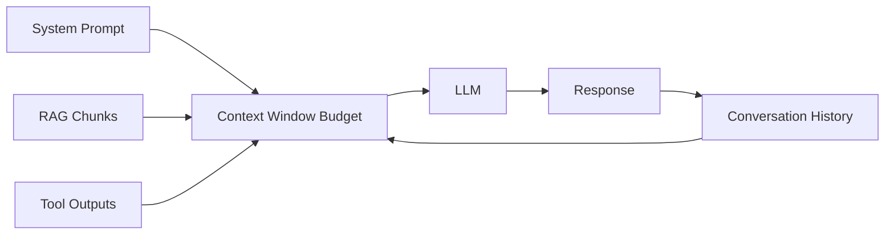

# Context length

> **Learning Path:** AI / LLM Foundations
> **Section:** 6.2.4 — Model selection

### 6.2.4 — Model selection: Context length

**The problem**
You want an LLM to reason over a real task: a long conversation history, a set of retrieved documents, tool outputs, and a system prompt. The model can only attend to a fixed number of tokens at once. If you exceed it, you get truncation, errors, or silent loss of information. If you stay far under it, you may be overpaying for unused capacity.

Context length is not a feature. It is a hard budget.

The budget must cover everything the model sees in one forward pass: system instructions + user prompt + history + retrieved context + tool results + the tokens the model will generate.

**Mental model**
Think of context length as RAM for a single request. It is measured in tokens, not characters. ~4 tokens ≈ 1 English word.

Two numbers matter:
* **Window size**: max input + output tokens the model can handle.
* **Effective usable input**: you need headroom for output and for the model to keep a working memory. Practically, usable input ≈ window - expected output - safety margin.

A larger window lets you keep more raw data in-context. A smaller window forces you to compress, summarize, or retrieve.

**How it works**
Tokenization is model-specific, so the same text costs different tokens across models. Architecturally this means you cannot reason about context in characters.

At inference time the model builds a KV-cache for every token in the window. Cost and latency scale with:
* Input tokens: proportional to window fill
* Output tokens: proportional to generation length
* Attention compute: ~ quadratic in sequence length for naive attention, optimized in practice but still monotonic

Therefore filling a 128k window costs materially more than filling an 8k window, even with the same model family.

**Architectural reasoning**
Context length drives model selection when you have a non-negotiable amount of information that must be in-context together.

When it helps to pick a larger window:
* Long documents must be compared holistically, e.g., contract redlining, code diff review.
* Conversation continuity matters and summarization would lose nuance.
* You need few-shot examples that are long and specific.

When it hurts:
* You pay for capacity you don't use. A 128k model on 2k-token prompts is wasteful.
* Larger windows often mean larger models, higher latency, and higher cost per token.
* Longer context can dilute attention; the model may perform worse on the important parts.

Alternatives to a bigger model:
* **Retrieval**: keep the window small, retrieve only relevant chunks per turn.
* **Summarization / compression**: maintain a running summary of history, or compress retrieved docs with a smaller model.
* **Hierarchical processing**: map-reduce over chunks, then synthesize.
* **Tooling**: offload structured work to tools and pass only results back.

Model selection is therefore: *Can I fit the required reasoning within a cheaper window via architecture? If not, do I need a larger window model?*

**Trade-offs and failure modes**
* **Cost vs fidelity.** Larger windows = higher input cost. For high-volume apps this dominates. A 128k model can be 2-5x more expensive per request than an 8k sibling.
* **Latency.** Longer prompts increase prefill time. Users feel this.
* **Attention dilution.** More context ≠ better answers. Relevant signal can be drowned out. Models have a "sweet spot" and a "lost in the middle" problem.
* **Silent truncation.** APIs may truncate oldest messages to fit. You lose system instructions or early conversation turns without an error.
* **Output budget.** Teams forget to reserve tokens for output. A 128k window filled with 120k input leaves only 8k for generation, often insufficient.

**Example**
Enterprise support assistant with 12-month conversation history per customer and a knowledge base.

Naive approach: pick a 200k context model and dump entire history + all retrieved KB articles into the prompt. Cost explodes, latency spikes, and answers degrade.

Architected approach:
* Keep a 32k window model.
* Store conversation as a vector DB of turns, retrieve last N turns + semantically relevant turns.
* Summarize long resolved threads into a compact memory entry.
* Retrieve top-k KB chunks, ~4k tokens max.
* System prompt + retrieved context + recent turns fits comfortably with budget for 1k output.

Result: same quality, lower cost, lower latency, and predictable behavior.

**Reasoning challenge**
You are designing a code-assistant for a monorepo. Average PR diff is 15k tokens. Developers want the model to reason across multiple files in the same request, and to keep the last 10 turns of discussion. The 32k model costs $0.03/1k tokens input, the 128k model costs $0.06/1k tokens input. Latency SLA is <2s.

Do you select the 128k model, or keep the 32k model and add an architecture change? What is the trade-off you are making?

**Key takeaway**
* Context length is a budget, not a capability. Design to fit inside it.
* Model selection is a trade-off between raw window size, cost, latency, and architectural complexity.
* Larger windows reduce the need for retrieval/summarization but increase cost and risk of attention dilution.
* Always reserve tokens for output and track real token usage per request type before choosing a model.

You should be able to reason: *What must stay in-context together? Can I compress or retrieve instead? What does that cost in dollars and latency?*
