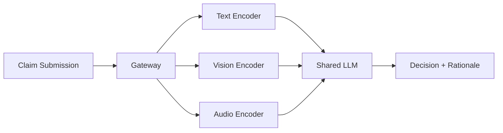

# Multimodal capability

> **Learning Path:** AI / LLM Foundations
> **Section:** 6.2.5 — Model selection

**The problem**

Text-only models break when the real world is not text. A user pastes a screenshot of an error, a doctor attaches an X-ray, a customer sends voice note + photo of a damaged product. With text-only you force a human to transcribe, describe, or drop the modality entirely.

The constraint is: the input and output you need are multimodal, but the model you can deploy must be chosen once. You cannot retrofit modality later without re-architecting data pipelines, latency budgets, and cost.

**Mental model**

A multimodal model is a single inference surface with multiple encoders feeding a shared reasoning core.

Text -> Text encoder
Image -> Vision encoder
Audio -> Speech encoder
All -> same latent space -> LLM backbone -> output in any modality.

Think of it as one brain with multiple sensory inputs, not separate specialists you have to orchestrate.

**How it works**

Each modality is projected into tokens the LLM understands.

Vision encoder extracts patches, audio encoder extracts frames, text is already tokens. A projector aligns them to the LLM's embedding space. The LLM then attends across modalities as if they were a long context.

Output can be text, or text-conditioned generation for image/audio. Most models today are multimodal in, text out. True multimodal out is rarer and more expensive.

The key is alignment, not just concatenation. The model must learn cross-modal grounding: which words correspond to which pixels, which sounds correspond to which concepts.

**Architectural reasoning**

When it helps:
* The task is inherently multimodal. Diagnosis from image + notes, visual question answering, document understanding with scanned PDFs.
* You want one model interface instead of N specialist services. Fewer failure modes, simpler ops.
* User experience demands natural interaction: point at screen, speak, upload.

When it hurts:
* Modality is optional or rare. 95% text, 5% images. Paying for vision encoder on every request is waste.
* You need best-in-class per modality. A dedicated vision model + text model often beats a generalist multimodal model on quality and cost.
* Strict latency/cost budgets. Vision tokens are expensive. A 1MP image can be 1k+ tokens.

Alternatives:
* Unimodal LLM + separate specialist model with orchestration. Cheaper for sparse use, better peak quality.
* Modality-specific pre-processing. OCR image to text, ASR audio to text, then feed text-only model. Loses nuance but is cheap and controllable.

**Trade-offs and failure modes**

* Cost vs fidelity. Multimodal inference costs more per request and higher latency. Vision tokens dominate.
* Hallucination across modalities. Model confidently describes objects not in image because text prior is strong.
* Token budget pressure. High-res images consume context window, crowding out text history.
* Data quality asymmetry. Model performance drops sharply if one modality is noisy, low-res, or missing. Architectures must handle missing modalities gracefully.
* Operational complexity. You now have to validate and guard multiple input types, manage larger payloads, and monitor modality-specific drift.

**Example**

Insurance claims triage.

Claim arrives as text description + photo of damage + short audio note from agent.

Unimodal approach: OCR photo -> text, transcribe audio -> text, then feed text LLM. You lose visual detail like crack patterns, and audio tone.

Multimodal approach: Single model receives text, image, audio together. It can reason: "The photo shows hail impact consistent with description, audio urgency is low, approve standard payout."

Architecture: API gateway validates and routes media, multimodal model for triage, text-only model for downstream policy generation. You use multimodal only where grounding matters.

**Reasoning challenge**

You are designing a customer support bot for a SaaS product.

* 80% of tickets are plain text.
* 15% include screenshots of UI errors.
* 5% include short screen recordings.

Latency SLO is 800ms p95, cost budget is tight. Do you pick a native multimodal model for all traffic, a text model with an OCR fallback for screenshots, or a hybrid router that only invokes multimodal when an image is present?

What do you monitor to know if your choice is working?

**Key takeaway**

* Multimodal capability exists to reduce translation loss between the real world and the model.
* Choose it when grounding across modalities is core to the decision, not just a nice-to-have.
* It trades cost, latency, and operational complexity for reduced orchestration and better user fidelity.
* Model selection is about sparsity of modalities and quality requirements, not feature checklists.
