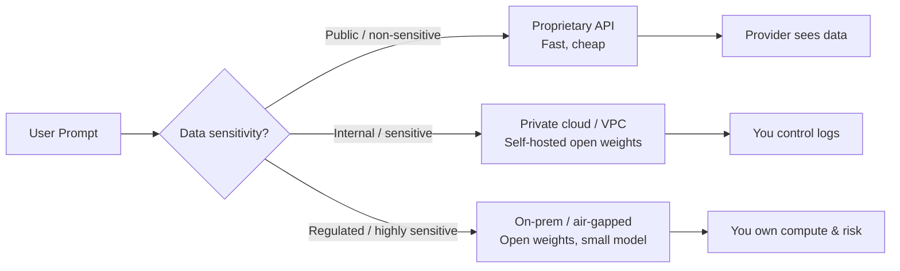

# Privacy

> **Learning Path:** AI / LLM Foundations
> **Section:** 6.2.6 — Model selection

### The problem

You need LLM capabilities for a product. Your prompts contain user data: PII, health records, internal code, customer conversations, financial transactions.

Sending that prompt to a third-party model API means the data leaves your trust boundary. You lose control over:
* Who can read it
* Where it is stored
* How long it is retained
* Whether it is used for training

Privacy is not a feature toggle. It is a constraint on data flow.

### Mental model

Model selection is a data governance decision disguised as a performance decision.

Think of it as three layers of exposure:
1. **Inference exposure:** The prompt and response are visible to the model provider during the request
2. **Retention exposure:** Logs, telemetry, and debugging stores keep data after the request
3. **Training exposure:** Data may be used to improve the model, directly or indirectly via memorization

A private model = you control all three layers. A public API = you trust the provider's controls for all three.

### How it works

Model choice determines the hosting topology, which determines privacy guarantees.

Proprietary API models: best performance/cost, zero ops. You accept provider's DPA, data retention policy, and geographic residency.

Self-hosted open-weight models: you run inference in your infra. You control logging, network egress, and data at rest. You pay for compute and lose some frontier performance.

Smaller on-device models: data never leaves the device. Best privacy, worst capability and context length.

### Architectural reasoning

When does privacy drive model selection?

* **Regulatory constraint exists.** GDPR, HIPAA, PCI-DSS, ITAR require data residency and purpose limitation. If you cannot guarantee that, you cannot use a public API.
* **Data is non-public by contract.** Customer data in a B2B SaaS product is your customer's data, not yours to share.
* **Prompt data is derived from sensitive sources.** RAG over internal docs means the prompt contains the doc content. That content is now exposed to the model provider.

Alternatives to a full private deployment:
* **Data minimization + redaction** before sending to API. Reduces risk but rarely sufficient for regulated data.
* **Synthetic data / anonymization** for fine-tuning. Helps training exposure but not inference exposure.
* **Bring-your-own-key + private endpoints.** Improves network isolation but does not remove provider access to data for inference.

Choose private deployment when the cost of a breach > cost of running your own infra. Choose API when data is truly public and latency/cost matter more.

### Trade-offs and failure modes

* **Privacy vs capability.** Frontier models are almost exclusively API-first. Self-hosted open weights lag 3-12 months. You trade privacy for quality.
* **Privacy vs cost.** Self-hosting shifts CapEx to GPU clusters, autoscaling, and ML ops. API is pay-per-token.
* **Privacy vs operability.** You own model updates, security patches, and monitoring. An API abstracts that away.
* **False sense of privacy.** `no-logging` flags and DPAs do not prevent in-memory access by the provider. Fine-tuning on your data creates model memorization risk even if logs are deleted.

Failure modes architects miss:
* Prompt leakage via RAG: you retrieve a private document, include it in the prompt, it is now sent externally.
* Chat history retention by default in apps.
* Employee data in system prompts for internal tools.
* Model inversion attacks extracting training data from open-weight models you fine-tuned on private data.

### Example

Enterprise support assistant for a bank.

Problem: agents need LLM help summarizing tickets. Tickets contain account numbers and PII.

Options:
* Public API: cheapest, best model. Violates PCI-DSS and customer contract. Rejected.
* Private cloud deployment of a mid-tier open model in VPC with no internet egress, logging disabled, and prompt redaction for account numbers. Acceptable. Cost ~$40k/mo in infra.
* On-prem smaller model on-premise for the most sensitive tickets. Slower, but meets audit requirement.

Decision: hybrid. Public API for public FAQ, private deployment for ticket summarization, redaction layer before any external call.

### Reasoning challenge

You are building an AI copilot for doctors drafting clinical notes. Notes contain PHI. The model vendor offers a HIPAA-compliant API with BAA, data not used for training, and EU residency.

Do you use the API, self-host an open model, or a mix? What additional controls would you require beyond the vendor's BAA?

### Key takeaway

* Privacy is an architectural constraint on data flow, not a model feature.
* Model selection = who sees the prompt, where it is stored, and whether it can influence future model behavior.
* Public API = trust and contractual controls. Self-hosted = technical controls. On-device = minimal exposure.
* The cheapest model is expensive if it violates regulation or customer trust.
