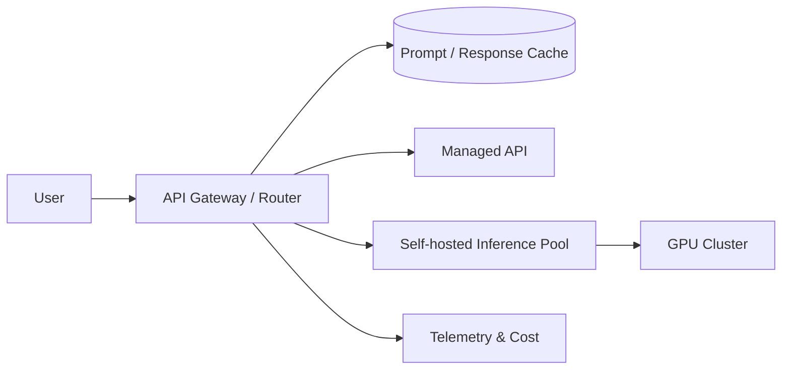

# Hosting

> **Learning Path:** AI / LLM Foundations
> **Section:** 6.2.7 — Model selection

### The problem

You need LLM capability in production. The model is not the decision. The hosting choice is the decision.

Picking a model without knowing where it runs leads to: latency you can't meet, data you can't protect, costs that explode, and an ops team you don't have.

Model selection is therefore hosting selection. The same model behaves differently on a managed API vs a self-hosted GPU cluster vs an edge device.

### Mental model

Hosting is the control plane for three non-functional properties: **data sovereignty, latency profile, and cost predictability**.

Think of it as a spectrum of control:

`Managed API` -> `Managed cloud service` -> `Self-hosted on cloud` -> `On-prem / air-gapped`

Moving right increases control and compliance, and increases operational burden and capital cost. Moving left increases speed to value and reduces ops, and reduces control.

### How it works

Essentially you are placing inference compute close to data, users, and compliance boundaries.

**Managed API** - you call a provider endpoint. Provider owns model weights, GPUs, autoscaling, patching.
**Managed cloud service** - e.g., Azure OpenAI, Bedrock. You stay in your cloud account, get network isolation, logging, but model still runs on vendor infra.
**Self-hosted open weights** - you deploy open models with vLLM/TGI/Llama.cpp. You control hardware, quantization, routing, fine-tuning data.
**Edge/on-device** - tiny models run locally for offline/low-latency use.

The architecture is the same pattern: Router -> Gateway -> Inference Pool -> Caching -> Telemetry.

### Architectural reasoning

When it helps:

* **Managed API** helps when you need speed to market, variable traffic, and no GPU ops expertise. Good for prototyping, internal tools, non-sensitive workloads.
* **Managed cloud service** helps when you need compliance features like VPC, private link, audit logs, but still want vendor managed inference.
* **Self-hosted** helps when data cannot leave your perimeter, latency must be guaranteed, or you need cost control at scale. Also needed for custom fine-tuning and model routing logic.

Alternatives to consider:
* API vs self-host is not binary. Hybrid is common: managed for 95% traffic, self-hosted for sensitive workloads.
* Model choice is coupled to hosting. A 70B model is fine on managed API, impossible on edge. A 3B quantized model may be fine on edge.

Decision drivers:
* Data sensitivity / regulation
* P95 latency budget
* Traffic pattern and cost predictability
* Team ops capacity for GPUs
* Need for customization, fine-tuning, or prompt routing

### Trade-offs and failure modes

* **Control vs Ops burden.** Self-host gives you data control, but you own GPU failures, autoscaling, quantization, and security patching.
* **Cost predictability vs burst capacity.** Managed API is pay-per-token, simple. Self-host is fixed capex + utilization risk. Under-utilized GPUs burn money.
* **Latency vs consistency.** Managed APIs have variable cold start and network hops. Self-hosted in same region gives stable latency.
* **Vendor lock-in vs speed.** Managed APIs make switching models easy but switching providers hard due to API differences and fine-tunes.

Common failures:
* GPU contention causing queue blow-ups under load
* Prompt cache misses leading to 2-3x cost
* Missing data residency leading to compliance breach
* Over-provisioning self-hosted fleet for peak that never comes

### Example

Fintech customer support chatbot handling PII and account data.

Constraints: EU data residency, P95 latency < 400ms, 10k RPM peak.

Decision: Managed API is out due to data residency. Self-host Llama 3 70B quantized on Azure NDv5 in EU region with vLLM, private link, and prompt caching in Redis.

Trade-off: Team hired one ML ops engineer, added autoscaling and model router that falls back to smaller 8B model for simple queries to reduce GPU load. Cost is higher fixed but predictable, latency stable, compliance met.

If they had chosen managed API, they would have shipped in 2 weeks but failed audit.

### Reasoning challenge

You are building a medical triage assistant for a hospital network. Data is PHI, latency budget is 800ms, traffic is 200 RPM steady with 10x spikes at night. Team has no GPU ops experience.

Would you start with managed API, managed cloud service, or self-host? What is the first constraint that forces you to move right on the control spectrum?

### Key takeaway

* Hosting choice is an architectural decision, not an infra detail. It determines latency, cost, compliance, and ops burden.
* Data sovereignty and latency requirements dominate the decision more than model accuracy.
* Managed API optimizes for speed to value, self-host optimizes for control and cost at scale. Most production systems use a hybrid.
* Model selection only makes sense after you have chosen the hosting constraints it must live within.
