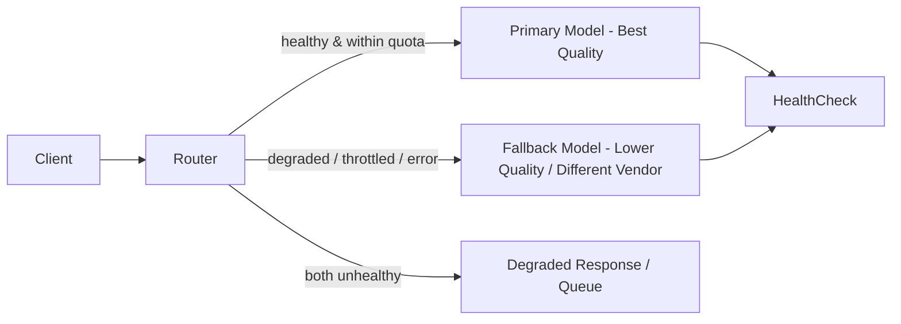

# Availability

> **Learning Path:** AI / LLM Foundations
> **Section:** 6.2.8 — Model selection

### The problem

You select a model on benchmarks: best accuracy, long context, low cost. You ship. Then it throttles you at peak traffic, it is unavailable in the region where your users live, or the vendor has an outage for 20 minutes. The model is technically correct but not usable.

Model selection is not just capability. It is the ability to serve a request reliably, within latency SLO, in the right place, under load. Availability is the constraint that turns a good model into a production model.

### Mental model

Availability = probability a request gets a valid response within its SLO, not just "is the service up".

For LLMs this is three layers:
* **Service availability**: vendor API uptime SLA
* **Capacity availability**: rate limits, tokens per minute, concurrent requests
* **Geographic availability**: model exists in the region you need for latency and compliance

A 99.9% SLA sounds good until you realize it allows 43 minutes of downtime per month, and your traffic peaks at 10x baseline for 5 minutes during an incident.

### How it works in model selection

Availability shapes the selection criteria beyond benchmarks.

**Uptime and SLA.** Managed APIs publish SLAs. Self-hosted gives you control but you own uptime.

**Rate limits and burst.** LLMs are quota-limited. Availability at 100 RPM is not availability at 10k RPM. You need headroom for traffic spikes.

**Latency SLO.** Availability includes latency. A model that times out at p99 is unavailable for that user.

**Region and data residency.** If your data cannot leave EU, a model only available in US-East is unavailable to you.

**Model lifecycle.** Vendors deprecate models. An API version can be retired with 6 months notice. Selection must consider longevity.

### Architectural reasoning

When does availability drive the decision?

* **User-facing synchronous paths** need high availability and low tail latency. Chat, search, real-time agents.
* **Batch/async paths** can tolerate lower availability. Backfill, summarization, nightly jobs.
* **Compliance-bound workloads** need regional availability.

Alternatives:
* Single best model from one vendor. Simpler, lower cost, single failure domain.
* Multi-vendor routing with fallback. Higher availability, higher complexity.
* Self-hosted open model. Full control of availability, you pay for ops and lose rapid capability upgrades.

Decision is driven by SLO, not benchmark.

This router is the architecture availability demands. Health checks measure error rate, latency, and quota. Circuit breakers open on sustained failure.

### Trade-offs and failure modes

* **Availability vs capability.** The best model is often the least available. Smaller, widely replicated models can be more available.
* **Availability vs cost.** Multi-region, multi-vendor redundancy doubles cost. Self-hosted reduces vendor dependency but shifts ops burden.
* **Availability vs consistency.** Fallback models change output style and quality. Users notice.
* **Throttling cascades.** One slow request holds connections, backs up queues, and makes the service look unavailable even though the model is up.

Common failure modes architects miss:
* Assuming API uptime = your availability. Rate limits cause effective downtime under load.
* No warm-up. Cold start after scale-up increases p99 latency and timeouts.
* Vendor incident in one region only. Your global app becomes regionally unavailable.
* Model deprecation without migration plan. Production breaks on a scheduled date.

### Example

Enterprise customer support bot, 99.9% availability SLO, EU data residency.

Model A: top accuracy, 99.9% SLA, only US-East, 3k TPM quota.
Model B: 5% lower accuracy, 99.95% SLA, available in EU and US, 10k TPM quota, same price.

Choice: Model B as primary in EU, with Model A as optional quality boost for non-PII queries routed to US. Router monitors TPM and latency, falls back to Model B if Model A throttles.

The architecture accepts a small accuracy loss for guaranteed service in the required region and higher burst capacity.

### Reasoning challenge

You need a real-time co-pilot for a trading desk. Latency SLO <800ms p95, 99.95% availability, data must stay in US. Vendor X offers best accuracy, 99.9% SLA, single US region, strict TPM limits. Vendor Y offers slightly lower accuracy, 99.99% SLA, multi-region US, higher quotas, and an open-weight model you can self-host for the same latency.

Do you pick X, Y, or a hybrid? What do you measure first to validate availability, and what is your fallback plan when the primary is throttled at market open?

### Key takeaway

* Availability for LLMs is uptime * capacity * latency * region, not just API status.
* Choose models based on SLOs and constraints, not benchmarks alone.
* Design for failure with routing, health checks, and graceful degradation.
* Document model lifecycle and regional limits as part of selection criteria.

Availability is the reason a good model stays in the lab and a slightly worse model runs in production.
