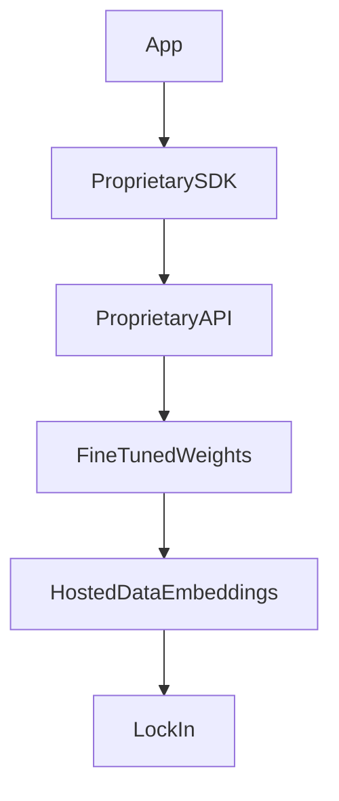

# Vendor lock-in

> **Learning Path:** AI / LLM Foundations
> **Section:** 6.2.9 — Model selection

**Vendor lock-in**

### The problem

You need a model that works today. The best option is a managed API with proprietary tools, fine-tuning, and hosted embeddings. Six months later the price doubles, the model is deprecated, or compliance requires data residency you can't get.

The problem isn't the vendor. It's that switching cost grows over time while the decision looks cheap at first.

In LLM selection this compounds: model behavior, prompt format, tool calling, fine-tuning data, and evaluation metrics all co-evolve with the provider. The more you build on top, the more the provider becomes the platform.

### Mental model

Vendor lock-in is accumulated switching cost, not a single choice.

Think of it as layers of coupling:

Each layer is optional. The deeper you go, the more you pay to leave. An adapter at the API layer is cheap. A fine-tuned model plus proprietary evaluation harness is expensive.

### How it works

Lock-in accrues through four vectors in AI:

* **Interface lock-in:** Provider-specific chat completions, tool schemas, streaming, and rate limits. Your code calls `openai.chat.completions.create` directly.
* **Model behavior lock-in:** Prompts, system messages, and few-shot examples tuned to one model's quirks. Performance drops on another model even with same parameters.
* **Data and training lock-in:** Fine-tunes, RLHF jobs, and proprietary vector stores with provider-specific embeddings. Re-embedding is costly and changes retrieval quality.
* **Operational lock-in:** Observability, guardrails, and deployment pipelines built around one console. Team expertise becomes provider-specific.

You get velocity first. You pay later.

### Architectural reasoning

When does lock-in help?

* You need speed to market and the provider offers managed quality, safety, and scale you can't build.
* The workload is experimental, with short lifetime.
* Cost of abstraction exceeds expected switching cost.

When does it hurt?

* Core IP or regulated data lives in the model.
* Multi-year cost commitments or compliance constraints are likely.
* You need best-of-breed model selection per task, not one model for all.

Architectural decision: accept tactical lock-in with an exit path, or design for portability from day one.

A portable architecture isolates the model as a replaceable capability:
`App -> Model Interface -> Adapter -> Vendor A/B`

The interface defines your contract: messages in, structured output out, latency SLOs, cost budget. Adapters translate to vendor specifics. Evaluation and prompt management stay in your control.

### Trade-offs and failure modes

* **Velocity vs portability.** Abstraction adds latency in development and sometimes runtime. You ship slower now to ship anywhere later.
* **Best model vs best platform.** The best model changes quarterly. The best platform is sticky. Picking one optimizes for today.
* **Managed safety vs control.** Hosted guardrails are convenient until policy changes break your workflow.
* **Cost predictability.** Provider pricing is not stable. Self-hosted open weights trade ops cost for price control.

Failure modes architects see: sudden model deprecation, breaking API changes, embedding dimension changes breaking retrieval, fine-tune data export restrictions, and compliance audits failing because data left the region.

### Example

Enterprise support chatbot.

Initial choice: OpenAI API, `gpt-4o` with function calling for ticket creation, embeddings in OpenAI vector store, fine-tune on internal FAQs.

Six months in, EU customers require data residency. OpenAI cannot guarantee it. Switching requires:
* Re-embedding 2M docs with new model, re-tuning retrieval thresholds
* Re-writing prompts for Anthropic's tool format
* Re-running evaluation suite because output style differs
* Re-training the fine-tune or switching to RAG-only

Cost is weeks of eng + quality regression. If an adapter and model-agnostic eval harness had been built, the switch is adapter work + re-eval, not rewrite.

### Reasoning challenge

You are designing a medical triage assistant. Latency <800ms p95, PHI cannot leave your VPC, model choice must be auditable.

You can use a managed API with zero ops cost, or self-host an open-weight model with full control.

Where do you accept lock-in and where do you enforce portability? What is the minimum abstraction you need to keep optionality open without over-engineering?

### Key takeaway

* Lock-in is a deliberate trade for speed; make it explicit.
* Decouple at the model interface layer early. Keep prompts, eval, and data in your repo, not the vendor console.
* Fine-tuning and proprietary embeddings are the deepest lock-in; treat them as architectural commitments.
* Design for evaluation-driven model selection, not vendor-driven. If you can swap models with a config change, you own the decision.

You want to be able to leave the vendor, not to actually leave.
