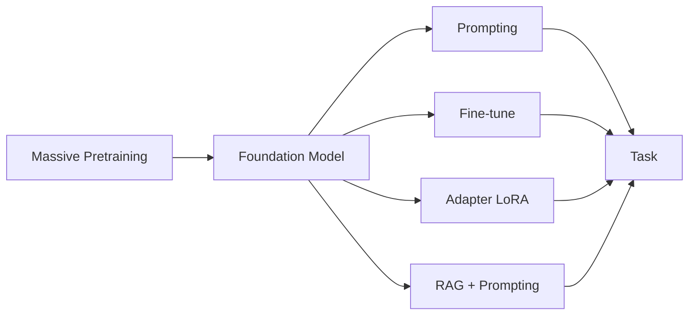

# Foundation models

> **Learning Path:** AI / LLM Foundations
> **Section:** 6.3.1 — Model patterns

**Foundation Models: 6.3.1 — Model patterns**

### 1. The problem

You need language, vision or multimodal capabilities across dozens of tasks: classification, summarization, code generation, chat, extraction.

Training a high-quality model from scratch per task is infeasible. It requires billions of tokens, weeks of compute, and a team of researchers. Even fine-tuning a medium model from scratch for each customer domain is expensive and slow.

The constraint is not accuracy on one task. It is **economies of scale**: how to amortize massive pretraining cost across many downstream uses while keeping each use controllable, cheap, and safe.

### 2. Mental model

A foundation model is a large pretrained representation learner, not a finished application.

Think of it as a general-purpose engine. Pretraining gives it the ability to map inputs to rich internal representations. You do not rebuild the engine for each car. You change the interface, fuel mix, and control software.

The pattern is always: **Base → Adapt**.

Base = pretraining on broad unlabeled data. Adapt = a lightweight pattern that specializes the base to a task without retraining everything.

### 3. How it works

Pretraining learns general patterns of language/vision. Then adaptation is chosen based on constraints.

Four common adaptation patterns:

* **Prompting / In-context learning.** No weight change. You steer behavior with examples and instructions. Fastest, cheapest, zero training.
* **RAG.** Leave weights frozen, inject external knowledge at inference. Solves freshness and hallucination without retraining.
* **Parameter-efficient fine-tuning, e.g. LoRA.** Train small adapter matrices on top of frozen base. ~0.1-1% of parameters, much cheaper than full fine-tune, can be swapped per tenant.
* **Full fine-tuning / Instruction tuning.** Update all weights on domain data. Highest fidelity and control, highest cost and risk of catastrophic forgetting.

### 4. Architectural reasoning

When it helps:
* You have many downstream tasks sharing the same modality.
* You have limited labeled data for each task.
* You need rapid iteration and A/B testing.

Why choose it over task-specific models:
* **Reuse amortizes cost.** One pretraining run serves N products.
* **Data efficiency.** Adaptation needs 10s-1000s of examples, not billions.
* **Operational consistency.** Same base, same safety filters, same observability.

Alternatives:
* Train small models from scratch per task. Cheaper to train, but worse generalization and needs more labeled data per task.
* Use closed APIs only. Fast to start, but limited control, latency, cost, and data privacy.

Decision rule: If the task is narrow and data is abundant and static, full fine-tune can win. If data is scarce, sensitive, or changing, prefer prompting + RAG + adapters.

### 5. Trade-offs and failure modes

* **Generalization vs control.** Base models hallucinate and reflect pretraining biases. More adaptation increases fidelity but reduces generality and increases overfit risk.
* **Cost model shifts.** Training cost moves from per-task to once-per-base. Inference cost rises with model size. Adapters reduce training cost but increase serving complexity.
* **Data privacy and compliance.** Fine-tuning on customer data bakes it into weights. Prompting + RAG keeps data out of weights, easier for audit and deletion.
* **Versioning and drift.** Base model updates invalidate prompts and adapters. You need a model registry, evaluation harness, and canary rollout.
* **Failure modes.** Prompt injection, context window limits, RAG retrieval errors leading to confident wrong answers, adapter interference when stacking.

### 6. Example

Enterprise support assistant.

Base: 70B instruction-tuned LLM.

Architecture:
* RAG over ticket KB, product docs, and internal runbooks with retrieval grounded to product version.
* LoRA adapter per product line trained on 2k anonymized resolved tickets.
* System prompt enforces tone, escalation policy, and refusal for PII.

Why this pattern? No retraining for new KB articles. Adapter gives product-specific style without touching base. RAG keeps answers current. Prompting enforces guardrails at inference time.

Cost: one base model serving, adapter swap per request is cheap. Data never leaves the org for fine-tuning.

### 7. Reasoning challenge

You must build a medical triage classifier for a hospital network. Data is limited to ~5k labeled cases, highly sensitive PHI, and regulations require explainability and auditability. Latency budget is 300ms.

Do you choose prompting + RAG, LoRA adapter, or full fine-tune? What changes if the hospital wants a model per department?

### 8. Key takeaway

* Foundation models exist to amortize pretraining cost across many tasks via reusable bases.
* Choose adaptation pattern by data availability, privacy, latency, and control needs: prompting for speed, RAG for freshness, adapters for customization, full fine-tune for maximum fidelity.
* Architect for model lifecycle: versioning, evaluation, guardrails, and cost at inference, not just training accuracy.
* The decision is not which model is best, it is which adaptation pattern matches your constraints.
