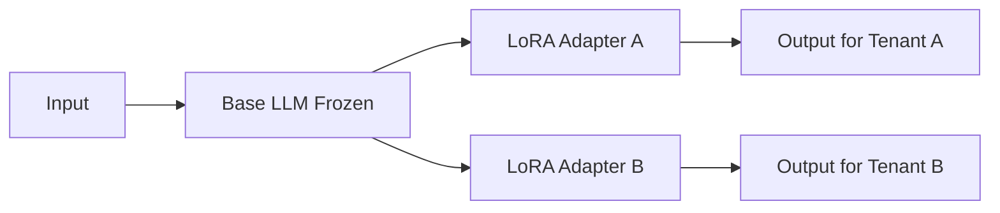

# LoRA / PEFT

> **Learning Path:** AI / LLM Foundations
> **Section:** 6.3.6 — Model patterns

**6.3.6 — Model patterns: LoRA / PEFT**

### 1. The problem

You need a large language model to behave differently for different use cases: customer support tone for one brand, legal summarization for another, internal tooling for engineering.

Full fine-tuning solves this, but creates an architectural problem:
* A 70B model needs hundreds of GB of VRAM and hours/days of training per variant.
* You now have N full copies of the model to store and serve.
* Updates to the base model force you to re-train everything.
* Small datasets overfit and you lose general capability.

The constraint is not accuracy alone. It is **cost, storage, and composability** at model scale.

### 2. Mental model

Think of a base model as a frozen general knowledge core. You don't need to rewrite the core; you need a small, cheap steering layer that shifts its behavior for a specific task.

LoRA = Low-Rank Adaptation. Instead of updating all weights W, you learn a tiny delta ΔW = A × B where A and B are thin matrices. The base weights stay frozen, the adapter is injected at inference time.

PEFT is the family. LoRA is the dominant member because it is cheap to train, cheap to store, and composable.

### 3. How it works

During fine-tuning, the forward pass becomes:

W' = W_frozen + α * (A · B)

W is frozen. A and B are initialized small and trained. Rank r is typically 8-64, so parameters per layer are ~2 * r * d instead of d².

At serve time you have two options:
* Merge: W' = W + A·B once, serve as a normal model. Fast inference, one artifact per tenant.
* Unmerged: keep base + adapter separate and add on the fly. Slower, but you can hot-swap adapters per request.

One base, many tiny adapters.

### 4. Architectural reasoning

When it helps:
* You need many specialized variants from one base model.
* You have limited data and compute per variant.
* You want to keep the base model up to date without retraining.
* You need fast iteration for product teams.

Alternatives:
* Full fine-tuning: maximum capacity, maximum cost. Good for a single flagship product with huge data and budget.
* Prompt tuning / in-context learning: zero training cost, but limited steering and higher inference tokens. Good for ephemeral tasks.
* Adapters / QLoRA: similar to LoRA, QLoRA adds 4-bit quantization to fit training on consumer GPUs.

Decision rule: if the delta you need is narrow and you need many of them, prefer parameter-efficient methods. If you need a fundamental shift in capability, full fine-tune may still win.

### 5. Trade-offs and failure modes

* Capacity vs size. Low rank limits expressiveness. A complex rewriting task may need higher rank or full fine-tune.
* Rank selection is a real tuning problem. Too low = underfit, too high = wasted params and risk of overfitting.
* Inference cost. Unmerged adapters add a small matmul per layer. Merged adapters are free at inference but cost storage per variant.
* Composition is not free. You can stack adapters, but interference grows. Merging two LoRAs is not guaranteed to preserve both behaviors.
* Catastrophic forgetting is avoided, but you can still overfit to the adapter data and lose instruction following.
* Operational complexity. You now have a model registry of adapters, versioning, and routing logic: which adapter for which request.

### 6. Example

Enterprise SaaS with one 70B base model serving 200 customers.

Full fine-tuning: 200 × 140 GB = 28 TB of weights, separate training pipelines.

LoRA: 1 × 140 GB base + 200 × ~80 MB adapters = ~156 GB total. Training per customer runs on 1-2 GPUs for hours on a few thousand examples.

Routing layer selects adapter by tenant id, loads it into memory on demand, or serves merged variants for hot customers. Base model upgrades roll out once; adapters are re-trained only if needed.

### 7. Reasoning challenge

You have a medical coding assistant that must be certified per hospital system with strict data isolation. You can either fine-tune a separate model per hospital or use LoRA adapters with a shared base.

What factors decide whether LoRA is sufficient, and what operational guardrails would you put in place for adapter storage, evaluation, and rollback?

### 8. Key takeaway

* LoRA exists to make specialization cheap and composable, not to beat full fine-tuning on raw capacity.
* The architectural win is one base + many small adapters, enabling multi-tenancy and fast iteration.
* Choose rank and merge strategy based on serving constraints: latency vs storage vs swap speed.
* Monitor for underfitting, adapter interference, and version drift; treat adapters as first-class artifacts with CI/CD.
