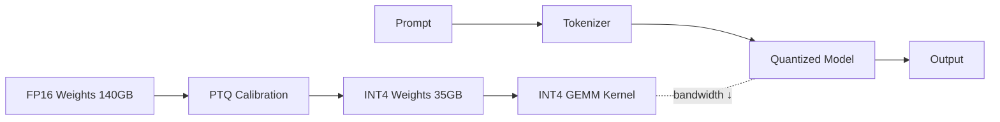

# Quantization

> **Learning Path:** AI / LLM Foundations
> **Section:** 6.3.7 — Model patterns

**Quantization**

### 1. The problem

You have a model that is accurate but too big to run economically.

A 70B parameter LLM in FP16 is 140 GB of weights. It does not fit on a single consumer GPU, needs multiple high-memory accelerators, and inference is memory-bandwidth bound, not compute bound. Each token requires loading the full weight matrix from HBM to SRAM. Smaller batch size, higher latency, higher cost per token.

The constraint is not accuracy, it is deployment: memory footprint, throughput, latency, and dollar cost per inference. You need the same model behavior with less bits moved.

### 2. Mental model

Quantization is lossy compression of numeric precision.

Think of it as reducing color depth. A 24-bit image has 16 million colors. An 8-bit image has 256. Visually similar for most content, smaller file, faster to move. Quantization maps a wide floating point range to a small integer range with a scale and zero-point.

Weights are not random. They cluster around zero with long tails. You can represent them with 4-8 bits instead of 16-32 with a small error, and the network tolerates that error because it was trained to be robust.

### 3. How it works

Core mechanism: map real values `x` to integers `q` via `q = round( x / scale + zero_point )`, and dequantize on the fly for compute.

Two dimensions matter:

* **What to quantize:** Weights only, activations only, or both. Weights are quantized offline. Activations are dynamic per token.
* **When to quantize:** Post-Training Quantization PTQ calibrates scale from a small representative dataset. Quantization-Aware Training QAT simulates quantization during training for higher fidelity.

In practice for LLMs:
* **PTQ weight-only INT4/INT8** is the default. Methods like GPTQ and AWQ exploit outlier channels and per-channel scaling to keep accuracy.
* **Dynamic activation quantization** keeps activations in higher precision and quantizes on the fly.
* Hardware kernels like Tensor Cores, INT4/INT8 GEMM, and GGUF formats make the quantized weights actually faster, not just smaller.

### 4. Architectural reasoning

Quantization solves a capacity and cost problem, not a modeling problem.

Choose it when:
* You need the same model class on cheaper hardware. Edge device with 8 GB RAM, single GPU serving, or multi-tenant serving with higher QPS.
* Inference is memory bandwidth bound. Reducing bits per weight directly increases tokens/sec.
* Latency SLOs require smaller models or larger batch sizes.

Alternatives:
* **Smaller model / distillation**: changes model capacity. Quantization preserves capacity.
* **Pruning**: removes parameters. Quantization keeps all parameters, just cheaper.
* **Speculative decoding / MoE routing**: improves throughput differently.

Decision rule: If accuracy loss from 4-8 bit is acceptable for your task, quantization is usually the cheapest first lever before retraining a smaller model.

### 5. Trade-offs and failure modes

* **Accuracy degradation**: Typically 1-3% on general benchmarks for INT4, near zero for INT8. Degrades more on math, coding, and long-context reasoning where precision matters.
* **Calibration sensitivity**: PTQ quality depends on calibration set distribution. A bad calibration set creates systematic errors.
* **Outliers**: A few large-magnitude weights dominate error. Per-channel scaling and AWQ's activation-aware weighting exist to mitigate this.
* **Hardware lock-in**: INT4 performance is great on NVIDIA H100/A100, mediocre elsewhere. Quantization format choice affects portability.
* **Serving complexity**: You now maintain two artifacts: original and quantized. Validation, rollback, and A/B testing overhead increase.

Failure mode to watch: silent quality drop on tail tasks. Quantized model passes generic evals but fails on domain-specific numeric tasks. Always measure task-specific metrics, not just average perplexity.

### 6. Example

Enterprise customer support assistant based on Llama 3 70B.

Unquantized: 140 GB FP16, requires 2x80 GB H100, ~$60/hr, ~50 tokens/s, fits 2 concurrent users per node.

INT4 GPTQ quantized: 40 GB, runs on 1x H100 80 GB, ~$30/hr, ~120 tokens/s due to higher memory bandwidth efficiency. Accuracy on internal QA set drops from 82.4 to 81.1 F1, within tolerance.

Architectural decision: quantize + vLLM with paged attention for cost reduction, keep FP16 golden model for evaluation and for high-stakes flows.

### 7. Reasoning challenge

You are architecting a real-time code completion service. Latency p95 < 120ms, throughput > 1000 req/s. Options: 32B model in FP16 on 8 GPUs, or 70B model INT4 on 4 GPUs. Accuracy on code generation is critical.

What do you measure first before choosing quantization, and what operational risk do you accept if you go INT4?

### 8. Key takeaway

* Quantization trades numeric precision for memory bandwidth and cost, not model size in parameters.
* It is an inference deployment pattern. Choose it to fit larger models into smaller hardware or increase throughput.
* PTQ INT4/INT8 gives most value with minimal retraining. QAT is needed when accuracy loss is unacceptable.
* Validate on task-specific metrics and watch for outlier sensitivity and calibration drift.
