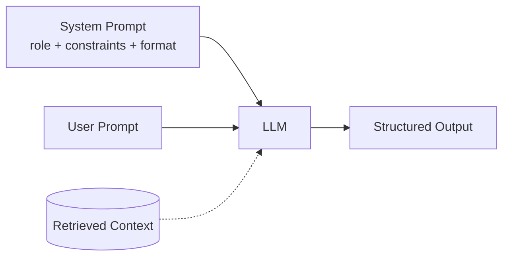

# System prompts

> **Learning Path:** LLM Application Engineering
> **Section:** 7.1.1 — Prompt engineering

**System prompts**

### 1. The problem

You ship an LLM to production and it behaves differently every time. One request it writes like a blog, next like a legal brief. It hallucinates internal data, reveals instructions, or forgets the task you need it to do.

The root cause is not the model. It is that a raw LLM has no persistent identity, no business rules, and no session contract. Every user prompt arrives in a vacuum. You cannot rely on it to stay in role, respect compliance boundaries, or produce a stable schema without re-explaining everything each turn.

You need a way to set baseline behavior once per session, invisible to the user, that survives across turns.

### 2. Mental model

A system prompt is the operating system for a conversation. User prompts are applications running on top of it.

It defines *who the model is, what it must never do, and how it must respond* before any user input is seen. Think of it as configuration, not content. It is loaded first, has highest priority, and frames the interpretation of everything that follows.

### 3. How it works

In most APIs the system message is a separate role prepended to the conversation history. The model attends to it with higher weight than user/assistant messages.

```
system: You are a finance assistant for Acme Bank. Never disclose account numbers. Respond in JSON with fields {answer, confidence}.
user: What is my balance?
assistant: ...
```

Mechanically it is just tokens, but architecturally it is a control plane: role, constraints, output format, tool-use policy, and safety guardrails are declared once and reused across turns. Context window cost is paid once per session, not per turn.

### 4. Architectural reasoning

System prompts solve the need for consistent behavior without retraining.

When it helps:
* **Identity and tone**: brand voice, persona, domain framing
* **Hard constraints**: never hallucinate dates, always cite sources, refuse disallowed topics
* **Output contract**: enforce JSON schema, markdown structure, function calling format
* **Session context**: product name, user tier, compliance rules that are stable for the session

Alternatives and why system prompts are chosen first:
* **Fine-tuning** gives deep behavioral change but costs time, data, and loses flexibility. Use for core capability shifts.
* **Few-shot in user messages** works but pollutes the prompt, is expensive, and is fragile to user overrides. Use for examples, not policy.
* **RAG** supplies facts, not behavior. Use together with system prompts.

Decision rule: if the rule is *stable across users and sessions*, put it in the system prompt. If it is *user-specific data*, put it in the user prompt or RAG. If it is *persistent capability*, consider fine-tuning.

### 5. Trade-offs and failure modes

* **Brittleness**: long system prompts compete for context budget and can be overridden by clever user prompts. Keep it concise, declarative, and test edge cases.
* **Leakage**: models sometimes echo system instructions. Treat the system prompt as semi-secret; never put secrets in it.
* **Versioning and drift**: system prompts become production config. Change without tests and you change behavior globally. Version them like code, with canary rollout and evals.
* **Prompt injection**: user input can attempt to jailbreak the system role. System prompts reduce risk but do not eliminate it. Pair with output validation and allowlists.
* **Model differences**: system role weight varies by model. What works on GPT-4 may be weaker on open models. Test per provider.

### 6. Example

Enterprise support bot.

System prompt:
```
You are Acme Support Agent v2. Use friendly, concise tone.
Never reveal internal ticket IDs or pricing not in context.
Always respond in JSON: {intent, answer, next_step}.
If asked about refunds, require ticket_id and escalate.
```

User prompt: "My order is late, can I get a refund?"

The model stays in agent role, keeps format stable for downstream automation, and refuses to hallucinate policy. RAG provides order status; system prompt enforces policy and schema.



### 7. Reasoning challenge

You are building a multi-tenant SaaS copilot. Each tenant wants custom brand voice and different disallowed topics. System prompts are shared per deployment for cost reasons.

Do you put tenant-specific rules in the system prompt, user prompt, or both? What breaks if you put everything in the system prompt, and what breaks if you put everything in the user prompt?

### 8. Key takeaway

* System prompts are session-level configuration for behavior, not data.
* Use them to enforce identity, safety, and output contracts once per conversation.
* Prefer system prompt for stable policy, user prompt for variable data, fine-tuning for persistent capability.
* Version system prompts, test for injection and leakage, and monitor drift like any production config.
