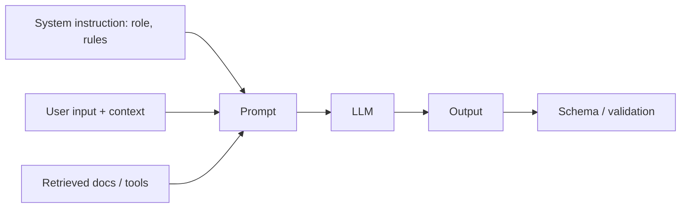

# User prompts

> **Learning Path:** LLM Application Engineering
> **Section:** 7.1.2 — Prompt engineering

## 1. The problem

You have an LLM API you cannot retrain. You need consistent behavior, correct output format, and safe answers, but the model is a general-purpose stochastic system.

The problem is not lack of capability, it is lack of control. Without steering, the same query produces different tones, formats, and hallucinations. Retraining or fine-tuning is slow, expensive, and brittle for changing requirements.

Prompt engineering exists because the only stable interface you have is text in, text out. You must encode intent, constraints, and context into that text.

## 2. Mental model

Think of a prompt as a **program for a non-deterministic interpreter**.

System + user + tools = structured context that defines role, goals, constraints, and data. The model is the runtime.

A good prompt is not clever wording. It is a contract: what the model should do, what it should not do, what the input looks like, and what the output must look like.



## 3. How it works

Four levers matter architecturally:

**Instruction.** Explicit role and rules set the operating mode. “You are a triage agent. Only use provided docs.”

**Context.** Relevant information must be inside the window. Too little = hallucination. Too much = dilution and cost.

**Format.** Delimiters and output schema reduce variance. Asking for JSON with keys `intent, priority, answer` is more reliable than free text.

**Reasoning control.** Techniques like chain-of-thought for internal reasoning, then final answer, improve complex tasks. For production, you often want hidden reasoning and validated structured output.

Prompt is composition, not magic. Template + variables + retrieved context + system constraints = deterministic-ish behavior.

## 4. Architectural reasoning

Use prompt engineering when you need behavior steering without model change, and requirements change faster than a fine-tune cycle.

It helps when:
* You need fast iteration on policy, tone, or format
* You want to route different behaviors via different system prompts per use case
* You need to combine live context via RAG or tool use

Alternatives:
* Fine-tuning / RLHF for stable, high-volume behavior where prompt tuning plateaus
* Code-level orchestration for logic that is deterministic and testable

Choose prompt engineering for the control plane, code for the logic plane. If the rule is “if X then Y” and is business-critical, encode it in code and let the prompt call it via tools.

## 5. Trade-offs and failure modes

* **Brittleness.** Small wording changes change outputs. Prompts need versioning, tests, and evals like code.
* **Prompt injection.** User input can override system instructions. Treat user content as untrusted and sandbox it.
* **Cost and latency.** More context = more tokens. Engineering is finding the minimal sufficient context.
* **Evaluation gap.** No compile errors. You need golden sets, output schema validation, and behavioral tests.
* **Security.** System prompts can leak. Never put secrets in prompts.

The failure mode to remember: prompt works in dev, degrades in production when distribution shifts.

## 6. Example

Enterprise support triage with RAG.

System prompt defines role, allowed actions, and output schema. User prompt contains ticket text plus top 3 retrieved KB chunks, delimited.

Prompt template:
```
You are a support triage agent. Use only provided docs.
Output JSON: {"intent":..., "priority": "low|medium|high", "suggested_reply":...}
Ticket: {{ticket}}
Docs: {{chunks}}
```

Architecturally this gives you: consistent JSON for downstream routing, traceability to sources, and no model change when policy updates. When priority rules change weekly, you update the system prompt, not a model.

## 7. Reasoning challenge

Your finance team needs a summarizer that must never invent numbers. Business rules for what is summarizable change every 2 weeks. You can ship a fine-tune in 3 weeks for $20k, or iterate prompts daily.

Do you invest in prompt engineering with strict schema validation and retrieval, or move to fine-tuning? What signals would make you switch?

## 8. Key takeaway

* Prompt engineering is interface design for a stochastic model, not copywriting.
* Control behavior with role, constraints, context, and output schema.
* Use prompts for fast-changing policy, code and tools for deterministic logic.
* Version prompts, test outputs, and guard against injection and hallucination.
