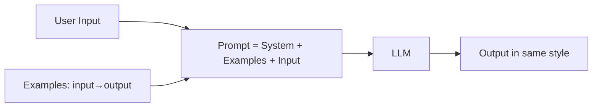

# Few-shot prompting

> **Learning Path:** LLM Application Engineering
> **Section:** 7.1.3 — Prompt engineering

**Few-shot prompting**

### 1. The problem

Zero-shot instructions work until they don't. You ask an LLM to "classify support tickets as billing, technical, or account" and get different labels, formats, and reasoning on the same input across runs.

Fine-tuning would fix consistency, but it costs data prep, training time, and creates a new model artifact per task. It also degrades quickly when the taxonomy changes.

You need a way to steer behavior **without retraining**, with low latency, and with control you can change in code.

### 2. Mental model

Few-shot prompting is in-context specification by example, not by description.

Instead of telling the model what to do in abstract language, you show it what correct input-output pairs look like and ask it to continue the pattern.

Think of it as a tiny, ephemeral training set that lives in the prompt.



The model does not learn permanently, it infers the task from the examples in context.

### 3. How it works

The essential mechanism is pattern completion with a constrained format.

A minimal few-shot prompt has three parts:
1. **Task framing**: one sentence of what to do and output format.
2. **Examples**: 2-8 curated input-output pairs, consistently formatted and delimited.
3. **Query**: the new input with a clear slot for completion.

Quality matters more than quantity. Examples should cover edge cases, be diverse, and avoid contradictions. The model will mimic the style, length, and biases of the examples.

Implementation tip: keep examples in the same format you want back, e.g., JSON with fixed keys, and put the query last. Use separators like `###` to reduce bleeding between examples.

### 4. Architectural reasoning

When it helps:
* You need consistent output format and style without training a model.
* The task is stable for days/weeks but changes faster than a fine-tune cycle.
* You have a small set of high-quality exemplars, not thousands of labels.
* Latency and cost budget allow extra tokens per request.

Alternatives:
* **Zero-shot + strong system prompt**: cheaper, works for broad tasks, fragile on nuance.
* **RAG**: solves knowledge gaps, not style/consistency gaps.
* **Fine-tuning / LoRA**: best for high-volume, stable tasks with thousands of examples. Pays off when prompt cost exceeds training cost.
* **Guided decoding / structured output**: enforces schema, not semantics.

Decision rule: use few-shot when you need to *teach behavior* quickly; use fine-tuning when you need to *bake behavior* permanently.

### 5. Trade-offs and failure modes

* **Token cost and latency.** Examples are repeated on every request. 4 examples at ~150 tokens each = 600 tokens of overhead per call.
* **Context window limits.** Examples compete with real user input and RAG context.
* **Example selection bias.** The model overfits to the few examples. Unrepresentative or contradictory examples degrade accuracy.
* **Fragility.** Small prompt changes change outputs. No guarantees like with code.
* **Prompt leakage / injection.** Malicious user input can break the delimiter and make the model treat it as an example.
* **Diminishing returns.** 1-3 examples often gives most of the gain; beyond ~8 examples you get minimal improvement and higher cost.

### 6. Example

Enterprise support ticket triage. Taxonomy changes weekly.

System: "Classify the ticket into one of: billing, technical, account. Output JSON with fields category and confidence."

Examples:
```
Ticket: "I was charged twice for my subscription"
→ {"category":"billing","confidence":0.9}

Ticket: "App crashes when I open settings on iOS"
→ {"category":"technical","confidence":0.95}
```

New ticket: "Can't log in, password reset email never arrives"
Model returns `{"category":"account",...}` with the same JSON shape as examples.

No model retraining needed; taxonomy update = edit the prompt examples.

### 7. Reasoning challenge

You have 10k historically labeled tickets and a taxonomy that changes every 2 weeks. You need <200ms p95 latency and classification cost < $0.001 per ticket.

Do you use few-shot, fine-tune a small classifier, or a hybrid? What drives the decision?

Consider token overhead per request vs training cost, update cadence, and consistency requirements.

### 8. Key takeaway

* Few-shot prompting trades tokens for training: you buy consistency with prompt context, not weights.
* Examples define the task more reliably than natural language instructions alone.
* Choose it for fast-changing, low-to-medium volume tasks where you can curate good exemplars.
* Watch token cost, example quality, and delimiter robustness; they are the operational risks.
* When volume is high and the task is stable, fine-tuning beats repeated few-shot economically.
