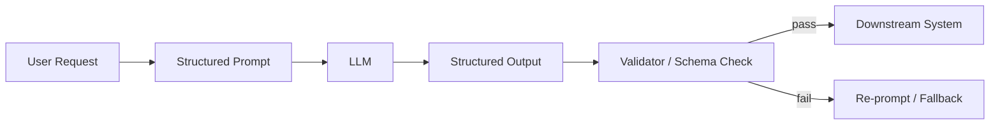

# Structured prompting

> **Learning Path:** LLM Application Engineering
> **Section:** 7.1.4 — Prompt engineering

**Structured prompting**

### 1. The problem

Free-form prompting works for exploration, it fails for production. An LLM will happily give you a different format, different field names, extra prose, or hallucinated values every time you ask the same question.

When the output is consumed by code — a DB write, an API call, a workflow router — variance is a bug. You need **predictable shape, not clever prose**.

The constraint is architectural: you need an LLM as a component, not a chatbot. Components need contracts.

### 2. Mental model

Think of a structured prompt as an API contract for a non-deterministic service.

You are not "talking nicer". You are defining:
* Role: what system the model should act as
* Context: what it can and cannot know
* Task: one clear transformation
* Constraints: rules it must obey
* Output schema: exact shape of the return value

The model is still stochastic, but the contract narrows the valid output space enough to validate.



### 3. How it works

Essentially three mechanisms:

**Delimiters and roles.** Give the model a bounded identity and scope. "You are a classifier for support tickets. Do not infer beyond the text."

**Explicit output contract.** Specify format before content. JSON with required keys, fixed enums, no extra text. Modern models support JSON mode / structured output, but the prompt must still define the schema.

**Constraints as guardrails.** Max length, no explanations, enum values only, reject if uncertain. This reduces drift.

Example skeleton:
```
Role: You are a data extractor.
Context: Customer messages from e-commerce.
Task: Extract intent and entities.
Constraints: Output valid JSON only. If unsure, set value to null. No extra text.
Output Schema: { "intent": "refund|exchange|... ", "amount": number|null, ... }
```

The model is guided, then the output is validated. Validation is mandatory — never trust the prompt alone.

### 4. Architectural reasoning

Use structured prompting when:

* Output feeds automated systems. Parsing must be reliable.
* You need repeatability across calls and models.
* You want to compose prompts. Structured outputs become inputs to the next step.

Alternatives:
* Natural language prompting: faster to write, high variance, bad for automation.
* Tool use / function calling: better for dynamic actions, heavier operationally.
* Post-hoc parsing with regex: fragile, moves complexity downstream.

Choice: structured prompting is the cheapest way to get machine-readable outputs without adding a tool layer. It enables prompt-as-API.

### 5. Trade-offs and failure modes

* **Rigidity vs flexibility.** Over-specifying kills nuance. Under-specifying kills reliability. You trade expressiveness for parseability.
* **Token cost.** Schema + examples + constraints consume tokens. For high volume, cost adds up.
* **Maintenance.** Schema changes require prompt changes and validation updates. Drift between prompt and validator is a silent failure.
* **Failure modes:** model emits valid JSON with wrong semantics; model refuses and returns apology text despite instructions; schema is too strict and causes high retry rate; prompt injection in user content breaks the contract.

Mitigations: schema validation layer, fallback re-prompt with stricter instruction, log failures to detect drift, keep examples minimal and representative.

### 6. Example

Enterprise support triage.

Unstructured: "Summarize this ticket and suggest next step." -> free text, inconsistent.

Structured:
```
Role: Ticket classifier.
Task: Classify intent and extract fields.
Output JSON only with keys: intent, priority, product, order_id.
intent enum: refund, exchange, shipping_delay, technical, other
priority enum: low, medium, high, critical
...
```

Output feeds directly into routing queue and CRM. Validator rejects non-conforming JSON and triggers a second pass with a simplified schema. This is the component boundary.

### 7. Reasoning challenge

You need to extract product specs from supplier PDFs for an inventory system. The PDFs vary wildly in layout. You can use structured prompting with a strict JSON schema, or use a vision model with function calling to extract fields step by step.

What do you optimize for first: latency/cost or extraction accuracy? Would you change the prompt structure if the supplier suddenly adds a new optional field? Why?

### 8. Key takeaway

* Structured prompting exists to make LLM outputs consumable by software, not just humans.
* The contract is Role + Context + Task + Constraints + Output Schema, enforced by validation, not trust.
* Use it when you need deterministic shape for automation; avoid it when you need open-ended creativity.
* Always validate outputs and plan for retries; the model will break the contract.
