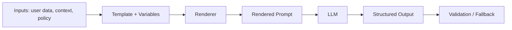

# Prompt templates

> **Learning Path:** LLM Application Engineering
> **Section:** 7.1.5 — Prompt engineering

**The problem**

An LLM is not deterministic software. The same intent expressed with slightly different wording, ordering, or context produces different outputs, latency, and cost. 

In production this creates three pressures:
* **Reproducibility.** A support agent prompt that works in a notebook drifts when copied into three services.
* **Maintainability.** Product, legal, and compliance requirements change the instructions, not the model.
* **Operational control.** You need to inject runtime data, enforce output schema, and measure prompt performance without editing code everywhere.

Free-form prompting works for exploration. It fails when prompts become shared assets with SLAs.

**Mental model**

A prompt template is a parameterized contract for an LLM call.

Think of it as a function signature:
`inputs + instructions + context + output contract -> deterministic behavior`

The template defines *what varies* and *what is fixed*. Fixed parts are system role, guardrails, formatting rules, few-shot examples. Variable parts are user data, session state, business rules.

The template is code, not a sentence.

**How it works**

A template engine renders a final prompt from parts:

* **Structure.** System / Developer message for role and constraints, User message for task and variables.
* **Parameters.** Placeholders for runtime values: `{customer_tier}`, `{ticket_history}`.
* **Delimiters.** Clear boundaries for injected content so the model does not confuse instruction with data.
* **Output schema.** Explicit format requirement, e.g., JSON with fields, to make parsing reliable.
* **Few-shot.** Curated examples that encode style and edge cases.

Render -> final prompt -> LLM -> parse output.



Version the template, not the model.

**Architectural reasoning**

Use templates when a prompt is reused, owned by a team, or subject to change.

It solves:
* Consistency across services
* Safe injection of untrusted user data via delimiters and sanitization
* A/B testing of phrasing without redeploying app code
* Auditability: prompt version in logs correlates to output

Alternatives:
* Hard-coded strings. Fast to start, unmaintainable at scale.
* Ad-hoc prompt chaining in application code. Couples logic to wording.
* Prompt libraries without versioning. Creates drift.

Choose templates when the cost of a bad output > cost of templating overhead. That is almost always true in production.

**Trade-offs and failure modes**

* **Rigidity vs flexibility.** Over-templating makes prompts brittle. Under-templating loses control. Keep instructions stable, keep data variable.
* **Context bloat.** Injecting too much history fills the window and dilutes signal. Summarize or select.
* **Injection risk.** User input inserted raw can override instructions. Treat template variables as untrusted data. Use delimiters, escape, and validation.
* **Hidden coupling.** Changing a template changes downstream parsing. Version templates and test outputs.
* **False determinism.** Templates improve consistency but do not guarantee correctness. Always validate structured output.

**Example**

Enterprise support triage.

Template fixed parts:
```
You are a Tier-1 support triager. Never disclose internal notes.
Classify intent and extract fields. Output JSON only: {intent, priority, next_step}.
Priority rules: enterprise customers = P1 if downtime mentioned.
```

Template variables:
`{customer_tier}`, `{sla_hours}`, `{ticket_history_summary}`

Render per request, log template version + input hash. When compliance changes the disclosure rule, update one template, rollout via feature flag, measure classification accuracy before full release.

**Reasoning challenge**

You have a customer chatbot with three intents: billing, technical, sales. One team wants a single template with an `if intent = ...` block inside. Another wants three separate templates with a router.

What do you choose, and what do you measure to decide? Consider latency, maintenance, prompt leakage, and error handling.

**Key takeaway**

* Prompt templates turn prompts into versioned, testable software artifacts.
* Separate fixed instructions from variable data; treat user data as untrusted input.
* Version templates, validate outputs, and measure performance per version.
* Use templates for reuse and control; avoid them for one-off exploration.
