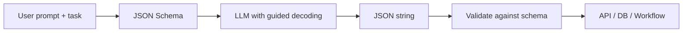

# JSON schema

> **Learning Path:** LLM Application Engineering
> **Section:** 7.2.1 — Structured outputs

**JSON Schema for LLM Structured Outputs**

### The problem

LLMs are trained to produce natural language. When you ask for "extract the invoice data", you get free text that varies in wording, ordering, and formatting every time.

That creates a problem for software architecture: downstream systems need reliable data shapes. A parser, database loader, or API call cannot work with "I think the total is about $123". You need deterministic fields, types, and cardinality.

Without a contract, you end up with brittle regex, manual post-processing, and silent failures in production. The cost is not just engineering time; it is data quality and reliability at scale.

### Mental model

Think of JSON Schema as a type contract for the model.

It is not a prompt instruction. It is a machine-readable specification of the shape the output must have: objects with required properties, types, enums, ranges, and nested structures.

The model is constrained to produce valid JSON that conforms to the schema. The schema becomes the interface between the LLM and the rest of your system.

### How it works

You supply the schema alongside the prompt. Modern providers implement guided decoding: the token sampler is constrained at decode time to only emit tokens that can lead to a valid JSON instance of the schema.

The flow is:



If the model cannot satisfy the schema, it either fails cleanly or returns a validation error you can handle, rather than producing unparseable text.

Implementation is typically:

```json
{
  "type": "object",
  "properties": {
    "invoice_id": {"type": "string"},
    "total_amount": {"type": "number"},
    "items": {
      "type": "array",
      "items": {
        "type": "object",
        "properties": {
          "sku": {"type": "string"},
          "qty": {"type": "integer", "minimum": 1}
        },
        "required": ["sku", "qty"]
      }
    }
  },
  "required": ["invoice_id", "total_amount", "items"]
}
```

The schema is declarative. You define shape, not how to extract it.

### Architectural reasoning

Use JSON Schema when you need machine-consumable output from an LLM as part of a larger system.

It helps when:
* Outputs feed directly into databases, APIs, or orchestration tools
* You need repeatable validation and error handling
* Multiple consumers rely on the same contract
* You want to separate *what* to produce from *how* to produce it

Alternatives exist. Function calling / tools give the model a predefined set of callable outputs with a schema, which is stronger for tool use. Regex or post-processing is cheaper but fails under variation. Pydantic models are developer-friendly wrappers around JSON Schema.

Choose JSON Schema when the contract is data-shaped and you want provider-agnostic, standard validation. Choose function calling when the output should trigger an action. Often they are used together: schema defines the shape, function calling enforces it.

### Trade-offs and failure modes

Schema too strict: model refuses or hallucinates to fit constraints, e.g., invents a field rather than leaving it null.

Schema too loose: you get valid JSON that is semantically wrong. Schema validates syntax, not truth.

Complexity cost: deeply nested schemas increase token cost and reduce success rate. The model struggles with > ~5 levels of nesting or many conditional rules.

Versioning: schemas are contracts. Changing a required field is a breaking change for downstream consumers. Treat schemas like APIs.

Latency and cost: guided decoding adds overhead. For high-volume, low-value extraction, a simpler pipeline may be cheaper.

Failure modes to design for: missing required fields, wrong types, enum violations, and extra properties. Always validate output and have a fallback: retry with a relaxed schema, human review queue, or structured repair step.

### Example

Enterprise invoice ingestion.

Task: extract line items from scanned PDFs.

Architecture: Document upload -> LLM with JSON Schema for `Invoice` -> validation -> write to data warehouse.

Schema defines `invoice_id`, `date`, `vendor`, `total_amount`, `currency`, `items[]`. The downstream loader expects exactly those fields with correct types. Validation failures route to a human review queue with the original text and the partial JSON.

This removes custom parsers per vendor format and gives a single contract for finance, analytics, and compliance.

### Reasoning challenge

You need to extract product reviews into sentiment, pros, cons, and rating. Reviews are often missing rating or have sarcasm.

Do you make `rating` required in the schema, make it nullable, or create two schemas: one strict for automated ingestion and one relaxed for human review? What is the trade-off for data completeness vs pipeline reliability?

### Key takeaway

* JSON Schema turns LLM output from free text into a typed contract your system can rely on.
* It solves the integration problem, not the extraction problem. The model still needs good prompting.
* Prefer explicit, minimal schemas. Validate always, and design failure paths.
* Treat schemas as versioned APIs. Changing them has downstream cost.
* Schema is syntax; you still need semantic validation for truthfulness.
