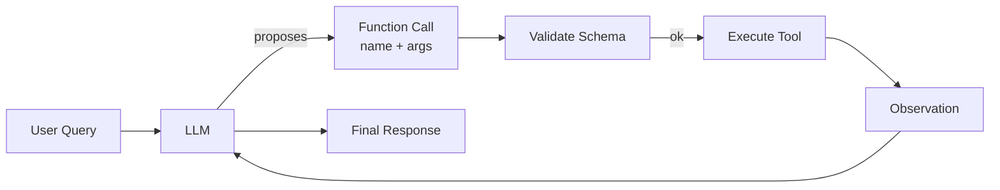

# Function calling

> **Learning Path:** LLM Application Engineering
> **Section:** 7.2.2 — Structured outputs

**The problem**

You need an LLM to do more than write text. You need it to trigger real actions: call a pricing API, create a Jira ticket, query a vector DB, book a room. 

Raw text output is the problem. Prompting for JSON works until it doesn't. The model hallucinates fields, changes types, drops required keys, or just writes prose when you asked for structured data. You get parsing errors in production, silent failures, and brittle post-processing with regex.

The constraint is an interface contract. Your system needs a deterministic, typed output that can be validated before it touches downstream services. You also need the model to choose *which* action to take, not just generate a string.

**Mental model**

Think of function calling as giving the LLM a typed API surface and letting it act as a router.

User intent → LLM parses intent → LLM selects a function + fills arguments → System executes → Result fed back to LLM → Final response.

The model is not executing the function. It is proposing a call with arguments that conform to a schema you defined. You validate, execute, and return the observation.

**How it works**

You define a schema for each function: name, description, parameters with types, required fields, and constraints. The model sees the schema as part of its context, not as free-form text.

At inference time the model is constrained to emit a structured call instead of free text. With native function calling the output is a discrete tool call object. With structured outputs the model is forced to produce JSON that validates against a JSON Schema.

The loop is critical:
1. Model proposes call
2. You validate arguments against schema
3. You execute the real function
4. You return the result as an observation
5. Model continues with grounded data

This separates *intent recognition* from *execution*.

**Architectural reasoning**

When it helps:
* You need reliable structured data from an LLM for downstream systems
* You want to ground the model in real tools and data instead of relying on parametric knowledge
* You need auditability: which tool was called, with what args, and why

Alternatives:
* **Prompt-only JSON**: cheap, works for simple cases, fails on edge cases and schema drift
* **Post-hoc parsing + retries**: adds latency and complexity, still brittle
* **Function calling / structured outputs**: adds a contract, reduces hallucinations, increases reliability

Choose function calling when correctness and type safety matter more than raw flexibility. Choose structured outputs when you only need a data shape, not a tool execution loop.

**Trade-offs and failure modes**

* **Hallucinated parameters and wrong function selection.** The model can pick the right tool but fill arguments incorrectly. You must validate and have a fallback/retry strategy.
* **Schema complexity vs model capability.** Overly nested schemas reduce accuracy. Keep parameters flat and descriptions explicit.
* **Latency and cost.** Tool loops add round trips. Each call costs tokens and adds latency. Design for 1-2 hops, not chains of 10.
* **Vendor coupling.** Function calling formats differ across providers. Abstract the tool definition layer so you can swap models.
* **Error handling.** Tool failures, timeouts, and partial results must be returned as structured observations, not swallowed. Otherwise the model invents.

**Example**

Enterprise support triage.

User: "My laptop won't connect to VPN after the update."

System provides tools:
* `search_kb(query)` 
* `create_incident(user_id, issue_type, priority)`
* `check_vpn_status(user_id)`

The model first calls `check_vpn_status` to ground the request. Observation: status = disconnected, last error = certificate mismatch. Model then calls `search_kb("vpn certificate mismatch after update")`. Observation returns KB article. Model decides no incident needed and returns the fix.

Without function calling you would get a plausible but possibly wrong answer from the model's training data. With it you get a verifiable action trail and grounded response.

**Reasoning challenge**

You have a finance assistant that can call `get_account_balance`, `transfer_funds`, and `get_exchange_rate`. A user asks: "Move $500 from savings to checking and tell me the new balance."

The model proposes `transfer_funds(from='savings', to='checking', amount=500)` then `get_account_balance(account='checking')`. Is this safe? What would you change before deploying?

**Key takeaway**

* Function calling turns the LLM from a text generator into a typed intent router with an API contract.
* Structured outputs enforce shape; function calling enforces action + shape. The tool loop provides grounding.
* Design tools with clear names, descriptions, and minimal parameters. Validate everything.
* Expect wrong function choice and bad arguments. Build validation, retries, and observability in.
* Use it when reliability, auditability, and integration with real systems matter more than free-form generation.
