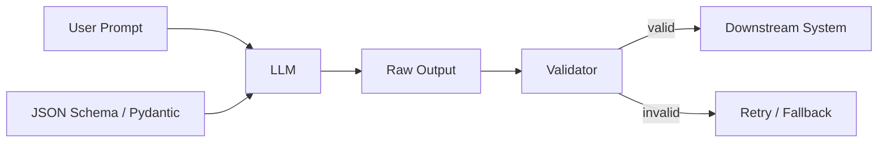

# Typed outputs

> **Learning Path:** LLM Application Engineering
> **Section:** 7.2.3 — Structured outputs

**Typed outputs**

### 1. The problem

LLMs are great at natural language, terrible at contracts.

You need to call a billing API with `customer_id`, `amount`, `currency`. You need to extract 7 fields from an invoice PDF. You need to route a ticket to one of 4 queues.

With free-form text you get:
* Inconsistent key names: `customerId` vs `customer_id`
* Wrong types: `"amount": "12.30 USD"`
* Missing fields, extra fields, hallucinations
* Parsing code that breaks every week

The problem is not intelligence, it is interface reliability. You cannot build a system on regex over prose.

### 2. Mental model

Typed outputs turn the LLM into a typed service with a schema contract.

Think of it as: **Prompt + Schema → Validated data structure**.

The schema is the API contract. The LLM is the implementation. Validation is the type checker at runtime.



You are not asking for text, you are asking for data that conforms.

### 3. How it works

Three mechanisms, same goal:

* **Schema prompting**: Describe the output shape in the prompt and ask for JSON. Cheap, fragile.
* **Constrained decoding / guided generation**: The model can only emit tokens that keep the output valid JSON matching the schema. OpenAI structured outputs, Anthropic tool use, etc.
* **Schema validation layer**: Always validate with Pydantic / JSON Schema after generation. Never trust the model.

Implementation pattern:
1. Define a strict schema with types, enums, required fields.
2. Pass schema to model via function calling / structured output mode.
3. Validate output. If invalid, retry with error feedback or fall back.

The validation step is non-negotiable. Even constrained decoding can drift under ambiguity.

### 4. Architectural reasoning

When it helps:
* LLM output feeds directly into code, DB, or another service
* You need deterministic downstream processing, e.g., routing, extraction, classification
* You need auditability and schema versioning

Alternatives:
* Free text + post parsing with LLM again: higher latency, higher error rate
* Regex / LLM + heuristics: works until edge cases explode
* RAG over examples only: no guarantees

Choose typed outputs when the cost of a bad parse > cost of schema constraints. That is almost always in production systems.

### 5. Trade-offs and failure modes

* **Schema rigidity vs flexibility**: Tight schemas improve reliability but reject valid nuance. Loose schemas reintroduce ambiguity. You need versioned schemas.
* **Latency and cost**: Constrained decoding and validation add overhead. Function calling is more expensive than chat completion.
* **Hallucination moves**: The model will still hallucinate values that fit the schema. Type correctness ≠ semantic correctness.
* **Schema drift**: Business logic changes, schema lags. Without ownership, you get silent failures.
* **Error handling**: What do you do on validation failure? Silent coerce, retry with critique, or human review. The retry loop can become a reliability hazard if unbounded.

Failure mode to watch: Partial compliance. Output is valid JSON but fields are empty strings or `null`. Validate business rules, not just types.

### 6. Example

Enterprise support triage.

Input: customer message.
Output schema:
```python
class Triage(BaseModel):
    intent: Literal["billing","technical","account","other"]
    priority: Literal["low","medium","high","urgent"]
    entities: list[str]
    requires_human: bool
```

The triage service calls LLM with structured output mode. Validator checks schema. If valid, route to queue and create ticket with fields. If invalid, retry once with error message, then send to human review queue.

You now have a typed contract between LLM and your orchestration layer. Metrics: parse success rate, retry rate, field null rate.

### 7. Reasoning challenge

You need to extract product attributes from 10k catalog descriptions daily. Attributes are mostly stable but occasionally new brands introduce novel fields.

Do you enforce a closed schema with strict validation, or an open schema with an `extra_fields` dict? What do you do when validation fails 3% of the time?

### 8. Key takeaway

* Typed outputs exist to make LLM outputs machine-consumable, not just human-readable.
* Always validate. Schema + validator is the contract; the model is untrusted.
* Design schemas for evolution: version them, make fields optional where ambiguity is real, add enums to constrain choices.
* The architectural win is composability: you can chain LLM steps, test them, and monitor them like any service.

You should leave able to reason: *Is this output going to code? If yes, schema it, validate it, and plan for failures.*
