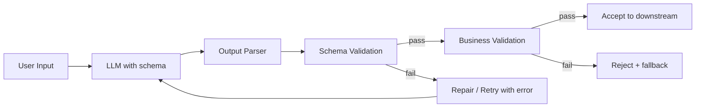

# Validation

> **Learning Path:** LLM Application Engineering
> **Section:** 7.2.4 — Structured outputs

### 1. The problem

LLM application engineering is about turning free-form language into reliable system actions. The moment you need that output to drive a database write, an API call, or another service, you have a contract problem.

The model is non-deterministic and optimizes for plausibility, not correctness. It will happily emit JSON that looks right but has wrong types, missing required fields, extra fields, or values that violate business rules. Format also drifts over time with prompt changes, model updates, or temperature.

Without enforcement, downstream systems fail silently, corrupt data, or require brittle regex parsing.

### 2. Mental model

Validation is a contract boundary between the LLM and the rest of your system.

The LLM is a probabilistic generator. Your system is deterministic. Validation is the translator that decides: accept, repair, or reject.

Think parse → validate → enforce.

Syntactic validation checks shape: types, required fields, enums.
Semantic validation checks meaning: business invariants, referential integrity, policy.

### 3. How it works

Essential mechanism is a closed loop, not a one-shot prompt.

Implementation is typically:
1. **Constrain generation**: JSON schema / Pydantic model / function calling/tool definition. This reduces the search space.
2. **Parse**: strict JSON parser, no silent coercion.
3. **Validate schema**: Pydantic / jsonschema. Fail fast on type/shape errors.
4. **Validate semantics**: domain rules, e.g., price > 0, date in future, product exists.
5. **Feedback loop**: if validation fails, return structured error to the model with one targeted retry. Do not re-prompt from scratch.

### 4. Architectural reasoning

Use validation when the output is consumed programmatically and correctness matters more than fluency.

It solves: format drift, hallucinated fields, type errors, and silent data corruption.

Alternatives:
* **Prompt only**: "output valid JSON". Cheap, fails in production.
* **Post-hoc regex**: fragile, doesn't scale with schema changes.
* **Function calling / structured outputs**: moves schema enforcement into the model. Better first-pass rate, but still needs validation.

Choose strict schema + validation when you have downstream contracts. Choose looser validation when you only need human-readable summaries.

Place validation as middleware immediately after generation, before any side effect. Never let unvalidated output touch a database or payment system.

### 5. Trade-offs and failure modes

* **Strictness vs completion rate.** Tighter schemas raise first-pass validity but increase rejections. Architect for a target accept rate, not 100%.
* **Latency vs safety.** Validation + retry adds 1-2 LLM calls. Budget for it in SLOs.
* **Syntactic vs semantic.** Schema validation catches shape errors. Only business validation catches "valid JSON, wrong meaning". Both are needed.
* **Repair loops.** Blind retries amplify hallucinations. Cap retries to 2, then fallback to human review or safe default.

Common failures:
* Partial output truncated by token limit → parser error.
* Model satisfies schema but hallucinates IDs → passes syntactic, fails semantic.
* Schema changes without versioning → old prompts generate deprecated fields.

### 6. Example

Natural language to order creation.

Schema: `order = {customer_id: str, items: [{sku: str, qty: int>0}], total: float>0}`

LLM returns valid JSON with `qty: "two"`. Schema validation fails → error returned: "qty must be integer". Model repairs to `qty: 2`.

Next, business validation checks `sku` exists in catalog and `total` matches sum of items. If mismatch, reject rather than silently correct.

Validation lives in the service layer, not in the prompt. Prompts reference the schema version; validation enforces it.

### 7. Reasoning challenge

You have a customer support agent that extracts refund requests into structured claims. Strict schema validation gives 92% first-pass acceptance. Adding semantic validation for policy rules drops acceptance to 78% and adds ~400ms p95.

Do you keep both validations in the hot path, move semantic validation async, or relax policy rules to prompts?

### 8. Key takeaway

* Validation is a system boundary, not a prompt trick.
* Enforce shape first with schema, then meaning with business rules.
* Design for failure: parse errors and semantic rejections are normal, build repair and fallback.
* Keep schemas versioned and validation separate from generation for operability and auditability.
