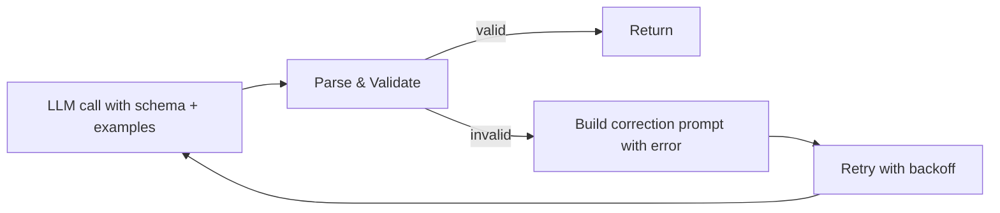

# Retries

> **Learning Path:** LLM Application Engineering
> **Section:** 7.2.5 — Structured outputs

**Retries for Structured Outputs**

### 1. The problem

You ask an LLM to return structured data — JSON matching a schema, with required fields and types. Downstream code assumes that shape.

The problem: LLMs are non-deterministic text generators. Even with a schema hint, they routinely produce:
* missing required fields
* wrong types: `"price": "19.99"` instead of number
* extra fields, wrong enum values, unclosed braces
* valid JSON but semantically wrong

In LLM Application Engineering, structured output is a contract. A single malformed response breaks parsing, validation, and the pipeline.

You can't fix this with a better prompt alone. You need a reliability mechanism around the call.

### 2. Mental model

Retry for structured outputs is not blind repetition. It is a **validate → feedback → correct** loop.

Think of it as a compiler error loop. The model writes code, the validator points out the syntax error, the model fixes it. Each iteration uses the previous failure as context.

### 3. How it works

Essential mechanism:



1. Call with schema, examples, and strict instructions.
2. Parse and validate against JSON Schema / Pydantic.
3. If invalid, capture the validation error — e.g., `price must be number, got string`.
4. Feed the error back in a correction prompt: "Previous output failed validation for reason X. Fix it. Output only valid JSON."
5. Retry with limited attempts and increasing backoff.

Implementation is cheap: a thin wrapper around the LLM call. The cost is an extra call, not a new model.

### 4. Architectural reasoning

When it helps:
* Schema is strict and downstream is brittle
* Cost of a bad record > cost of an extra LLM call
* Latency budget allows 1-2 retries

What it solves:
* Converts probabilistic output into a deterministic contract with high probability
* Works with any model, even those without native structured output mode

Alternatives:
* **Native structured output / tool calling**: Model constrained at generation time. Lower latency, higher first-pass success. Best when available.
* **Post-processing heuristics**: Regex fixes, type coercion. Fast and cheap but fragile and can hide real errors.
* **Human in the loop**: For low volume, high-value extraction.

Why choose retry with feedback over native only: Native mode reduces errors but doesn't eliminate them. Retry is the safety net for edge cases, model drift, and complex schemas.

Decision rule: Use native structured output first, then add a bounded retry-with-validation layer for production reliability.

### 5. Trade-offs and failure modes

* **Cost vs reliability**: Each retry = tokens + latency. 2 retries ≈ 3x cost in worst case. Budget for it.
* **Latency**: P95 latency grows with retry probability. Put retries behind async queues if latency sensitive.
* **Error amplification**: Feeding raw validation errors can confuse the model or cause it to over-correct. Summarize errors, don't dump full stack traces.
* **Non-convergence**: Some prompts never converge. Without a max attempts cap you get infinite loops and runaway cost.
* **Semantic drift**: The model may make the JSON valid but change meaning to satisfy schema. Validate semantics too, not just syntax.
* **Prompt leakage**: Including error messages can leak internal schema details. Sanitize feedback.

### 6. Example

E-commerce product extraction.

Schema requires: `{"name": string, "price": number, "sku": string, "in_stock": boolean}`

First call returns:
```json
{"name":"Widget","price":"19.99","sku":"W-123"}
```
Validation fails: price is string, in_stock missing.

Correction prompt includes: `Validation error: price must be number, got string. Missing required property in_stock.`

Second call returns valid JSON. Total cost ~2 calls, success rate goes from ~70% first-pass to >95% with 2 retries.

If still invalid after 2 attempts, route to fallback: generic extraction + human review, don't keep looping.

### 7. Reasoning challenge

You have a high-throughput chatbot that extracts user intents into a strict schema. P95 latency must stay <800ms. Retry success rate is 85% on first try, 95% after one retry. Each LLM call is ~400ms.

Do you add retries inline or move failed requests to an async reprocess queue? What changes if the downstream system can tolerate partial data?

### 8. Key takeaway

* Retries exist because LLMs are probabilistic and structured outputs are a hard contract.
* The pattern is validate → feedback → correct, not blind repeat.
* Combine native structured output with bounded retry for production reliability.
* Cap attempts, budget cost/latency, and always have a fallback for non-converging cases.
* Architectural goal is a reliable contract, not perfect first-pass generation.
