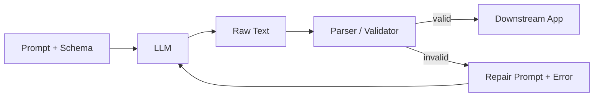

# Output parsing

> **Learning Path:** LLM Application Engineering
> **Section:** 7.2.6 — Structured outputs

**Output Parsing**

### 1. The problem

An LLM is a free-text generator. Downstream systems are not. Your database, API, workflow engine, and agents need typed fields, enums, arrays, and referential integrity.

The problem appears when you ask an LLM for structure:
* It will produce plausible text but the format drifts. Keys change, types change, fields are missing.
* It hallucinates values that fit the schema.
* Even with instructions, output is non-deterministic.

Without enforcement, you get silent data corruption. Parsing fails in production, or worse, succeeds with bad data.

You need a contract between the generative model and the deterministic system.

### 2. Mental model

Think of the LLM as an unreliable producer and output parsing as a contract enforcer.

The LLM proposes. The parser validates, repairs, or rejects. The system only accepts data that matches a schema.

`Prompt + Schema → LLM → Raw Text → Parser → Valid Object or Error`

The schema is the interface. Parsing is the boundary.

### 3. How it works

The core mechanism is schema-driven validation with a repair loop.

1. **Schema declaration.** Define the shape you need: JSON Schema, Pydantic model, or function signature. This is the contract.
2. **Constrain generation.** Use JSON mode, structured outputs, or function calling to bias the model toward valid syntax.
3. **Validate.** Parse the raw text and validate against the schema. Types, required fields, enums, ranges.
4. **Repair or retry.** On failure, feed the error back with the original context for a targeted fix. One or two retries max.

This is not post-processing for convenience. It is a reliability layer.

### 4. Architectural reasoning

Output parsing helps when:
* LLM output feeds a typed system: DB writes, API calls, agent tool use.
* You need machine-readable guarantees, not human-readable prose.
* Failure cost is high: billing, medical coding, compliance.

Alternatives:
* **Regex / heuristic extraction.** Works for one-off patterns, breaks under variation.
* **Free text + human review.** Expensive, not scalable.
* **Constrained decoding only.** Improves syntax but not semantics. Model can still hallucinate valid-looking values.

Choose parsing when correctness > flexibility. Choose free text when you need open-ended reasoning and will consume it with another LLM.

### 5. Trade-offs and failure modes

* **Strictness vs. recall.** Tight schemas reduce hallucinations but cause rejections on edge cases. Loose schemas pass more but let bad data through.
* **Latency vs. reliability.** Validation + retry adds round trips. Budget 1-2 retries, then fallback to human or safe default.
* **Model lock-in.** Native structured outputs exist in some providers. Portable systems use schema validation after generation.
* **Repair amplification.** Feeding errors back can cause the model to over-correct and invent fields. Cap retries and log failures.

Common failures:
* Partial JSON, trailing text, code fences.
* Type mismatches: string where number expected.
* Missing required fields the model deemed unimportant.
* Valid schema, invalid semantics: correct format, wrong entity.

Mitigate with: schema examples in prompt, field descriptions, enum constraints, and post-validation business rules.

### 6. Example

Support ticket triage. You need `category`, `priority`, `entities[]`, `action`.

Pydantic model defines the contract. LLM generates JSON. Parser validates. If invalid, you retry with the validation error.

The system never writes a ticket without a valid `category` from the enum. Downstream routing is deterministic.

### 7. Reasoning challenge

You need to extract medication names and dosages from free clinical notes for a billing system. Accuracy must be >99%. Latency budget is 800ms p95.

Do you use JSON mode + single-pass validation, or constrained decoding with a repair loop? What do you do when the model confidently outputs a dosage that is not in the note?

Decide based on cost of false positive vs. latency budget.

### 8. Key takeaway

* Output parsing exists to enforce a typed contract at the LLM boundary.
* Validate schema first, semantics second. Never trust raw LLM text.
* Design for failure: expect invalid output, budget retries, and have a safe fallback.
* The schema is architecture. It defines what the system can do with the LLM.
