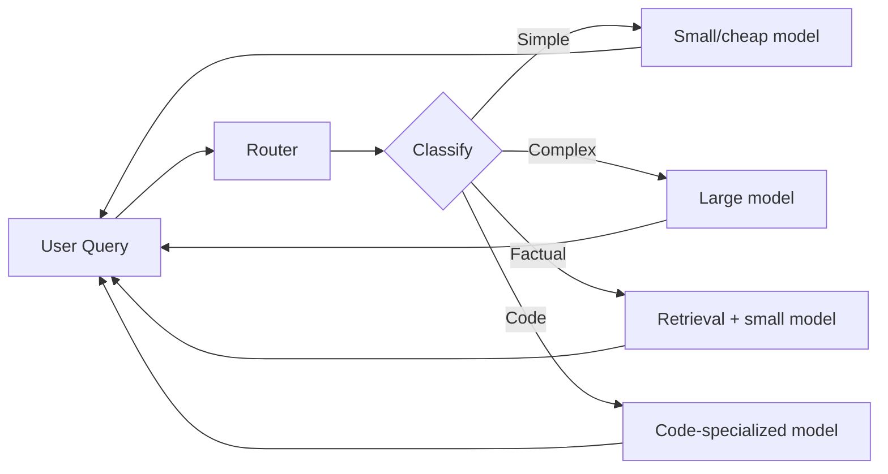

# Router

> **Learning Path:** LLM Application Engineering
> **Section:** 7.3.3 — LLM patterns

### 1. The problem

You have one user interface but you cannot have one model.

A single LLM is a compromise: a small model is cheap and fast but fails on complex reasoning, a large model is capable but expensive and slow, a specialized model is great for code but bad for summarization.

In production you see a real distribution: 60% simple classification/FAQ, 30% medium reasoning, 10% hard multi-step. Paying for a frontier model on every request is wasteful. Using a small model on every request hurts quality.

You also have non-model options: a tool, a retrieval step, or a cached answer can be cheaper and more correct than an LLM call.

The problem is **heterogeneous demand meets heterogeneous supply**. You need a decision point before the model.

### 2. Mental model

A Router is a traffic controller in front of your LLM fleet.

It classifies intent, estimates cost/latency/quality needs, and dispatches to the right backend. It is not a model itself, it is a policy.

Think of it as a load balancer with a cost function, not just round-robin.

### 3. How it works

Request → Router → Backend

The router has three parts:

* **Classifier:** maps the query to a class. Can be rule-based, embedding similarity, or a tiny classifier LLM.
* **Policy:** decides where to send it. Policy uses class + context: user tier, cost budget, latency SLA, model health.
* **Fallback / retry:** if the chosen backend fails or confidence is low, escalate to a stronger model.

Routing can be static: `if query contains code → code model`. Or dynamic: learn from past success, latency, and cost.

### 4. Architectural reasoning

When it helps:

* **Cost control.** Route the long tail of cheap queries away from expensive models.
* **Latency SLOs.** Small models satisfy interactive paths; large models for async jobs.
* **Capability matching.** Route to models/tools with the right strength: math, code, vision.
* **Resilience.** If a model is degraded, route around it.

Alternatives:

* **One big model for all.** Simple to operate, consistent behavior. Expensive, slow, overkill.
* **Ensemble / cascade.** Always try small, fallback to large on failure. Good but adds latency on fallback path.
* **Router.** Pay classification cost once to save model cost many times. Requires observability.

Choose router when query distribution is skewed and you have at least two backends with materially different cost/latency/quality profiles.

### 5. Trade-offs and failure modes

* **Routing tax.** Classification adds latency and cost. If the router is wrong, you pay for a bad decision plus a retry.
* **Misrouting.** Overly aggressive cheap routing degrades user experience. Under-routing wastes money. You need confidence thresholds and monitoring.
* **Feedback loops.** If you route based on past success, the router can starve a model of training data and get worse at evaluating it.
* **Observability burden.** You now have a new system to debug: why was this query sent to model X? You need routing logs, per-route success metrics, and cost attribution.
* **Policy drift.** Model capabilities change with updates. A static rule set rots.

Failure mode to watch: the router becomes a hidden single point of failure and a source of non-determinism. If it fails closed, all traffic goes to the default expensive model. If it fails open, quality collapses.

### 6. Example

Enterprise support assistant.

* Simple FAQ → cached retrieval + 3B model. <200ms, $0.0001.
* Account troubleshooting → 7B model with tool use for CRM lookup.
* Refund negotiation → 70B model with reasoning and human-in-the-loop flag.
* Code generation → code-specialized model.

Router classifies on intent + user tier. Free tier gets stricter cost policy. Enterprise tier allows larger model budget. Monthly review of routing accuracy vs user satisfaction adjusts policy.

Result: 40% cost reduction with no measurable drop in CSAT.

### 7. Reasoning challenge

You have two models: Model A is 5x cheaper, 2x faster, but fails 15% of complex queries. Model B is accurate but expensive.

Your router classifier is 90% accurate at distinguishing simple vs complex. Should you route, cascade, or use Model B for all? What metric would you track to decide if the router is helping?

### 8. Key takeaway

* A Router exists to match heterogeneous queries to heterogeneous backends for cost, latency, and quality.
* Routing is a policy problem, not just a classification problem. It must balance cost, SLA, and confidence.
* The router adds complexity and a new failure surface; it pays off only when query distribution is skewed and backends differ meaningfully.
* Monitor per-route success, cost, and latency. Without it you are flying blind.

You should finish knowing why you would add a router, what it costs to operate, and how it can silently degrade quality if misconfigured.
