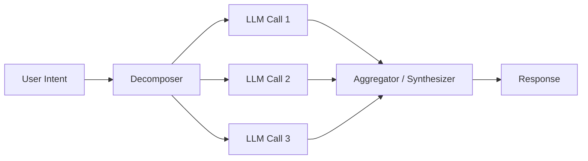

# Parallel execution

> **Learning Path:** LLM Application Engineering
> **Section:** 7.3.4 — LLM patterns

**Parallel execution in LLM apps**

### 1. The problem

A single LLM call is slow. 500ms-2s is normal, more with tools and large context. When you chain calls sequentially, latency adds up linearly.

Problem → Constraints → Options

You need a travel plan with flights, hotels, and activities. Chained:
`flights -> hotels based on flights -> activities based on hotels` = 3x latency.

If those three sub-tasks are independent, you are paying sequential latency for no reason. The constraint is wall-clock time, not total compute.

### 2. Mental model

Fan-out, fan-in.

Decompose one user intent into N independent sub-problems, execute them concurrently, then aggregate the results into a final answer.

Think of it as parallelism at the *task* level, not the token level. The LLM itself is still sequential inside, but your application orchestrates multiple calls in parallel.

### 3. How it works

1. **Decompose.** Identify independent pieces of work from the prompt.
2. **Fan-out.** Launch N LLM calls at once with different prompts / tools.
3. **Fan-in.** Collect results, reconcile conflicts, and synthesize a final response.

No shared state between calls. Each call gets the minimal context it needs, not the whole chain.

### 4. Architectural reasoning

**When it helps**
* Independent sub-queries: summarize 3 documents, extract features from different product categories, generate options for flights/hotels/restaurants.
* Parallel tool calls: fetch weather, news, and stock price at once.
* Map-style work: classify 10 items, translate 5 paragraphs.

**When it hurts**
* Tasks have data dependency. You cannot pick a hotel before you know the city from the flight.
* Context is large and overlapping. Sending the same 50k token context to 5 calls multiplies cost and rate limits.

Alternatives:
* **Sequential chaining** - lower cost, preserves dependency, higher latency.
* **Map-Reduce** - parallel map then sequential reduce. Parallel execution is the map part.
* **Speculative / early generation** - start multiple candidates and pick the best.

Decision rule: use parallel execution when sub-tasks are *logically independent* and latency dominates cost.

### 5. Trade-offs and failure modes

**Cost multiplies.** 5 parallel calls = 5x tokens vs 1 sequential call. Budget and rate limits become real constraints.

**Rate limits and throttling.** LLM providers limit requests per minute. A fan-out of 20 can hit limits instantly. You need a semaphore / queue.

**Partial failure.** One call fails or times out. Do you fail the whole request or return partial results? Need explicit failure policy.

**Ordering and consistency.** Parallel calls can return contradictory facts. The aggregator must detect and resolve, not just concatenate.

**Prompt drift.** Without tight scoping each call hallucinates in different ways. The aggregator becomes a correctness bottleneck.

Common failure: thundering herd on a shared tool, e.g., 10 parallel calls all query the same database.

### 6. Example

Enterprise RAG for competitive analysis.

User asks: "Summarize how Competitor A, B, C position their pricing, features, and customer sentiment."

Sequential would be 9 calls.

Parallel design:
Decomposer creates 3 groups, each with 3 parallel calls:
Pricing A/B/C in parallel
Features A/B/C in parallel
Sentiment A/B/C in parallel

9 calls launched concurrently ~1.2s wall time instead of ~9s. Aggregator then synthesizes a comparison table.

Cost is higher, but the user gets an answer in interactive time.

### 7. Reasoning challenge

You need to build a resume reviewer that extracts skills, estimates years of experience, and flags gaps vs a job description.

Skills and experience can be extracted in parallel from the resume. Gap analysis needs both outputs.

How do you structure the calls? Where is the boundary between parallel and sequential?

### 8. Key takeaway

* Parallel execution trades cost and complexity for latency. Use it to hide independent LLM latency.
* Only parallelize truly independent work. Dependencies force sequencing.
* Design fan-out with explicit scopes, and fan-in with conflict resolution and partial-failure handling.
* Rate limits and token cost scale with fan-out width. Control it with concurrency limits and prompt minimization.

You should be able to reason: *Is this sub-task independent? What breaks if one call fails? Is the latency gain worth the cost?*
