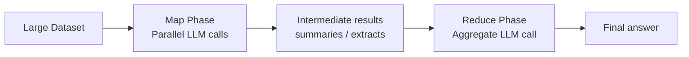

# Map/reduce

> **Learning Path:** LLM Application Engineering
> **Section:** 7.3.5 — LLM patterns

**Map/Reduce for LLMs**

### 1. The problem

You need an answer derived from a large collection: 10,000 support tickets, 500 research papers, a whole repo of logs.

A single LLM call cannot do it. Constraints bite at once:
* **Context window:** The whole collection does not fit in one prompt.
* **Cost and latency:** One massive prompt is expensive and slow.
* **Rate limits:** You cannot send 10,000 items sequentially in one request.
* **Reasoning quality:** LLMs degrade on very long prompts; they miss details.

You need to extract signal from many items and combine it into one coherent output.

### 2. Mental model

Fan-out then fan-in.

**Map:** Run the same small, focused operation in parallel over many items independently. Each call is cheap, bounded, and stateless.

**Reduce:** Take the intermediate results and aggregate them with one or more LLM calls into a final answer.

Think of it as hiring many analysts to read one document each, then a senior analyst to synthesize their notes.

### 3. How it works

**Map phase.** Define a strict instruction and schema. Each item is processed independently, no cross-item context needed.

Prompt shape: `Given this item, extract X in JSON.`

Output is structured, e.g., `{theme, sentiment, key_quote}`. This makes reduction reliable.

**Reduce phase.** You now have N small results, not N huge documents. Reduce combines them.

Two common variants:
* **Single reduce:** One LLM call over all map outputs, with a token budget in mind. Works for N in hundreds.
* **Hierarchical reduce:** Reduce in trees. Map 1,000 items → 100 summaries → 10 summaries → 1 final. Keeps token usage bounded and latency reasonable.

### 4. Architectural reasoning

When it helps:
* Input is too large for one context window.
* Items are independent, so parallelism is safe.
* You need a global synthesis, not just per-item answers.

Alternatives:
* **Single prompt with truncation** - fast and cheap, loses data.
* **RAG retrieval** - good for finding relevant items, poor for exhaustive aggregation like "count themes across all items".
* **Streaming/chunking** - still one model, still misses cross-item patterns.

Choose map/reduce when you need *complete coverage + synthesis*. The decision is about correctness over speed and cost.

### 5. Trade-offs and failure modes

* **Cost scales linearly with items.** Map is O(N) LLM calls. Budget and caching matter.
* **Error propagation.** Hallucinations in map are amplified in reduce. Mitigate with structured output, few-shot examples, and validation.
* **Loss of nuance.** Summarization in map discards detail. Reduce can only work with what was kept. Choose map prompts to preserve decision-relevant signals.
* **Ordering and deduplication.** Map is unordered. Reduce must be idempotent and handle duplicates.
* **Latency.** Fan-out is parallel, but the tail latency of map determines start of reduce. Hierarchical reduce adds steps.

Failure modes to watch: token overflow in reduce, prompt drift across map workers, and silent schema violations that break the reduce prompt.

### 6. Example

Enterprise support analysis.

Goal: Find top 3 product issues from 2,000 tickets this month.

Map: For each ticket, prompt `Extract product area, issue type, severity 1-5, and one sentence summary. Return JSON.` Run with 50 parallel workers.

Reduce: Feed the 2,000 JSON objects to a hierarchical reducer: first summarize per product area, then produce final ranking with evidence quotes.

Result is comprehensive, reproducible, and fits in context.

### 7. Reasoning challenge

You have 50,000 customer reviews and need a quarterly report with sentiment trends per region. Rate limit is 1,000 LLM calls per minute and context window is 128k tokens.

Do you use single reduce, hierarchical reduce, or map only? What do you put in the map output to make reduce reliable, and what do you do about cost?

### 8. Key takeaway

* Map/reduce exists to turn an unbounded collection into a bounded synthesis problem the LLM can solve.
* Map for parallelism and extraction, reduce for aggregation. Structure is the interface between them.
* Use hierarchical reduce when intermediate results do not fit in one prompt.
* The pattern trades cost and latency for completeness and consistency.
* Quality is determined by map prompt design and reduce schema, not by model size alone.
