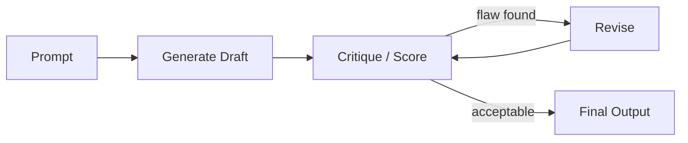

# Reflection

> **Learning Path:** LLM Application Engineering
> **Section:** 7.3.6 — LLM patterns

**Reflection** in LLM applications is not self-awareness. It is an architectural pattern to make a single model act as both generator and critic.

### The problem

A single-pass LLM is fast and cheap, but it has no verification step. It will confidently hallucinate, make arithmetic errors, choose the wrong tool, or produce code that looks right but fails.

You can increase quality with better prompts, more context, or RAG. But you still have one shot at generation with no internal check. For complex reasoning, coding, or factual tasks, error rate scales with task complexity.

The constraint is: you want higher quality without always calling an external system or a human.

### Mental model

Think writer + editor in one model.

Instead of: Prompt → Output
You do: Prompt → Draft → Critique → Revised Output

The same model, or a different instance, generates an answer then evaluates it against criteria, finds flaws, and rewrites. The loop can repeat.

The key is separation of concerns inside the LLM: generation mode vs evaluation mode.

### How it works

Essential mechanism is prompt-driven role switching:

1. Generate initial output with instructions to be complete.
2. Ask the model to critique it against explicit criteria: correctness, completeness, style, safety.
3. Feed critique back with the draft, ask for revision.
4. Optionally score and loop until threshold or max iterations.

It works because LLMs are good at evaluating text they did not generate. The critic persona reduces the model's tendency to defend its own first answer.

Variants:
* **Self-reflection**: same model does both steps.
* **Critique-rewrite**: two models, or same model with different temperature/role.
* **Scored reflection**: generate N candidates, self-score, pick best.

### Architectural reasoning

When it helps:
* **Complex reasoning and planning**: multi-step math, legal analysis, code generation where first draft is often wrong.
* **Quality-sensitive outputs**: customer-facing summaries, financial reports, where hallucination cost is high.
* **Self-contained tasks**: no reliable external verifier available, or you want to reduce tool calls.

What it solves: increases accuracy and reduces obvious errors without adding new services.

Alternatives:
* More few-shot examples or chain-of-thought prompting. Cheaper, but limited.
* RAG and tool use. Better for factual grounding, not for logical consistency.
* External validator / test harness. Strongest, but adds latency and complexity.

Choose reflection when you need a *better* answer from the same model, and can tolerate 2-3x latency and token cost.

### Trade-offs and failure modes

* **Latency and cost.** Each iteration is a full generation. Typical reflection is 2-3x tokens and 2-4x latency. It does not scale to high-throughput, low-latency paths.
* **Diminishing returns and oscillation.** After 1-2 rounds improvements plateau. The model can over-edit, remove correct details, or loop on style.
* **Self-reinforcing bias.** The critic is still the LLM. It can miss the same class of errors it makes as generator, especially factual errors not in context.
* **No ground truth.** Reflection improves plausibility, not truth. Without external verification, it can make a bad answer more confidently wrong.

Operate it with a max iteration cap, explicit checklists, and stop criteria like score threshold.

### Example

Code generation service for internal SDK.

First pass generates a function from spec. Reflection prompt then asks: "Review this code for correctness, edge cases, Python style, and testability. List issues, then output revised code."

In practice, first draft often misses error handling. After critique, revision adds validation and type hints. Accuracy on unit tests improves from ~55% to ~80% with one reflection round, at ~2.5x token cost. For production release, final step still runs an automated test harness, but reflection reduces the number of failing candidates significantly.

### Reasoning challenge

You are designing a real-time customer support chatbot with an SLA of 800ms p95. The model currently hallucinates product specs ~12% of the time. You can add RAG with ~150ms overhead, or add one round of self-reflection with ~600ms overhead.

Which do you choose, and what hybrid option could you consider?

### Key takeaway

* Reflection trades latency and cost for quality by making the LLM critique then revise its own output.
* It is useful when error cost is high and tasks are reasoning-heavy, not when speed is critical.
* It improves plausibility and consistency, not guaranteed correctness. Pair with external verification for factual safety.
* Architect it as a bounded loop with explicit criteria, max iterations, and clear stop conditions.
