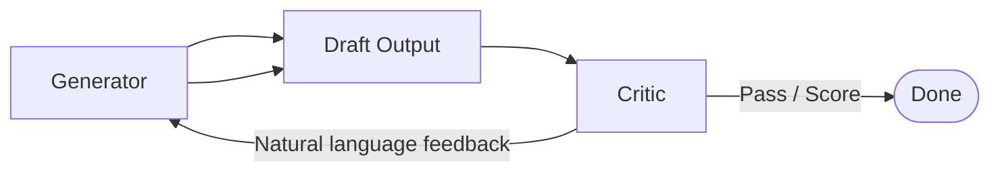

# Critic

> **Learning Path:** LLM Application Engineering
> **Section:** 7.3.7 — LLM patterns

### The problem

A single-pass LLM generation is fast and cheap, but it is not reliably correct. It will confidently produce plausible answers that violate constraints, hallucinate facts, break style guides, or fail hidden requirements.

You can try to make the prompt better. You can add more context. You still get errors, especially when the output must satisfy multiple, non-local constraints at once: factual accuracy + tone + compliance + formatting.

The constraint is: you cannot always add a human in the loop, but you cannot trust the generator alone.

### Mental model

Critic is code review for LLM outputs.

A generator produces a draft. A critic — often another LLM call — reads the draft against criteria and returns feedback: what is wrong, why, and how to fix it. The generator then revises.

You are splitting generation from evaluation. The critic does not need to generate the final answer well; it needs to evaluate well.

### How it works

The essential mechanism is a feedback loop, not a single call.

1. Generate candidate with the generator, with the task and constraints in context.
2. Critic evaluates against explicit criteria. Output is either a scalar score or natural language critique: "Missing citation, tone too formal, math error in step 3".
3. If criteria met, accept. If not, feed critique back to generator for revision. Optionally iterate with a max budget.

Two variants matter architecturally:
* **Self-critic:** same model plays both roles, different prompts. Cheaper, risks echo chamber.
* **Separate critic:** different model, often smaller and cheaper for classification, or a stronger model for high-stakes review. Decouples capabilities.

Critic criteria are made explicit: checklist, rubric, or rule set. Vague "is this good?" produces vague feedback.

### Architectural reasoning

Use a critic when output quality has a verifiable spec and failure cost is high.

It helps when:
* You need constraint satisfaction beyond what prompting can enforce, e.g., compliance, safety policies, output schema.
* You need improvement over a single pass without scaling model size.
* You can tolerate extra latency and cost for higher precision/recall.

Alternatives:
* Stronger base model. Often helps, but is expensive and does not guarantee constraint adherence.
* Better prompting / chain-of-thought. Improves reasoning but does not provide external verification.
* RAG / tools. Improves factual grounding but does not check style, logic, or compliance.

Choose critic when you need *detect and fix* rather than just *generate better*.

### Trade-offs and failure modes

**Latency and cost.** Each iteration is N additional LLM calls. Real-time use cases may be unacceptable. Budget iterations, e.g., max 2 revisions.

**Critic quality.** A weak critic approves bad outputs or gives misleading feedback. The critic must be at least as good at evaluation as the generator is at generation. Sometimes a smaller, fine-tuned classifier beats a general LLM for scoring.

**Over-correction and drift.** The generator can overfit to the critic's feedback, making outputs safer but bland, or oscillate between errors.

**Echo chamber.** Self-critic with the same model tends to agree with itself. Use different temperature, different prompt framing, or a separate model to break symmetry.

**Non-termination.** Without a hard stop, you can loop forever chasing marginal improvements. Always cap iterations and define acceptance threshold.

### Example

Enterprise code generation with policy compliance.

Generator produces a Python function from a spec. Critic checks a rubric: correct signature, handles edge cases, no disallowed imports, docstring present, unit test passes conceptually.

First draft uses `eval`. Critic returns: "Security violation: eval is prohibited by policy. Replace with ast.literal_eval". Generator revises. Second pass passes rubric, output accepted.

This is cheaper than human review and more reliable than single-pass generation for policy-bound code.

### Reasoning challenge

You are building a real-time customer support chatbot. Latency SLA is <800ms p95. You want to reduce hallucinations on product facts. Would you add a critic loop in the request path?

What would you change about the architecture to keep the SLA while still getting verification benefits?

### Key takeaway

* Critic exists to add verifiable quality control to generative systems where single-pass is insufficient.
* Split generation from evaluation; make criteria explicit and testable.
* It trades latency and cost for accuracy and constraint satisfaction.
* Success depends on critic capability, clear acceptance criteria, and bounded iteration to avoid cost and drift.
