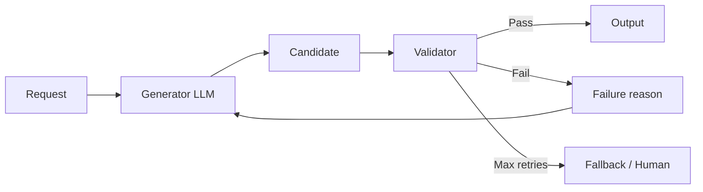

# Generator/validator

> **Learning Path:** LLM Application Engineering
> **Section:** 7.3.8 — LLM patterns

**Generator/validator**

### 1. The problem

A single LLM call is cheap and fast, but it is probabilistic. For high-stakes outputs you get three failure classes:

* **Format failures:** JSON is malformed, fields are missing, schema is violated.
* **Content failures:** Hallucinated facts, wrong reasoning, policy violation.
* **Semantic failures:** Output is valid but doesn't satisfy business rules.

Prompt engineering, stronger models, or constrained decoding reduce these failures, but they do not eliminate them. When the cost of a bad output is high — money, compliance, user trust — you need a *verifiable* output, not just a better prompt.

### 2. Mental model

Generator/validator is a separation of concerns for reliability.

Generator = creativity under constraints. Produce candidates quickly.
Validator = judgment with rules. Reject or score candidates.

Think of it as a compiler pipeline: generator writes code, validator runs tests. The validator is deterministic or stricter than the generator, and the loop continues until the candidate passes or you give up.

### 3. How it works

Core loop:

1. **Generate.** One or more candidates from the generator with temperature >0.
2. **Validate.** Check against explicit criteria: schema, facts, policy, business rules.
3. **Decide.** Pass → return. Fail → feed validation error back to generator with a revise prompt.
4. **Repeat** up to N times, then fallback.

Validator can be:
* **Rule-based:** JSON schema, regex, type checks, unit tests.
* **Model-based:** A second LLM with a critique prompt: "Is this output correct and safe? Explain why not."
* **Hybrid:** Rules first, cheap and fast; model second for semantic checks.

The feedback is critical. Instead of "try again", give the validator's reason: "field `amount` is not numeric" or "claim conflicts with source doc X".

### 4. Architectural reasoning

When it helps:
* **Structured data extraction** where schema compliance is non-negotiable.
* **Code generation** where outputs must compile or pass tests.
* **Safety / policy** where you need a hard reject before user sees output.
* **RAG** where you must ground claims in retrieved docs.

What it solves: It converts non-deterministic generation into a controllable reliability loop. You can use a cheap, fast generator and a strict validator.

Alternatives and why you might not choose them:
* **Constrained decoding / function calling:** Great for format, weak for semantic correctness.
* **Stronger model only:** Improves average quality but doesn't give guarantees and costs more per call.
* **Post-processing regex:** Cheap, but can't catch semantic errors.

Architectural decision: You are trading latency and cost for verifiability. Use generator/validator when the cost of a bad output > cost of 2-3 LLM calls.

### 5. Trade-offs and failure modes

* **Latency x Cost.** Each iteration is another LLM call. Typical budget is 2-3 attempts. Design for tail latency.
* **Validator brittleness.** A too-strict validator rejects good outputs; too-lenient validator lets bad ones through. This is a tuning problem, not a code problem.
* **Echo chamber.** If validator is the same model family with similar biases, it can agree with bad generations. Use different prompting, or rule-based checks for orthogonal signals.
* **Feedback quality.** Vague feedback = no improvement. The validator must return actionable, specific errors.
* **Infinite loop risk.** Always cap retries and have a fallback: human review, safe default, or degraded output.

### 6. Example

Enterprise invoice extraction.

Generator prompt: "Extract line items from this invoice image as JSON with fields id, description, qty, unit_price, total."

Validator steps:
1. Rule: JSON parses and matches schema.
2. Rule: sum(qty * unit_price) == total within tolerance.
3. Model: "Are description values plausible for this vendor? Flag hallucinations."

If validation fails, feedback is sent back: "JSON valid but arithmetic mismatch: line 3 total should be 120 not 100." Generator revises.

This catches both format and business logic errors without requiring a single perfect model.

### 7. Reasoning challenge

You need to generate SQL from natural language for an internal analytics tool. Bad SQL can expose sensitive tables or be inefficient.

Do you use generator/validator, and what does the validator check? Would you use the same model for both roles, and what is the risk?

### 8. Key takeaway

* Generator/validator turns probabilistic generation into a verifiable pipeline by separating creation from judgment.
* Use it when output correctness, safety, or schema compliance is a requirement, not a nice-to-have.
* Validator quality determines system reliability; invest in specific, actionable feedback over clever generation.
* Budget for cost and latency: 2-3x calls is typical, cap retries, and design fallbacks.
