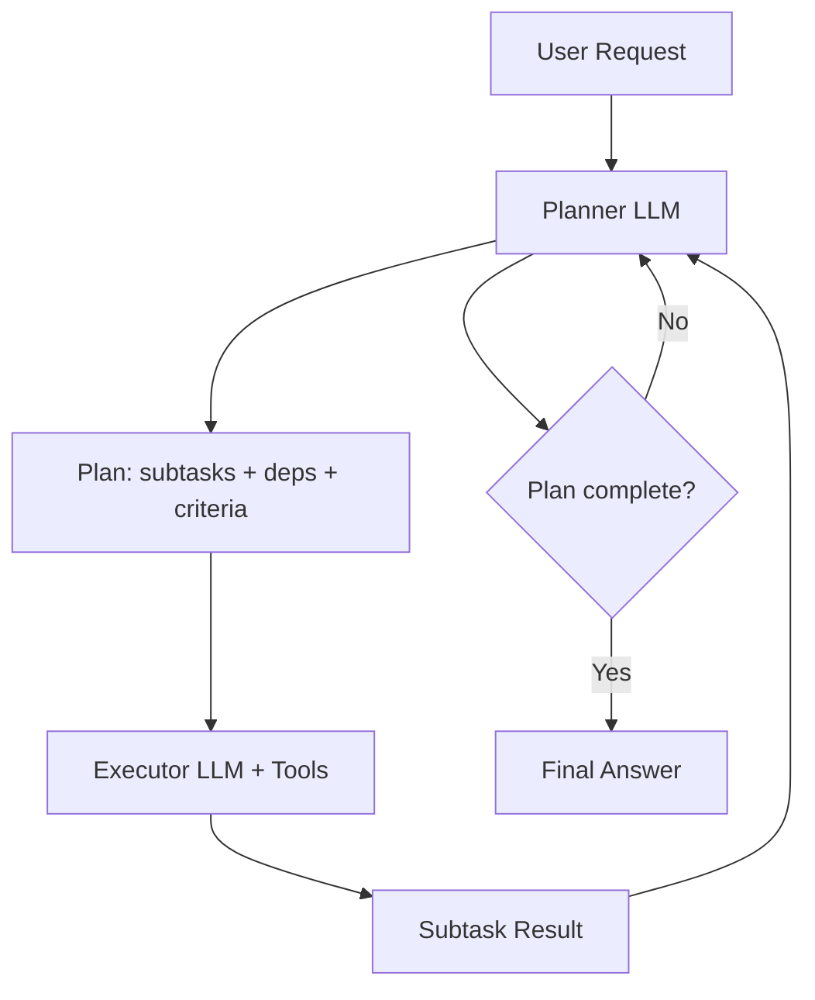

# Planner/executor

> **Learning Path:** LLM Application Engineering
> **Section:** 7.3.9 — LLM patterns

**Planner/Executor**

### 1. The problem

A single LLM call works for simple Q&A. It breaks on complex, multi-step work that requires planning, tool use, and verification.

What happens:
* The model tries to plan and execute in one shot → it loses track of steps, hallucinates intermediate results, or exceeds context.
* Long prompts with full history make the model drift.
* You need different capabilities for *decomposition* vs *execution*: planning needs breadth, execution needs precision with tools.

The constraint is not intelligence, it's working memory and reliability over steps.

### 2. Mental model

Planner = architect. Executor = specialist worker.

The planner doesn't do the work, it decides *what* work is needed, in what order, with what inputs/outputs. The executor runs each sub-task, often with tools, and returns concrete results. The planner can revise the plan based on results.

This separates concerns: strategy from tactics.

### 3. How it works

1. **Plan generation.** Planner receives the user request and produces a structured decomposition: list of subtasks, dependencies, required inputs, success criteria. Output is JSON or a constrained schema, not free text.
2. **Execution.** Each subtask is dispatched to an executor. The executor can be the same model with a different system prompt, or a smaller/faster model, or a tool. It has only the context for that subtask.
3. **Loop.** Results are fed back to the planner. Planner checks completeness, resolves failures, reorders, or creates new subtasks.
4. **Synthesis.** Once all subtasks succeed, planner synthesizes a final answer.

The key is explicit handoff with a contract: what the executor must produce, not how.

### 4. Architectural reasoning

**When it helps**
* Tasks are decomposable with clear intermediate outputs: research → summarize → draft.
* You need tool use in execution but not in planning.
* You want to control cost/latency by using a cheaper executor for routine steps and a stronger planner for coordination.
* You need auditability: plan is logged, each subtask is traceable.

**Alternatives**
* **Single agent with chain-of-thought:** cheaper, lower latency. Fails on long, branching tasks.
* **ReAct / tool-using agent:** interleaves reasoning and acting. Good for tight loops, bad for large upfront planning.
* **Router:** picks a specialist model per request, not per step.

Choose planner/executor when correctness of the *plan* matters more than speed, and when errors in one step should not corrupt the whole.

### 5. Trade-offs and failure modes

* **Error propagation.** A bad plan is fatal. The planner hallucinates a required data source or misses a dependency → executor cannot recover.
* **Latency and cost.** Multiple LLM calls + feedback loops. 3-7x cost vs single call.
* **Consistency.** Planner and executor can disagree on schema. You need strict output contracts and validation.
* **Over-decomposition.** Planner creates too many tiny steps → thrashing. Under-decomposition → executor fails the same way a single model would.
* **Observability burden.** You must track plan state, retries, and partial results.

Mitigations: validate plan schema, limit planner iterations, add a critic/verifier step, and allow executor to ask for clarification instead of guessing.

### 6. Example

Enterprise travel booking: "Book a 3-day trip to Lisbon for 2 people in March, under $2k, with vegetarian restaurants."

Planner outputs:
1. Get travel dates → determine flight window
2. Find flights < $800 pp
3. Find hotels 3 nights, budget remaining, central
4. Find 3 vegetarian restaurants per day
5. Build itinerary summary

Executor runs each subtask with tools: flight search API, hotel API, web search. Results return to planner, which checks budget constraint and revises hotel choice if flights are expensive. Final synthesis is a coherent itinerary, not a stream-of-consciousness answer.

### 7. Reasoning challenge

You have a customer support query: "My invoice #12345 is wrong, explain and refund if valid."

Options: single ReAct agent, or planner/executor with a separate policy executor.

What do you need to decide first, and what failure mode worries you most with planner/executor here?

### 8. Key takeaway

* Planner/executor exists to separate *what to do* from *how to do it* for reliability on multi-step tasks.
* It trades latency and cost for decomposability, auditability, and better tool use.
* The planner is the single point of failure; constrain its output and validate it.
* Use it when tasks are decomposable, have dependencies, and require verifiable intermediate results.
