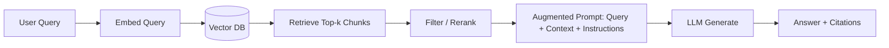

# RAG fundamentals

> **Learning Path:** RAG Architecture
> **Section:** 8.1.1 — Learn

**RAG Fundamentals — 8.1.1 Learn**

### 1. The problem

A general-purpose LLM is a frozen snapshot of the web up to a cutoff date. It cannot read your private data, it cannot know what changed yesterday, and it will confidently invent answers when it doesn't know.

For an AI Solution Architect this creates three constraints:
* **Knowledge freshness:** product docs, pricing, internal policies change faster than model retraining
* **Data privacy:** customer data, internal code, proprietary research cannot be put in training data
* **Controllability:** you need verifiable sources and audit trails, not just plausible text

Fine-tuning solves some of this but is expensive, slow to update, and leaks data into weights. Prompting alone doesn't scale.

### 2. Mental model

RAG = Retrieve then Generate.

Instead of forcing the model to memorize, you give it only the relevant external evidence at query time and ask it to reason over that evidence.

Think of it as a researcher with a library card: the LLM is the writer, retrieval is the librarian that finds the right books before writing starts.

### 3. How it works

The system has two paths: index and query.

Index: documents are chunked, embedded into vectors, stored with metadata. Chunking strategy determines recall.

Query:

Retrieval returns passages, not whole documents. Those passages are inserted into the prompt as context, with instructions to ground the answer and cite sources. Generation is still LLM, but now conditioned on retrieved facts.

### 4. Architectural reasoning

RAG helps when you need **grounding to external, changing, private data** without retraining.

* When it helps: enterprise knowledge bases, support tickets, legal contracts, real-time product catalogs, internal tools
* What it solves: hallucination reduction, freshness, privacy, explainability via citations
* Alternatives:
  * Fine-tuning / distillation: better for stable domain style and low latency, bad for daily updates and private data
  * Prompt-only with tools: works for small, structured data
  * Full agents with browsing: expensive and non-deterministic

Decision rule: If knowledge changes faster than you can retrain, is private, or must be cited, prefer retrieval over weight updates.

### 5. Trade-offs and failure modes

* **Retrieval quality > generation quality.** Bad chunks, poor embedding, or wrong top-k will poison the LLM. Garbage in, garbage out.
* **Latency and cost.** Retrieval + rerank + larger context window = more tokens and p95 latency. You trade speed for accuracy.
* **Context window limits.** You cannot retrieve everything. You need chunking, reranking, and summarization to fit relevant signal.
* **Freshness vs consistency.** Vector DB must be updated when source changes. Stale index = silent hallucinations.
* **Failure modes to design for:** no results, too many irrelevant results, contradictory sources, prompt injection via retrieved text, and leakage of sensitive passages into context.

### 6. Example

Enterprise support bot for an SaaS company.

Source: internal Confluence + Zendesk tickets + release notes. Indexed nightly with metadata: product, version, date.

Query: "Why did API rate limits change last week?"

Retriever finds release notes from 3 days ago and 2 related tickets. Reranker promotes the official note. LLM generates: "Rate limits increased from 100 to 200 rpm on 2026-01-12 per... [link]".

No training data exposed, answer is current, and citation is auditable.

### 7. Reasoning challenge

You are architecting an assistant for a retail catalog with 2M SKUs that changes daily, plus personalized pricing per customer segment.

Would you use RAG, fine-tuning, or both? What would you put in the vector store vs what would you keep in the prompt? Where does personalization happen?

### 8. Key takeaway

* RAG exists to ground LLMs in external, private, changing data without retraining
* Architecture is retrieve -> rank -> augment -> generate, with citations as a first-class requirement
* Retrieval quality dominates end-to-end quality; design chunking, embeddings, and reranking before you tune prompts
* Choose RAG when freshness, privacy, and auditability matter more than raw latency
* The main failure modes are stale indices, bad retrieval, and context overload — design for them explicitly
