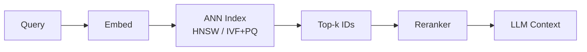

# ANN indexes

> **Learning Path:** RAG Architecture
> **Section:** 8.1.10 — Learn

### 1. The problem

RAG needs semantic retrieval at scale. You embed millions of chunks into 768-1536 dim vectors and for each query you need the top-k most similar vectors.

Brute force cosine similarity is O(N * d). With 10M vectors at 1024 dims that's ~10B operations per query. Even on GPU you won't hit <100ms p99, and you can't scale linearly with data.

Exact nearest neighbor is a non-starter. You need *approximate* nearest neighbor: fast enough to serve, good enough recall to keep answer quality.

The constraint is not just speed. You need predictable latency under load, bounded memory, and the ability to update the index as new documents arrive.

### 2. Mental model

Think of an exact search as checking every house in a city for the closest coffee shop. ANN is building a road map with shortcuts.

You don't need the mathematically closest house, you need one of the closest, found by following a few hops through a navigable structure. The index trades a small, controllable loss in recall for orders of magnitude faster search.

### 3. How it works

Two families dominate RAG:

**Navigable graphs - HNSW**
Build a multi-layer graph where each vector connects to its nearest neighbors. Search starts at an entry point in the top layer and greedily walks down, always moving to the nearest neighbor to the query, then descends to next layer.

It is fast because the graph is navigable: a few hundred hops find a good neighborhood. It has no training phase and supports incremental inserts.

**Inverted file + compression - IVF + PQ**
Partition vector space into coarse clusters with k-means. IVF narrows search to a few promising clusters. Product Quantization compresses vectors into codes, so distance is computed with lookup tables instead of full dot products.

IVF+PQ is memory efficient and great for large static corpora. HNSW is better for dynamic, high-recall, low-latency queries.

Both are approximate. You tune `ef_search` / `nprobe` to move along the recall-latency curve.

### 4. Architectural reasoning

Use ANN when you have:
* >100k vectors and need <50ms p99 retrieval
* Recall >0.85 is acceptable, perfect recall is not required
* Query volume is high enough that brute force cost dominates

Alternatives:
* **Brute force + GPU**: Works for <1M vectors in a single node. Fails on scale and cost.
* **BM25 keyword**: Complementary, not replacement. Use hybrid.
* **Exact tree methods**: KD-Tree, Ball Tree collapse in >~50 dims due to curse of dimensionality.

Decision drivers:
* **Dynamic vs static**: HNSW favors frequent inserts/updates. IVF+PQ favors batch rebuilds.
* **Memory budget**: PQ reduces RAM 8-16x at cost of recall. HNSW stores full vectors + graph.
* **Recall target**: Rerankers tolerate lower ANN recall. If you retrieve 100 and rerank to 10, you can afford 0.85-0.9 ANN recall. If you retrieve only 5, you need >0.95.

### 5. Trade-offs and failure modes

* **Recall vs latency vs memory**: Increase `ef_search` / `nprobe` -> higher recall, higher latency, higher CPU. This is the main knob.
* **Build cost vs query cost**: HNSW builds fast, queries fast. IVF needs clustering and quantization training. Rebuilds are expensive.
* **Freshness**: ANN indexes are eventually consistent. High write throughput causes stale reads or requires dual-write + background merge. A document ingested now may not be searchable for seconds-minutes.
* **Distribution shift**: Embeddings drift as the embedding model changes. An index built on old embeddings degrades silently. You need versioned indexes and re-embedding pipelines.
* **Tail latency collapse**: Under high QPS, HNSW graph walks contend on hot nodes. Recall drops if you don't cap `ef_search` per query.
* **Quantization error**: PQ introduces distance errors. For fine-grained domains like legal or medical, error can push the true neighbor out of top-k.

### 6. Example

Enterprise support RAG with 20M support articles and tickets.

Architecture:
* Ingest pipeline embeds chunks with `text-embedding-3-large`, writes to Kafka.
* Indexer builds a HNSW index in Qdrant/Milvus,  `M=32, ef_construction=200`, shards by tenant.
* Query path: embed query -> HNSW search with `ef_search=128` -> 100 candidates -> cross-encoder rerank to 10 -> LLM.

Result: ~35ms p99 retrieval, ~0.92 recall@100 vs brute force. Memory ~60GB for vectors + graph. Weekly re-index for new articles, incremental inserts for daily deltas.

If memory was constrained, they'd switch to IVF-PQ with `nlist=4096, m=64` and accept a rebuild nightly.

### 7. Reasoning challenge

You have 50M product vectors, 2,000 QPS, p99 latency budget 50ms, and you add ~1M new products per day. You currently use IVF-PQ with nightly rebuilds and see 15 minute lag for new items, and recall@10 dropped after a model upgrade.

What do you change, and what do you measure first?

*Hint: think about freshness vs recall vs rebuild cost.*

### 8. Key takeaway

* ANN exists because exact similarity search does not scale with vector dimensionality and corpus size.
* HNSW gives low-latency, high-recall dynamic search. IVF+PQ gives memory efficiency for large static corpora.
* Tune recall-latency via search parameters, not by chasing perfect recall.
* Operate ANN indexes like a system: version embeddings, monitor recall@k vs brute force on a golden set, and plan for rebuilds and freshness lag.
