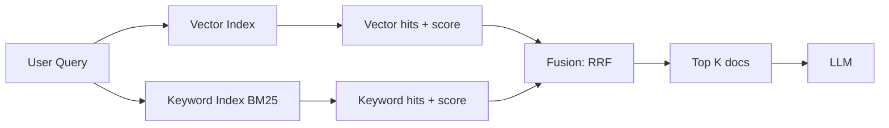

# Hybrid search

> **Learning Path:** RAG Architecture
> **Section:** 8.1.11 — Learn

**Hybrid search in RAG**

### 1. The problem

Pure vector search works well for semantic similarity: "cheap laptop for students" finds relevant docs even with different wording.

It fails badly on constraints an architect cares about:
* **Exactness and rarity.** Product SKUs, invoice numbers, dates, names. Embeddings collapse rare tokens into noise.
* **Lexical signals.** User types a proper noun or typo-near query. Vector similarity drifts.
* **Precision vs recall.** Vector retrieval is great recall for meaning, poor precision for exact match. Keyword retrieval is the opposite.

In RAG you need both: you want the model to understand intent *and* to find the exact passage that contains the fact.

### 2. Mental model

Hybrid search = two independent retrieval signals fused into one ranking.

Think of two experts:
* **Vector expert** says "these docs mean the same thing"
* **Keyword expert** says "these docs contain the same words"

You don't pick one expert. You ask both, then combine their votes.

### 3. How it works

Minimal pipeline:

1. Embed query, search vector store for cosine similarity.
2. Run same query through lexical index, usually BM25.
3. Fuse results. The common production choice is Reciprocal Rank Fusion:
   `score = sum(1 / (k + rank))` per system. No need to normalize scores across systems.
4. Optionally rerank top N with cross-encoder for quality.

This is retrieval, not a new index type. You keep two indexes and fuse at query time.

### 4. Architectural reasoning

When it helps:
* Queries mix semantic intent with exact entities. "Return policy for order #48291" needs exact match + context.
* Domain has rare but important terms: legal clauses, medical codes, product SKUs.
* You need high recall before LLM generation. Missed context = hallucination.

Alternatives:
* Vector only: cheaper, simpler, works for pure paraphrase.
* Keyword only: precise but brittle to rephrasing.
* Rerank-only vector: improves precision but doesn't fix missing rare terms.

Decision rule: if your corpus contains identifiers, numbers, or proper nouns that must be found verbatim, hybrid is the default. If your queries are purely conceptual, vector may be enough.

### 5. Trade-offs and failure modes

* **Latency and cost.** Two retrievals + fusion = 2x index reads. Mitigate with parallel execution and small top-K per system, e.g., 50 each -> fuse to 20.
* **Tuning.** RRF is robust, but you may need per-domain weighting. Over-weighting keyword yields noisy exact matches; over-weighting vector loses precision.
* **Duplicate and redundancy.** Same doc appears in both lists. Fusion handles it, but you must deduplicate.
* **Index drift.** Vector and keyword indexes must stay in sync on ingest. Lag in one creates inconsistent results.
* **False sense of coverage.** Hybrid improves recall but doesn't fix bad chunking or poor embeddings. Garbage in, garbage out.

### 6. Example

Enterprise support RAG with 2M help articles and order data.

User asks: "Did my order 8492-XYZ ship? What's the refund status?"

Vector retrieval finds articles about shipping delays and refund policies.
Keyword retrieval finds the exact order record containing `8492-XYZ` and the refund line.

Fusion surfaces the order record at rank 1 and relevant policy context at 2-3. LLM can answer with citation.

Pure vector would likely rank generic shipping articles above the specific order.

### 7. Reasoning challenge

You are designing RAG for a product catalog with 500k SKUs, each with description, specs, and price.

Queries are: "waterproof hiking boots under $200" and "Nike Air Max 270 size 10".

Would you use hybrid search? If yes, how would you weight the two signals for each query type, and what would you do about price filtering?

### 8. Key takeaway

* Hybrid search exists to fix the precision/recall gap between semantic and lexical retrieval.
* It is a fusion problem, not a single better index.
* Choose it when queries require both meaning understanding and exact term matching.
* The main costs are latency and operational complexity of keeping two indexes consistent.
* RRF is a simple, effective default for fusion; reranking is an optional second stage.

You should now be able to reason when vector alone is sufficient and when the extra complexity of hybrid is justified.
