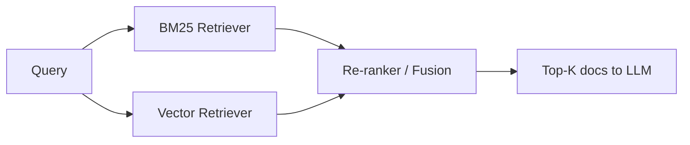

# BM25

> **Learning Path:** RAG Architecture
> **Section:** 8.1.12 — Learn

**BM25**

### 1. The problem

In RAG you need high recall retrieval before generation. Vector search gives semantic similarity, but it is expensive, non-deterministic, and brittle on rare terms.

Problems appear when:
* A query contains a proper noun, SKU, error code, date, or number. Embeddings compress those into a generic vector.
* New documents are added and not yet re-embedded.
* You need explainable recall: why was this document returned?

You need a cheap, deterministic lexical signal that finds documents containing the exact query terms, especially rare ones.

### 2. Mental model

BM25 ranks documents by how *surprisingly* they contain the query terms.

Think of it as a statistical TF-IDF with saturation.

* Term Frequency: more occurrences help, but with diminishing returns.
* Inverse Document Frequency: rare terms matter more than common words.
* Document length normalization: long documents don't automatically win.

It's not semantic. It doesn't know synonyms. It knows statistics.

### 3. How it works

For each query term t in document D:

`score(D,Q) = sum IDF(t) * TF_norm(t,D)`

Where:
* `IDF(t) = log[(N - n_t + 0.5) / (n_t + 0.5)]`
  N = total docs, n_t = docs containing t. Rare terms get high IDF.
* `TF_norm = [f * (k1 + 1)] / [f + k1 * (1 - b + b * |D|/avgdl)]`
  f = term frequency in D. k1 controls saturation ~1.2-2.0, b controls length norm ~0.75.

Result: a document gets high score if it contains rare query terms several times, but not if it's just long and noisy.

No training data, no embeddings, just inverted index statistics.

### 4. Architectural reasoning

BM25 solves lexical recall. Vector solves semantic recall.

When it helps:
* Exact match matters: product codes, names, citations, code symbols.
* Low latency, low cost retrieval needed. BM25 runs on inverted index in microseconds.
* You need deterministic, explainable ranking for auditing.

Alternatives:
* **Pure vector**: good for paraphrase, bad for rare terms and out-of-vocabulary.
* **Pure BM25**: good for keywords, bad for synonyms and intent shift.

Architectural decision in RAG is usually hybrid:

BM25 provides broad lexical recall, vector provides semantic recall, fusion gives both. Many systems do BM25 first for recall, then vector, then cross-encoder re-rank for precision.

### 5. Trade-offs and failure modes

* **No meaning, only statistics.** "car" and "automobile" are different. Synonyms, typos, paraphrases are missed. That's why you pair it with semantic.
* **Language and tokenization dependent.** Needs good analyzer for stemming, stopwords. Poor tokenization kills IDF.
* **Tuning matters.** k1 and b change behavior. Default k1=1.2, b=0.75 works generally, but domain-specific tuning improves recall.
* **Long document problem.** BM25 works per field. You need chunking strategy. Too small chunks lose context, too large dilute signal.
* **Cold start / updates are cheap.** New docs just update inverted index. No embedding recompute.

Failure mode to watch: over-relying on BM25 alone in conversational RAG. User asks "How do I reset my password?" BM25 finds "reset password" docs but misses "forgot credentials" docs.

### 6. Example

Enterprise support RAG.

Query: "Error 0x80070005 when installing KB5031356 on Windows Server 2022"

Vector may retrieve generic Windows install docs. BM25 will surface the exact KB article and forum posts containing both the hex code and KB number because those terms have very high IDF and appear together. Hybrid retrieval gets both the exact KB article via BM25 and semantically similar troubleshooting steps via vector.

### 7. Reasoning challenge

You are designing RAG for a legal contract search system. Queries are natural language like "indemnification clause for data breach liability". Documents are 10-200 page contracts with defined terms.

Do you use BM25, vector, or hybrid? What would you put in the BM25 index vs the vector index?

Think about rare defined terms vs paraphrased intent, and how you would chunk.

### 8. Key takeaway

* BM25 is a cheap, deterministic lexical ranker based on term rarity and saturated frequency, not semantics.
* Use it for recall of exact terms, proper nouns, codes, and for explainability and low cost.
* It complements vector search. Hybrid retrieval is the default architecture for production RAG.
* Tune k1/b and chunking, and expect failure on synonyms and paraphrase without semantic signal.
