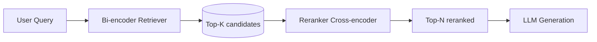

# Reranking

> **Learning Path:** RAG Architecture
> **Section:** 8.1.13 — Learn

### The problem

In RAG, the retriever's job is recall: find a broad set of passages that *might* contain the answer. Bi-encoder retrievers do this fast by embedding query and documents independently and ranking by cosine similarity.

The problem is similarity != relevance. A query and document can be vector-close yet mismatched on nuance, negation, intent, or required reasoning. The first pass is shallow: it can't model query-document interaction.

You can increase k to compensate, but you feed the LLM more noise, longer context, higher cost, and worse grounding. You can upgrade the embedding model, but you hit diminishing returns and still lack cross-attention.

You need a second pass that is slower but smarter, to prune and reorder.

### Mental model

Retrieval is a two-stage filter.

Stage 1: cheap recall. Get top-K candidates fast.
Stage 2: expensive precision. Re-score those candidates with full interaction.

Think of it as a bouncer then a judge. The bouncer lets in 100 plausible people quickly. The judge interviews them and picks the 5 who truly belong.

### How it works

Reranking takes the top-K from the retriever, typically 20-200, and scores each query-document pair with a cross-encoder.

A bi-encoder computes `E(q) · E(d)`. A cross-encoder computes `score = f([q; d])` with attention across tokens. That lets it capture phrase order, negation, and fine-grained relevance.

Flow:

Latency is dominated by RE. To keep it feasible you rerank a small K, not the whole corpus. Scoring is independent per pair, so it's embarrassingly parallel and batchable.

Some systems use a hybrid: lexical BM25 + vector, then rerank. Others cascade: small cross-encoder then larger one.

### Architectural reasoning

When it helps:
* You need high precision at top-N, not just recall at top-K. e.g., top 3 passages must be truly answerable.
* Queries are ambiguous or require semantic nuance that dot product misses.
* You have a latency budget that allows ~50-200ms extra per request but not a full corpus scan.

What it solves: reduces hallucinations and context pollution by replacing weak matches with strong ones.

Alternatives:
* Increase k and rely on LLM to ignore noise. Cheaper to build, more expensive to run, and LLM attention is not a perfect filter.
* Use a better embedding model. Helps recall, doesn't fix interaction limits.
* Use query expansion or hybrid retrieval. Complements reranking, not replaces it.

Decision rule: Use reranking when quality of the top few hits directly impacts downstream answer quality, and you can afford a small, bounded latency tax on a limited candidate set.

### Trade-offs and failure modes

**Latency vs quality.** Cross-encoders are 10-100x slower than bi-encoders per pair. You pay for each candidate you rerank. Batching and GPU help, but tail latency matters.

**Cost.** Reranking adds per-request inference cost. At scale this dominates retrieval cost.

**K selection.** Too small K hurts recall ceiling; the right answer was discarded before reranking. Too large K increases cost with little gain. Typical sweet spot is 50-100.

**Overfitting to reranker.** A reranker trained on MS MARCO-style relevance may not match your domain. It can favor verbose passages.

**Failure modes:** reranker latency spikes under load; reranker becomes a single point of failure; position bias in LLM persists even after good reranking if you feed too many docs.

### Example

Enterprise support RAG with 10M KB articles.

Retriever: `bge-large` bi-encoder over FAISS, top-100 in ~30ms.
Reranker: `ms-marco-MiniLM-L-12-v2` cross-encoder, batch size 32 on GPU, ~120ms for 100 docs.
Result: top-5 after reranking have 2.3x higher hit rate on human relevance judgments vs retriever top-5, and LLM answer correctness improves ~18%.

They keep k=100, n=5. If latency budget tightens, they fall back to k=50 with minimal quality loss.

### Reasoning challenge

You have a real-time chatbot with a 600ms p95 latency SLA. Retrieval is 40ms. LLM generation is 400ms. Your current top-10 retrieval gives acceptable recall but LLM often hallucinates due to noisy context.

Do you add a cross-encoder reranker, and if so, how do you size K and N to stay within SLA? What would you measure to decide if it's worth it?

### Key takeaway

* Reranking exists to convert cheap recall into precise top-N relevance via cross-attention.
* It is a deliberate latency-for-quality trade, applied only to a small candidate set.
* Choose K to preserve recall ceiling, choose N to fit LLM context and cost.
* Measure end-to-end: hit rate at top-N, LLM answer quality, and p95 latency/cost, not reranker score alone.
