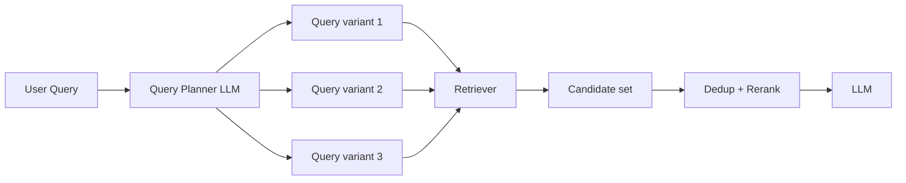

# Multi-query retrieval

> **Learning Path:** RAG Architecture
> **Section:** 8.1.15 — Learn

**Multi-query retrieval**

### 1. The problem

A single user query maps to one point in embedding space. Relevant documents are not distributed around that point.

The query is ambiguous, uses different terminology than the corpus, or needs multiple facets to be covered. Example: "How do we handle refunds?" is close to docs about "return policy", "chargeback process", "customer credit", and "reversal workflow". One embedding can't cover all of them.

With single-query retrieval you get high precision on exact phrasing and low recall on paraphrase and intent coverage. The LLM then hallucinates because context is incomplete.

You need recall without sacrificing too much latency or cost.

### 2. Mental model

Think of retrieval as casting a net. Single-query is one net in one shape. Multi-query is casting several nets shaped by different phrasings of the same intent, then merging the catch.

You are not asking the user for clarification. You are asking an LLM to imagine how the same intent would be expressed, and retrieve for each expression.

### 3. How it works

Query -> Query planner -> N reformulations -> Parallel retrieval -> Merge + dedupe -> Rerank

The planner generates 3-5 semantically faithful paraphrases, often with different focus. Each variant is embedded and retrieved independently. Results are unioned, duplicates removed by document ID or embedding similarity, then reranked by cross-encoder or original query relevance.

This is different from query expansion with keywords. The LLM generates full natural language queries, preserving intent.

### 4. Architectural reasoning

**When it helps**
* Ambiguous or broad intents: "pricing", "onboarding issues"
* Domain with jargon variance: legal, medical, enterprise SaaS
* Low recall is costly: you prefer over-retrieval then filter, not under-retrieval

**When it hurts**
* Very precise queries with known terminology
* Latency-sensitive paths where one extra LLM call + N retrievals is too much
* Small corpora where recall is already high

Alternatives:
* **Single query + hybrid BM25+vector**: improves lexical coverage, no LLM cost
* **Query decomposition**: for multi-hop questions, break into sub-questions
* **Iterative retrieval**: retrieve, generate, retrieve again

Multi-query sits between cheap hybrid search and expensive decomposition. It buys recall at the cost of an LLM planning step.

### 5. Trade-offs and failure modes

* **Recall vs precision**: You get more relevant docs, but also more noise. Reranking is mandatory.
* **Latency and cost**: 1 LLM call + N retrievals vs 1 retrieval. Parallelize retrievals, cache planner outputs for common queries.
* **Query drift**: The planner can hallucinate new intents. "refund policy" -> "how to cancel subscription" is drift. Constrain with prompt: "paraphrase, do not add new constraints".
* **Redundancy**: Same doc retrieved by 3 variants. Deduplication saves context window and ranking pollution.
* **Over-generation**: Too many variants dilute signal. 3-5 is typical sweet spot.

Failure mode to watch: The planner mirrors the user’s bias. If the query is vague, variants stay vague. Pair multi-query with a clarification step for truly underspecified queries.

### 6. Example

Enterprise support RAG for a SaaS product.

User asks: "Why is my export slow?"

Query planner produces:
1. "export performance troubleshooting"
2. "large data export timeout causes"
3. "export speed limits and quotas"

Each retrieves different KB articles: general performance guide, timeout config, plan limits. Single query would likely only hit the first.

Merged and reranked set gives the LLM enough context to answer accurately without asking follow-up questions.

### 7. Reasoning challenge

You have a RAG system for financial compliance with strict latency SLO of 600ms p95. Current single-query retrieval + rerank is 350ms. Adding multi-query with 4 variants adds 180ms LLM planning + parallel retrievals.

Do you enable multi-query globally, selectively, or not at all? What signals would you use to decide per query?

### 8. Key takeaway

* Single embeddings can’t cover paraphrase variance. Multi-query trades compute for recall.
* Generate variants that preserve intent, retrieve in parallel, then dedupe and rerank.
* Use it when recall matters more than raw latency and queries are ambiguous or domain-jargon heavy.
* Guard against drift and noise with tight prompting and good reranking.
* It’s an architectural decision about recall budget, not a feature toggle.
