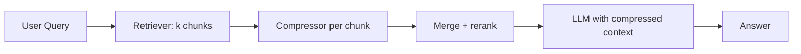

# Context compression

> **Learning Path:** RAG Architecture
> **Section:** 8.1.16 — Learn

### The problem

RAG works when you can fit the right evidence into the LLM's context window.

In practice retrieval is noisy and generous. You retrieve k=10-20 chunks to get good recall, each chunk 500-1000 tokens. That's 5k-20k tokens before the query, conversation history, and system prompt. You hit the window limit, you pay for tokens you don't need, and latency grows.

Worse, more context is not better. The model drowns in irrelevant sentences and loses the signal. You need *more recall at retrieval time* and *less noise at generation time*.

Context compression is the bridge between those two needs.

### Mental model

Think of it as a summarizer sitting between retrieval and generation.

Retriever is optimized for recall: get everything that *might* be relevant.
Compressor is optimized for precision: turn that set into a concise, query-focused briefing the LLM can actually use.

You are not trying to store the document. You are trying to preserve the answer-bearing facts.

### How it works

The essential mechanism is map-then-reduce over retrieved chunks:

* Extractive compression: keep only sentences/phrases with high query relevance, e.g. via cross-encoder scores or salience.
* Abstractive compression: a small LLM summarizes each chunk conditioned on the query. Query-aware summarization keeps facts that answer the question, drops the rest.
* Map-reduce: compress each chunk independently, then summarize the summaries. This bounds the work per chunk and parallelizes well.
* Structured compression: extract key-value triples, entities, or a short claim list instead of free text.

The compressor is usually cheaper and smaller than the generator. You pay a small latency cost up front to save a large cost downstream.

### Architectural reasoning

When it helps:
* Large corpora where high recall requires retrieving many chunks
* Long documents, e.g. legal contracts, support tickets with threads
* Multi-hop questions where you need evidence from 5+ sources
* Cost-sensitive workloads where context tokens dominate spend

What it solves:
* Fits more evidence into a fixed window without sacrificing recall
* Reduces noise that degrades LLM reasoning
* Lowers per-request token cost and latency at generation time

Alternatives:
* Retrieve less, e.g. top-3 with aggressive reranking. Cheaper, but you risk missing the answer.
* Bigger context window. Works until it doesn't; cost and latency scale linearly.
* Better chunking and retrieval. Necessary but not sufficient.

Choose compression when recall is valuable and the retrieved set is noisy, and you can tolerate a small fidelity loss.

### Trade-offs and failure modes

* Fidelity loss. Abstractive compression can hallucinate or drop nuance like dates, numbers, conditions. Extractive is safer but less compact.
* Added latency and cost. You add a compression step. It pays off if the generator is large and expensive.
* Query dependence. A generic summary is worse than a query-focused one. Compression must be conditioned on the user question, not just the chunk.
* Error amplification. A bad compressor hides the original evidence. You lose the ability to cite sources directly unless you keep provenance mappings.
* Over-compression. Aggressive compression collapses multiple distinct facts into one vague sentence.

Failure mode to watch: the compressor confidently summarizes a chunk that doesn't actually contain an answer, creating a false signal for the generator.

### Example

Enterprise support RAG over 100-page product manuals.

Retrieve top 20 chunks for "How do I reset the admin password on device X when 2FA is lost?"
Raw chunks = ~12k tokens, too much for the model and mostly procedural fluff.

Compressor runs per chunk with prompt: *Summarize this chunk in 2-3 sentences focused on admin password reset and 2FA loss. Keep steps, device model, and warnings.*

Result: 20 summaries → ~600 tokens. The LLM now sees a concise briefing with citations mapped back to source chunks. Answer quality improves and cost drops ~70%.

### Reasoning challenge

You have a RAG system for financial filings. Queries need exact numbers and clause references. Retrieval returns 15 chunks per query. You can either increase the context window or add a compressor.

Would you compress abstractively, extractively, or not at all? What do you keep to preserve auditability?

### Key takeaway

* Context compression decouples recall from context size. Retrieve wide, generate narrow.
* It trades fidelity for fit. Use query-aware compression, not generic summarization.
* It is worthwhile when generator cost/latency dominates and retrieved sets are noisy.
* Always preserve provenance and validate that critical facts survive compression.
