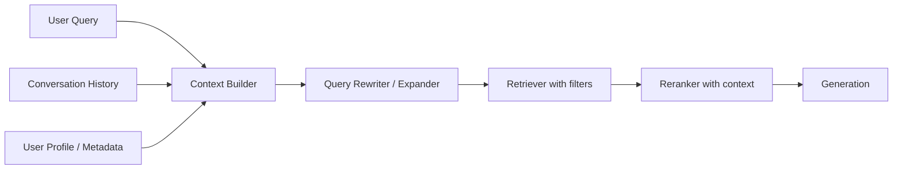

# Contextual retrieval

> **Learning Path:** RAG Architecture
> **Section:** 8.1.17 — Learn

**Contextual retrieval**

### 1. The problem

Naive RAG treats every query as independent: embed the query, find nearest chunks, generate.

That breaks in real conversations.
* Ambiguity: "Is it covered?" "Which plan?"
* Reference: "it", "that one", "the same as last time"
* Drift: user refines over turns, each query alone is incomplete
* Personalization: same question means different things for different users

Result: retriever returns plausible but irrelevant chunks. The LLM then hallucinates or apologizes.

You need retrieval to be aware of *what is already known*.

### 2. Mental model

Naive retrieval: `query -> similarity -> docs`

Contextual retrieval: `query + context -> better query -> similarity with filters -> docs`

Context is the session state that makes the query interpretable: conversation history, user profile, task, time, previous retrieval results.

Think of it as giving the retriever a working memory, not a blank slate each turn.

### 3. How it works

There are two practical mechanisms, often combined:

**Query contextualization.** Rewrite/expand the current query using history before embedding.
History → LLM rewriter → "self-contained" query → retriever

Example: User asks "What's the refund policy?" then "How long does it take?". Rewriter turns the second into "How long does the refund policy take to process for a standard account?"

**Context-aware retrieval.** Keep the query as-is but bias retrieval with context signals.
* Metadata filters from context: user tier, region, product, subscription status
* Session memory: boost chunks seen/accepted earlier, penalize rejected ones
* Contextual reranking: re-score candidates with history + query

Implementation is lightweight: a small rewriter prompt, a session store for history embeddings, and metadata indexes.

### 4. Architectural reasoning

When it helps:
* Multi-turn dialogue, agents, support chat
* Implicit references and pronouns
* Personalized knowledge bases
* Tasks with evolving constraints

What it solves: reduces mismatch between user intent and retrieval signal, improves first-pass recall without larger indexes.

Alternatives:
* Just retrieve more and let LLM filter. Works for small corpora, fails on cost and noise.
* Rely on LLM parametric memory. Fails for fresh/enterprise data.
* Full conversation re-embedding each turn. Expensive and unstable.

Choose contextual retrieval when accuracy per turn matters more than raw latency, and when queries are inherently referential.

### 5. Trade-offs and failure modes

* **Latency and cost.** Rewriting + extra embedding adds 1 LLM call per turn.
* **Context leakage / privacy.** History contains PII. Need redaction and session TTL.
* **Over-contextualization.** Rewriter can inject wrong assumptions from bad history → retrieval drift.
* **State management.** Session store must be consistent, evictable, and observable. Stateless retrieval is simpler to operate.
* **Evaluation difficulty.** You can’t measure recall with a single query anymore; you need conversation-level metrics.

Common failure: rewriting with too much history. The rewriter hallucinates entities not present, which then poisons retrieval. Cap context to last N turns and summarize.

### 6. Example

Enterprise support bot for SaaS billing.

User: "I upgraded last month"
Bot: "Got it. What do you want to know?"
User: "Is the extra storage active?"

Naive retrieval for "Is the extra storage active?" returns generic storage docs.

Contextual retrieval builds: `user_id=123, plan=Pro, upgrade_date=2025-06-12, query="Is the extra storage active?"`

Rewriter produces: "For user 123 on Pro plan upgraded 2025-06-12, is the extra storage add-on active and provisioned?"

Retriever filters by `user_id`, `product=billing`, `date >= upgrade_date`. Reranker boosts docs about Pro upgrades.

Answer is correct and grounded.

### 7. Reasoning challenge

You are designing a medical triage assistant. Conversations are 5-10 turns, highly sensitive, and must be auditable. Retrieval corpus is 2M clinical guidelines.

Do you add contextual query rewriting, session-aware metadata filtering, or both? What do you *not* store in the session store, and how do you prevent retrieval drift across turns?

### 8. Key takeaway

* Contextual retrieval exists because queries are not independent; intent is distributed across a conversation.
* Make retrieval session-aware via query rewriting and metadata filters, not just bigger indexes.
* The cost is latency, state complexity, and privacy risk. Mitigate with bounded history, summarization, and strict redaction.
* Measure at conversation level: task completion and drift, not single-turn recall.

You understand why this exists when you stop treating retrieval as a pure similarity problem and start treating it as a stateful interpretation problem.
