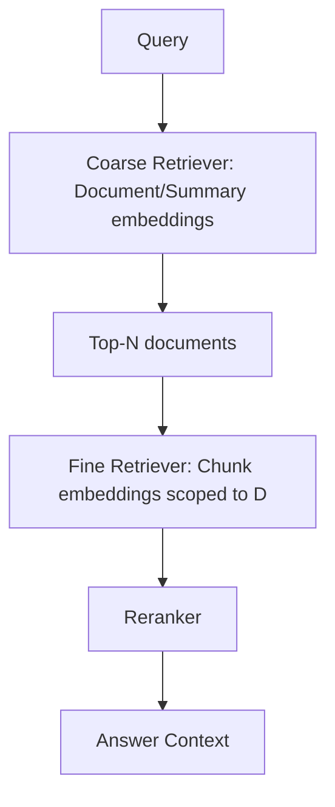

# Hierarchical retrieval

> **Learning Path:** RAG Architecture
> **Section:** 8.1.19 — Learn

**Hierarchical retrieval**

### 1. The problem

Flat retrieval over millions of chunks fails at scale.

A single vector search over 10M+ 512-token chunks gives you:
* **Low recall.** The query may match a chunk, but the embedding for that chunk is too specific. The right document is there but not in top-k.
* **High noise.** You retrieve 100 chunks from 100 different documents. Context window is wasted on irrelevant fragments.
* **Latency and cost.** Searching the whole corpus for every query is expensive, and reranking 100 candidates is wasteful when 90 come from irrelevant documents.

You need relevance at two levels: *which documents matter* and *which parts inside them matter*.

### 2. Mental model

Think library, not haystack.

You don't search every page. You first find the right floor, then the right aisle, then the right book, then the right page.

Hierarchical retrieval builds an index at multiple granularities and searches top-down:
Corpus -> Document/Collection -> Chunk

Each level has its own embedding. Query hits coarse level first to prune the search space, then drills down only inside promising branches.

### 3. How it works

Build two representations per unit of data:

* **Coarse representation:** Document-level summary or embedding. Can be an LLM-generated summary, first paragraph, or mean-pooled chunk embeddings.
* **Fine representation:** Chunk embeddings for actual retrieval.

At query time:
1. Retrieve top-N coarse candidates. This is cheap and high-recall.
2. Expand only those N documents into their chunks, typically 10-100x fewer chunks than full corpus.
3. Run second retrieval / rerank inside the narrowed set.

Variants:
* **Static hierarchy:** Document -> Chunks, with pre-built summary embeddings.
* **Dynamic clustering:** Cluster chunks into topics, embed cluster centroids, retrieve clusters then chunks.
* **Two-stage RAG:** First stage retrieves documents, second stage retrieves chunks within them with a stricter similarity threshold.

### 4. Architectural reasoning

When it helps:
* **Large corpora > 1M chunks** where flat top-k recall collapses.
* **Naturally hierarchical data:** company handbooks, code repos with files/modules, support tickets with conversations.
* **Need for citation fidelity.** You want to guarantee answers come from a small, auditable set of source documents.

Why choose it over flat search:
* Flat search optimizes for similarity, not containment. Hierarchical search optimizes for *recall of the right container* first.
* Reduces vector search cost: coarse index is 10-100x smaller.
* Improves relevance density: final context window is filled from few related documents, not random fragments.

Alternatives:
* Flat search + larger top-k + reranker. Works up to ~500k chunks, then latency and noise dominate.
* Hybrid search only. Improves precision but doesn't solve search space pruning.
* Graph retrieval. Good for relationships, not for scale pruning.

### 5. Trade-offs and failure modes

* **Latency adds up.** Two retrievals > one. Keep coarse retrieval very fast and N small, e.g., 8-20 documents.
* **Hierarchy staleness.** If you update chunks but not document summaries, coarse retrieval drifts. You need a rebuild or incremental update policy.
* **Over-pruning.** If coarse embeddings are too coarse, you lose recall. Summaries must capture the document's intent, not just keywords.
* **Complexity.** You now have two indexes to maintain, two embedding pipelines, and a coordination layer. Operational cost rises.

The key failure mode is *false negative at coarse level*. If the right document isn't in top-N coarse, it's gone forever. Mitigate with larger N at coarse stage, or query expansion.

### 6. Example

Enterprise support KB with 2M tickets.

Flat retrieval: query "refund after cancellation" returns chunks from billing, returns, and unrelated cancellation policies scattered across 200 tickets.

Hierarchical:
* Coarse index: 200k tickets with LLM-generated summary embeddings: "Ticket about refund request after user-initiated cancellation, denied due to policy X."
* Query retrieves top-12 tickets.
* Fine retrieval searches only chunks within those 12 tickets ~ 1,200 chunks instead of 2M.
Result: higher recall on the actual refund policy, fewer irrelevant fragments, and citations point to specific tickets.

### 7. Reasoning challenge

You have a code RAG system with 5M functions across 50 repos. Queries are "how do I handle X in the payment service". Flat search returns functions from all repos, noisy.

Do you use hierarchical retrieval by repo -> file -> function, or by semantic clustering of functions? What breaks if you choose one over the other?

### 8. Key takeaway

* Hierarchical retrieval exists to solve recall and noise at scale by pruning search space top-down.
* Coarse first, fine second. The coarse level must be high-recall, not high-precision.
* It trades latency and system complexity for relevance density and cost control.
* The architecture only works if the hierarchy matches how users think about the data and if summaries stay fresh.
