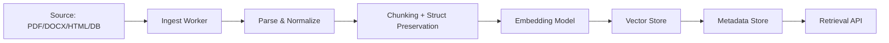

# Document ingestion

> **Learning Path:** RAG Architecture
> **Section:** 8.1.2 — Learn

**Document ingestion** is the assembly line that turns raw documents into something a retriever can actually use.

### 1. The problem

You have a RAG system. The LLM is great at reasoning over text, but it has no access to your PDFs, tickets, contracts, and Confluence pages. Even if you dumped the whole file in context, you hit token limits and lose precision.

So you need a pipeline that converts heterogeneous, noisy source documents into searchable vectors with enough context and metadata to be retrieved correctly. The problem isn't "store files". It's: *how do you preserve meaning while making documents retrievable, updatable, and cheap to query?*

### 2. Mental model

Think of ingestion as a factory line, not a copy operation.

Source → Parse → Normalize → Chunk → Embed → Index → Metadata

Each stage transforms the document into a more structured, more retrievable form. The output isn't text, it's **retrieval units**: chunks with embeddings + metadata that can be scored and reranked.

### 3. How it works

**Parse & Normalize:** Extract text while preserving structure. PDFs need OCR/layout analysis. HTML needs boilerplate stripping. You keep page numbers, headings, tables, and document IDs.

**Chunking:** Break documents into retrieval units. The key decision is *what constitutes a unit of meaning*. Options: fixed token window with overlap, semantic chunking by headings/sentences, or hybrid. Overlap prevents context loss at boundaries.

**Embed & Index:** Embed each chunk. Store vector + rich metadata: source_id, chunk_id, page, section, last_modified, access control tags, version.

Ingestion is usually asynchronous and idempotent. Sources change, so you need change detection, re-ingestion, and versioning.

### 4. Architectural reasoning

When to invest in a real ingestion pipeline vs simple upload?

* **Heterogeneous sources and scale:** One-off docs can be manual. Thousands of docs across S3, SharePoint, Jira need automation.
* **Freshness requirement:** If knowledge must be < minutes old, you need event-driven ingestion with queues, not batch nightly jobs.
* **Retrieval quality matters:** Legal or support use cases need provenance, exact quotes, and filters by tenant/region. That requires metadata and structured chunking.

Alternatives: dump whole docs into context, use naive text split, or rely on LLM to parse on read. All fail at scale, cost, and quality.

Choose ingestion when retrieval precision, auditability, and updateability are architectural constraints.

### 5. Trade-offs and failure modes

* **Chunk size vs recall:** Small chunks = precise retrieval but lose context. Large chunks = more context but dilute signal and increase cost. Typical sweet spot 200-800 tokens with 10-20% overlap.
* **Sync vs async:** Sync ingestion gives immediate availability but slows writes and couples parsing failures to user requests. Async via queue is resilient and back-pressurable.
* **Parsing fidelity vs speed:** Aggressive layout parsing preserves tables and headings but is slow and expensive. Fast text extraction loses structure.
* **Failure modes to design for:** Parsing errors creating empty chunks, duplicate ingestion without dedupe, embedding drift when you change models, metadata loss breaking filters, and PII leakage from unredacted sources.

Versioning is critical. When a source document updates, you must invalidate old chunks and re-index, otherwise you serve stale answers.

### 6. Example

Enterprise support RAG. Sources: Zendesk tickets, internal wiki, product manuals in PDF.

Ingestion worker listens to S3 events and Zendesk webhooks. PDFs go through layout-aware parser that extracts text with page and heading hierarchy. Chunking respects section boundaries, keeping FAQ Q&A together. Metadata includes product_line, language, ticket_priority, and tenant_id.

At query time, retriever filters by tenant and product, then reranks by recency. Support agents get answers with source links and page numbers.

### 7. Reasoning challenge

You are ingesting legal contracts that contain tables of pricing terms and narrative clauses. Fixed-size chunking with 200 token windows frequently splits a table row across chunks, destroying meaning.

Do you increase chunk size, switch to semantic chunking by table/section, or add post-processing to reconstruct tables? What is the trade-off for retrieval cost and precision?

### 8. Key takeaway

* Ingestion exists to create retrievable units of meaning, not to store files.
* Chunking strategy is an architectural decision that directly impacts retrieval quality.
* Asynchronous, idempotent pipelines with strong metadata and versioning are required for production RAG.
* Optimize for freshness, provenance, and filterability, not just embedding speed.
